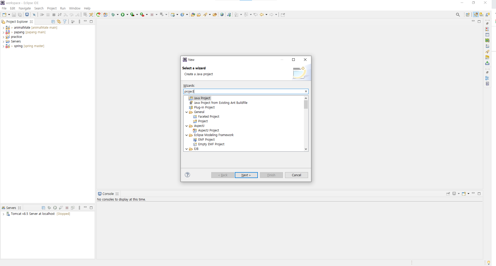
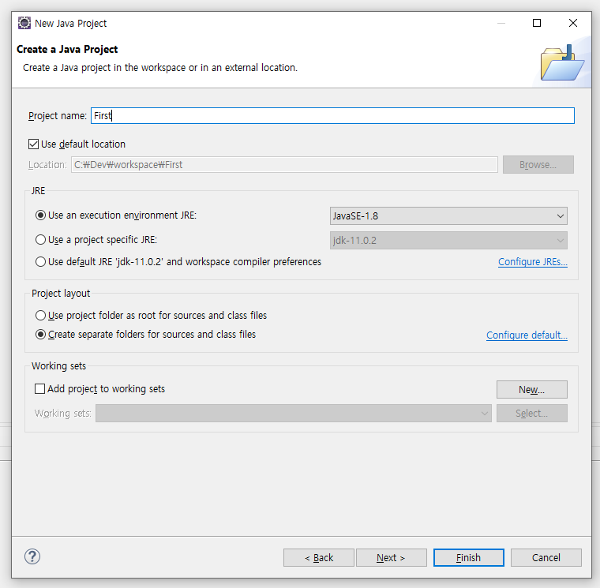
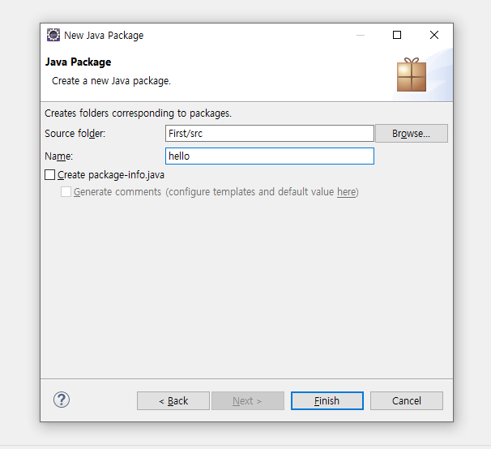
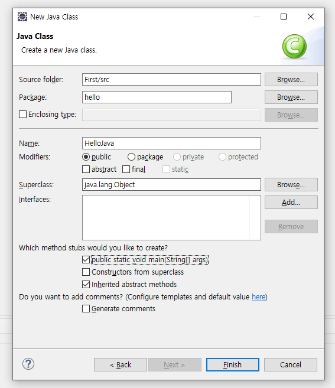
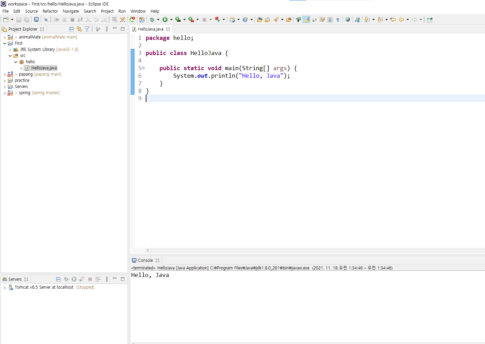
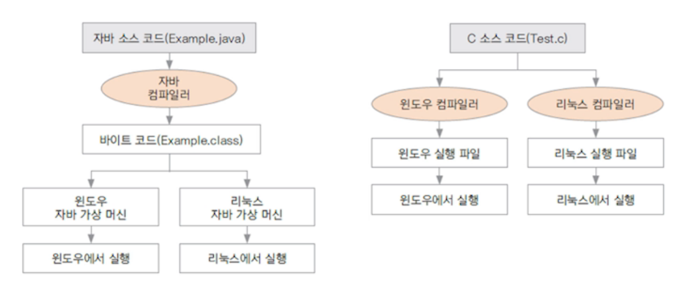

# 자바 프로그래밍 시작하기

## 1. 프로그래밍이란 무엇일까?

* ##### 프로그래밍: 컴퓨터에게 일을 하도록 명령어를 만드는 것

* ##### 컴파일: 프로그램 언어를 컴퓨터가 알 수 있는 언어로 바꿔 주는 일

* ##### 컴파일러: 기계어로 번역해주는 프로그램, 자바 설치시 자동으로 설치 됨


## 2. 이클립스로 자바 시작하기



1. ctrl + n을 눌러 새로 만들기 창 띄우기
2. Java Project를 검색해서 선택




1. 프로젝트 이름 입력 후 [Finish]




1. 새로 만들기에서 Package선택
2. 이름 입력 후 [Finish]

* **Package 이름은 항상 소문자로 시작한다.**




1. 새로 만들기에서 Class선택
2. 이름 입력
3. public static void main 메뉴 체크 후 [Finish]

* **Class 이름은 항상 대문자로 시작한다.**
* **모든 자바 프로그램은 클래스에 종속된다.**




1. 명령어 입력 후 [F5] 눌러서 결과 출력

```java
System.out.println("Hello, Java");
```


## 3. 자바를 쓰면 왜 좋을까요?

##### 1. 플랫폼(Windows, Rinux, Mac 등)에 영향을 받이 않으므로 다양한 환경에서 사용 가능



##### 2. 객체 지향 언어이기 때문에 유지보수가 쉽고 확장성이 좋다.

##### 3. 프로그램이 안정적이다.

##### 4. 풍부한 기능을 제공하는 오픈소스이다(JDK).