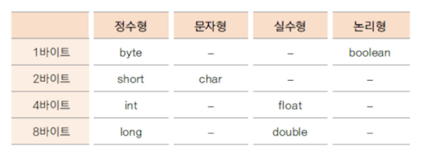
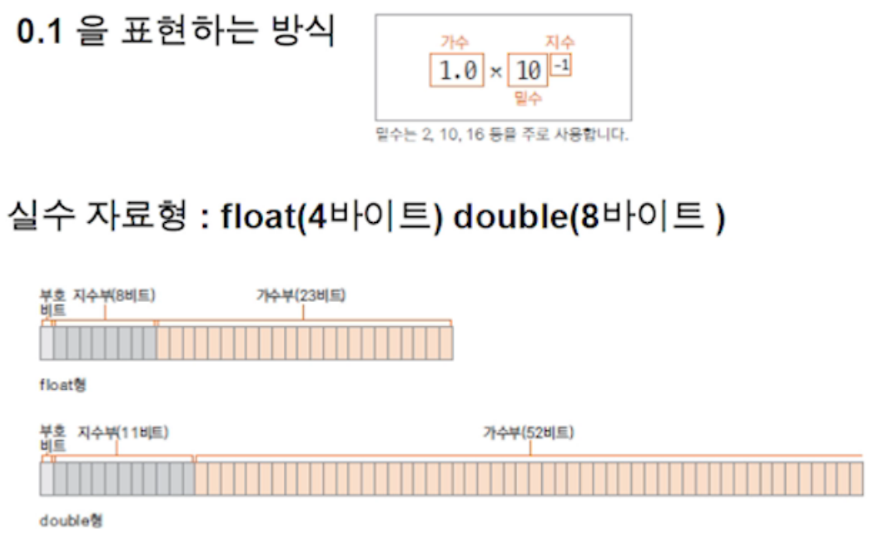
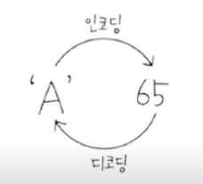

# 변수와 자료형 2

## 1. 변수

* 프로그래밍에서 값(Data)을 사용하기 위해 선언하는 것을 변수라 한다.

```java
	public static void main(String[] args) {
		int num; //변수 선언
		num = 10; //변수 초기화
		System.out.println(num);
		
		int level = 20; //선언과 동시에 초기화
		System.out.println(level);
	}
```


## 2. 변수 선언 시 유의점

* 변수의 이름은 알파벳, 숫자, _, $로 구성된다.
* 변수의 이름은 숫자로 시작할 수 없고, 공백을 사용할 수 없다.
* 예약어는 변수의 이름으로 사용할 수 없다.
* 대소문자를 구분한다.
* 변수의 이름은 그 변수의 의미를 유추할 수 있도록 적절하게 사용한다.


## 3. 변수가 저장되는 공간의 특성 - 자료형

* 자료형이 필요한 이유: 변수를 선언 할 때 변수가 사용할 메모리 크기와 타입을 구분하기 위해
* 변수의 자료형은 한 번 정해지면 바꿀 수 없다.



**정수 자료형**

* byte: 1바이트 단위의 자료형으로 동영상, 음악파일 등을 처리할 때 사용하기 좋은 자료형
* short: 2바이트 단위의 자료형으로 c, c++ 언어와의 호환 시 사용
* int: 자바에서 사용하는 정수에 대한 기본 자료형으로 4바이트 단위

&nbsp;&nbsp;&nbsp;&nbsp;&nbsp;&nbsp;=> 프로그램에서 사용하는 모든 숫자(리터럴)은 기본적으로 int로 저장됨

* long: 가장 큰 정수 자료형으로 8바이트 자료형

&nbsp;&nbsp;&nbsp;&nbsp;&nbsp;&nbsp;=> 숫자의 뒤에 L또는 l을 써서 long형임을 표시해야 함

```java
	public static void main(String[] args) {
		int num1 = 1234567890123; //변수 범위를 벗어나서 오류
		long num2 = 1234567890123; //숫자 데이터 자체가 int타입으로 저장되어 오류
		long num3 = 1234567890123L; //숫자 데이터도 long타입으로 저장하도록 끝에 L을 붙여서 오류 제거
	}
```

**실수 자료형(double, float)**

* 부동 소수점 방식: 무한의 실수를 표현하기 위해 실수를 지수부와 가수부로 표현한다.



* 실수는 기본적으로 double로 처리한다.
* float형으로 사용하는 경우 숫자에 f, F를 명시 함

**문자 자료형**

* char

&nbsp;&nbsp;&nbsp;&nbsp;&nbsp;&nbsp;=>  컴퓨터에서는 문자도 내부적으로 비트의 조합으로 표현

&nbsp;&nbsp;&nbsp;&nbsp;&nbsp;&nbsp;=> 자바에서 문자는 2바이트로 처리

&nbsp;&nbsp;&nbsp;&nbsp;&nbsp;&nbsp;=> 인코딩: 각 문자에 따른 특정한 숫자 값(코드 값)을 부여하는 것

&nbsp;&nbsp;&nbsp;&nbsp;&nbsp;&nbsp;=> 디코딩: 숫자 값을 원래의 문자로 변환하는 것



* 문자세트: 문자를 위한 코드 값을 정해 놓은 세트

&nbsp;&nbsp;&nbsp;&nbsp;&nbsp;&nbsp;=> 아스키(ASCII): 1바이트로 영문자, 숫자, 특수문자 등을 표현 함

&nbsp;&nbsp;&nbsp;&nbsp;&nbsp;&nbsp;=> 유니코드(Unicode): 한글과 같은 복잡한 언어를 표현하기 위한 표준 인코딩으로 UTF-8, UTF-16이 대표적

&nbsp;&nbsp;&nbsp;&nbsp;&nbsp;&nbsp;=> 자바는 유니코드 UTF-16 인코딩을 사용

```java
	public static void main(String[] args) {
		char ch = 'A';
		System.out.println(ch); //A출력
		System.out.println((int)ch); //코드 값(65)출력
		
		ch = 66;
		System.out.println(ch); //문자(B)출력
		
		int ch2 = 67;
		System.out.println(ch2); //67출력
		System.out.println((char)ch2); //문자(C)출력
	}
```

**논리형(boolean)**

* 참, 거짓을 표현하는 자료형
