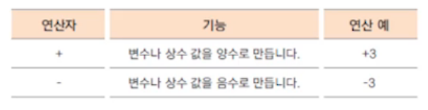
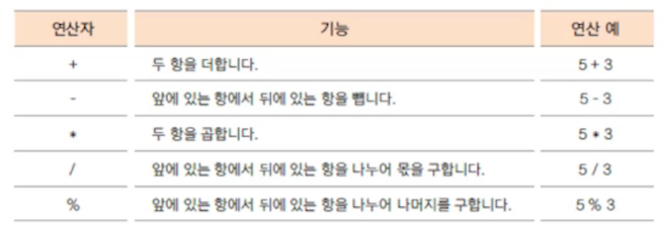
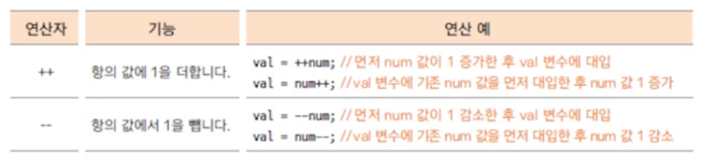
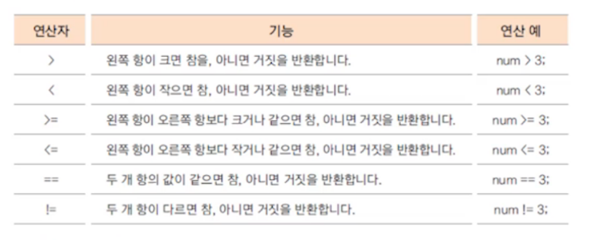
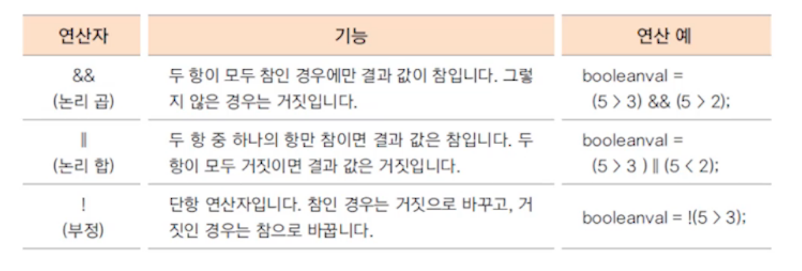

# 자바의 여러가지 연산자1

## 1. 항과 연산자

* 항(operand): 연산에 사용되는 값
* 연산자(operator): 항을 이용하여 연산하는 기호

​        

**항의 개수에 따른 연산자 구분**

|   연산자    |        설명         |           연산 예           |
| :---------: | :-----------------: | :-------------------------: |
| 단항 연산자 | 항이 한 개인 연산자 |            num++            |
| 이항 연산자 | 항이 두 개인 연산자 |         num1 + num2         |
| 삼항 연산자 | 항이 세 개인 연산자 | (num1 < num2)? ture : false |


## 2. 대입 연산자

* 변수에 값을 대입하는 연산자
* 연산의 결과를 변수에 대입
* 우선 순위가 가장 낮은 연사자
* 왼쪽 변수에 오른쪽 변수(값)를 대입

```java
int age = 24; //나이를 의미하는 age변수에 값 24를 대입함
int result = 3 + 5; //3과 5를 더한 값을 result변수에 대입함
```


## 3. 부호 연산자

* 단항 연산자
* 양수와 음수를 표현하거나 값의 부호를 변경




## 4. 산술 연산자

* 사칙연산에 사용되는 연산자




## 5. 증가 감소 연산자

* 단항 연산자
* 1만큼 더하거나 1만큼 뺄 때 사용하는 연산자
* 항의 앞/뒤 위치에 따라 연산의 결과가 달라짐에 주의




## 6. 관계 연산자

* 이항 연산자
* 연산의 결과가 true(참), false(거짓)으로 반환 됨




## 7. 논리 연산자

* 이항 연산자
* 연산의 결과가 true(참), false(거짓)으로 반환 됨
* 관계 연산자와 혼합하여 많이 사용 됨



<hr>

* **단락 회로 평가(short circuit evaluation)**

논리 곱(&&)은 두 항이 모두 true일 때만 결과가 true

=> 앞의 항이 false이면 뒤 항의 결과를 평가하지 않아도 false임

논리 합(||)은 두 항이 모두 false일 때만 결과가 false

=> 앞의 항이 true이면 뒤 항의 결과를 평가하지 않아도 true임

<hr>


