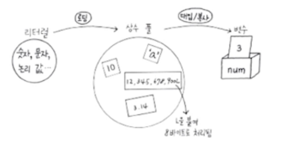
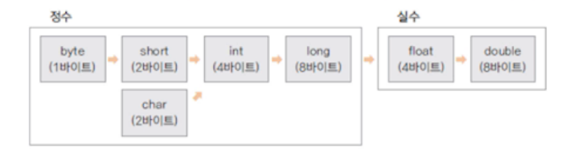

# 변수와 자료형 3

## 1. 상수(final)

* 상수는 변하지 않는 값을 의미한다.
* 일반적으로 이름은 대문자로 선언한다.
* 프로그램 내에서 변경되지 않아야 하는 값을 상수로 선언하고, 변경이 필요한 경우 선언되는 값 자체를 수정한다.

```java
	public static void main(String[] args) {
		final int MAX_NUM = 100;
		final double PI = 3.14;
		PI = 3.15; //상수는 값을 대입할 수 없다.
	}
```


## 2. 리터럴

* 프로그램에서 사용하는 모든 숫자, 값, 논리 값을 포함한다.
* 리터럴에 해당되는 값을 특정 메모리 공간인 상수 풀(constrant pool)에 저장된다.
* 정수는 int, 실수는 double로 저장되며 long, float 등의 값으로 저장이 필요한 경우 식별자(L, F 등)를 사용한다.




## 3. 형 변환(type conversion)



* 자료형은 각각 사용하는 메모리 크기와 방식이 다르다.
* 서로 다른 자료형의 값이 대입되는 경우 형 변환이 발생
* 묵시적 형 변환: 작은 수에서 큰 수로, 덜 정밀한 수(정수)에서 더 정밀한 수(실수)로 대입되는 경우
* 명시적 형 변환: 큰 수에서 작은 수로, 더 정밀한 수에서 덜 정밀한 수로 대입되는 경우

&nbsp;&nbsp;&nbsp;&nbsp;&nbsp;&nbsp;=>  변환되는 자료형을 명시해야 하며 자료의 손실이 발생할 수 있다.

```java
	public static void main(String[] args) {
        double dNum = 3.14;
        int num = (int)dNum; //자료형 명시 해야함(명시적 형 변환)
	}
```

```java
	public static void main(String[] args) {
		//묵시적 형 변환
		byte bNum = 10;
		int num = bNum;
		System.out.println(num);
		
		float fNum = 10;
		double dNum = fNum + num; //연산할 때도 형 변환 발생
		System.out.println(dNum);
	}
```

```java
	public static void main(String[] args) {
		//형 변환으로 인한 데이터 손실
		int iNum = 1000;
		byte bNum = (byte)iNum;
		System.out.println(bNum);//-24출력
		
		double dNum = 3.14;
		iNum = (int)dNum;
		System.out.println(iNum);//3출력
		
		//연산 순서에 따라 결과가 달라질 수 있다
		float fNum = 0.9F;
		int num1 = (int)dNum + (int)fNum;
		int num2 = (int)(dNum + fNum);
		System.out.println(num1); //3출력
		System.out.println(num2); //4출력
	}
```


