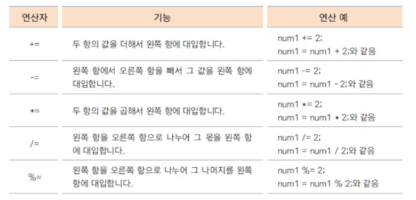
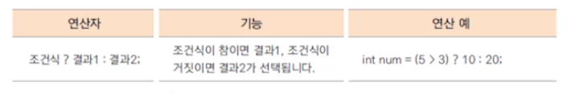
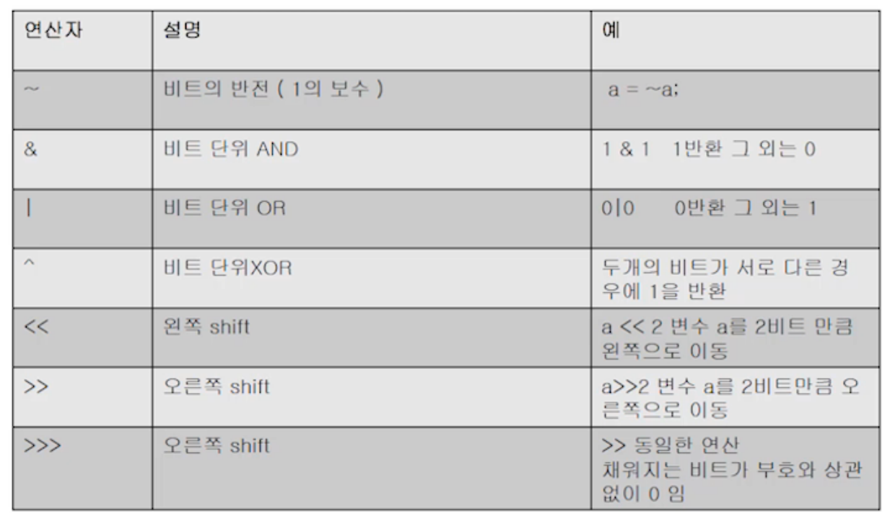
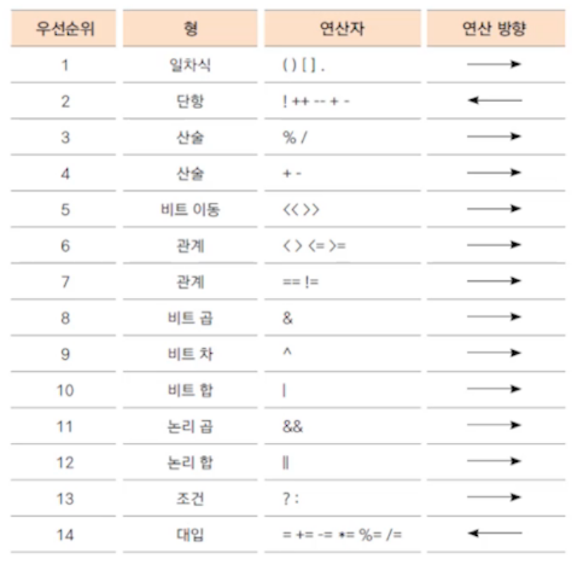

# 자바의 여러가지 연산자2

## 1. 복합 대입 연산자

* 대입 연산자와 다른 연산자를 함께 사용
* 프로그램에서 자주 사용하는 연산자

## 2. 조건 연산자

* 삼항 연산자
* 조건 식의 결과가 true(참)인 경우와 false(거짓)인 경우에 따라 다른 식이나 결과가 수행됨
* 제어문 중 조건문을 간단히 표현할 때 사용할 수 있음

## 3. 비트 연산자

* 비트 연산자는 정수에만 사용할 수 있다.

## 4. 연산자 우선 순위

