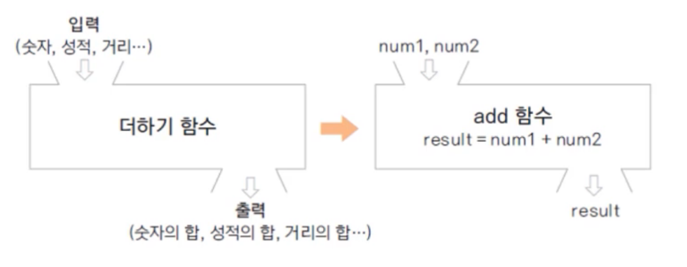
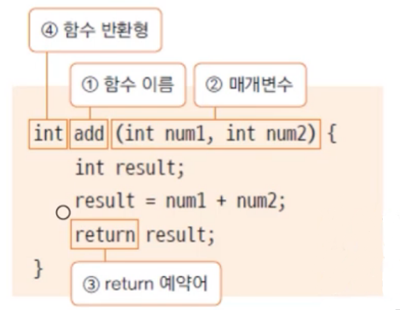
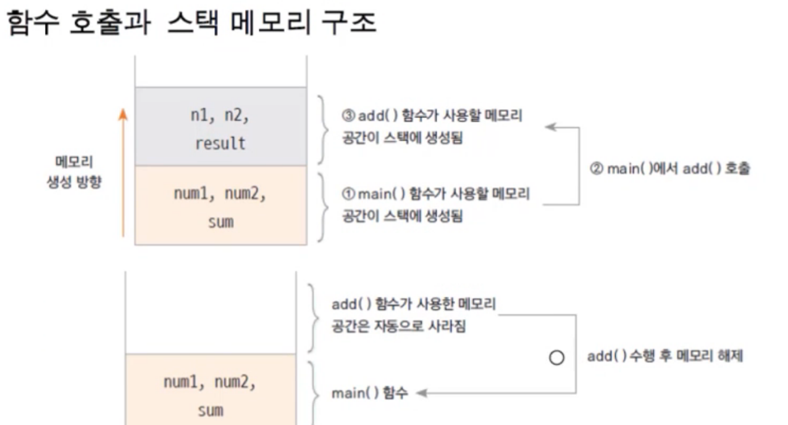

# 클래스와 객체 1-1

## 1. 객체지향 프로그래밍과 클래스

**객체(Object)란?**

* 사전적 의미: 의사나 행위가 미치는 대상
* 구체적 추상적 데이터 단위

**객체지향 프로그래밍(Object Oriented Programming, OOP)**

* 객체를 기반으로 하는 프로그래밍
* 객체지향 프로그래밍 구현 순서
  1. 객체 정의
  2. 객체 기능 구현
  3. 객체 간 협력 구현

**절차적 프로그래밍**

* 시간의 흐름에 따른 프로그래밍

ex) 일어난다 -> 씻는다 -> 밥을 먹는다 -> 버스에 탄다 -> 학교에 도착한다.

* C언어가 대표적


## 2. 클래스

**클래스(class)란?**

* 객체에 대한 속성과 기능을 코드로 구현한 것
* "클래스를 정의한다"라고 함
* 객체에 대한 청사진

**객체의 속성**

* 특성(property)
* 속성(attribute)
* 멤버 변수(member variable)

**객체의 기능**

* 객체가 하는 기능들을 메서드로 구현(method, member function)


## 3. 클래스 정의하기

```java
(접근 제어자) class 클래스 이름{
	멤버 변수;
	메서드;
}
```

* class는 통상적으로 대문자로 시작
* 하나의 java 파일에 하나의 클래스를 두는 것이 원칙이나, 여러 개의 클래스가 같이 있는 경우 public 클래스는 단 하나이며, public 클래스와 자바 파일의 이름은 동일해야 함
* 자바의 모든 코드는 class 내부에 위치

**클래스의 속성**

* 클래스의 특징을 나타낸다
* property, attribute라고도 한다
* 자료형을 이용하여 멤버 변수로 선언한다

```java
public class Student {
	int studentID;
	String studentName;
	int grade;
	String address;
}
```

**클래스의 기능**

* 메서드(method)로 구현
* 멤버 함수(member function)라고도 한다
* 객체가 수행하는 기능을 구현한다

```java
public void showStudentinfo() {
	System.out.println(studentName + ", " + address);
}
```


## 4. 메서드

* 함수의 일종
* 객체의 기능을 제공하기 위해 클래스 내부에 구현되는 함수

**함수란?**

* 하나의 기능을 수행하는 일련의 코드로 중복되는 기능을 함수로 구현하고 호출하여 사용한다



**함수 정의하기**

* 함수의 이름, 매개변수, 반환 값을 선언하고 코드로 구현한다



1. 함수 이름: 함수의 기능과 관련하여 명명
2. 매개 변수: 함수의 수행을 위해 필요한 변수
3. return: 함수 수행 결과를 반환하기 위한 예약어
4. 함수 반환형: 반환 값의 자료형을 나타내며 반환 값이 없을 경우 void라고 씀

```java
//함수 만들기
public class FunctionTest {
	public static void main(String[] args) {
		int num1 = 10;
		int num2 = 30;
		
		int sum = addNum(num1, num2);
		System.out.println(sum);
	}
	
	public static int addNum(int n1, int n2) {
		int result = n1 + n2;
		return result;
	}
}
```


## 5. 함수와 스택 메모리

**스택 메모리**

* 함수가 호출될 때 사용하는 메모리
* 함수의 기능 수행이 끝나면 자동으로 반환된다


