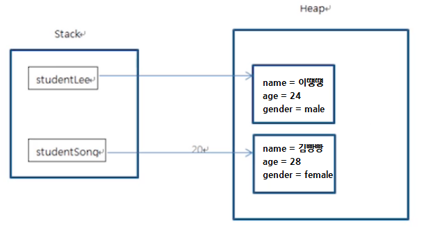
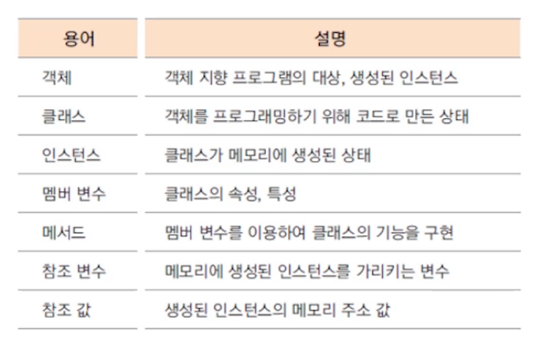
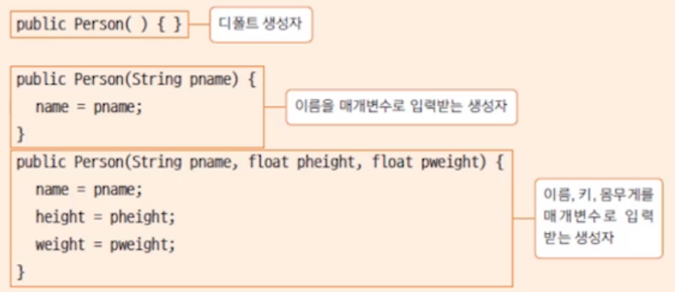

# 클래스와 객체 1-2

## 1. class & instance


**클래스 생성하기**

* 클래스를 사용하기 위해서는 클래스를 생성해야 한다
* new 예약어를 사용해 클래스를 생성한다

```java
클래스형 변수이름 = new 생성자
Student student = new Student();
```


## 2. 인스턴스와 힙(heap) 메모리

* 하나의 클래스 코드로부터 여러 개의 인스턴스를 생성
* 인스턴스는 힙(heap) 메모리에 생성됨
* 각각의 인스턴스는 다른 메모리에 다른 값을 가짐



**Stack영역**

* 함수가 호출되면 메모리 생성, 함수 종료 시 메모리 제거

**Heap영역**

* new 예약어를 통해 메모리 생성
* garbage collecter를 통해 메모리 제거


## 3. 참조 변수와 참조 값

* 참조 변수: 인스턴스 생성 시 선언하는 변수
* 참조 값: 인스턴스가 생성되는 힙 메모리 주소

```java
Student student = new Student(); //student가 참조 변수
System.out.println(student); //힙 메모리의 주소 값 반환(참조 값)
```





## 4. 생성자

```java
//생성자 기본 문법
<modifiers> <class_name>([<argument_list>]){
	[<statements>]
}

//예시
public Student(int id, String name){
	studentID = id;
	studentName = name;
}
```

* 생성자는 인스턴스를 초기화하는 명령어 집합이다
* 생성자의 이름은 클래스의 이름과 같다
* 생성자는 메소드가 아니므로 상속되지 않으며 리턴 값이 없다


**디폴트 생성자**

* 생성자를 따로 만들지 않으면 디폴트 생성자가 자동으로 생긴다
* 매개 변수 및 구현부가 없는 생성자
* 생성자가 하나라도 있으면 디폴트 생성자는 생기지 않는다

```
public Student(){};
```


**생성자 오버로드**

* 매개변수가 다른 여러 개의 생성자가 하나의 클래스에 있을 수 있다


