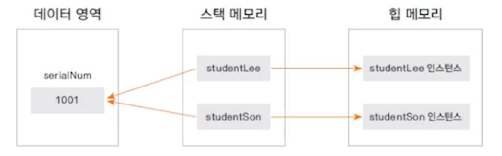
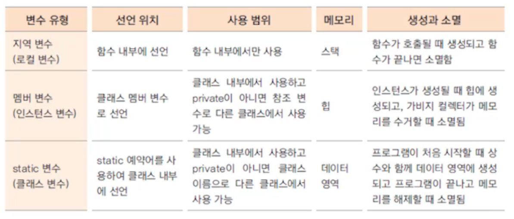

---

layout: single
title: "Do It Java Day12"
categories: java
tag: [java]
toc: true
author_profile: false
---
# 클래스와 객체 2-2

## 1. static 변수

* 사용 형식: static 자료형 변수명

ex) static int num;

* 여러 개의 인스턴스가 같은 메모리의 값을 공유하기 위해 사용

* 프로그램이 메모리에 적재(load)될 때 데이터 영역의 메모리에 생성된다(인스턴스가 생성될 때x, heap영역 x)
* 클래스 변수라고도 한다
* 인스턴스 생성과 관계없이 클래스 이름으로 직접 참조한다

```java
//static변수
Student.serialNum = 100; //serialNum이 static변수
```

```java
 //멤버변수(인스턴스변수)
 Student stu = new Student();
 stu.serialNum = 100;
```


## 2. static변수 vs 인스턴스 변수





**Tip.스태틱 메서드 안에서는 멤버 변수를 사용할 수 없다**

```java
public class Student {
	static int serialNum = 10000;
	int studentID;
	
	public static int getSerialNum() {
		this.studentID = 10; //static메서드 안에서는 멤버 변수 사용 불가능
		return serialNum;
	}
}
```


## 3. 변수의 유효 범위




## 4. static응용: singleton 패턴

* 인스턴스를 하나만 만들어야 하는 경우에 사용!

ex) 시간, 날짜

```java
public class Company {
	//내부에서 인스턴스 생성
	private static Company instance = new Company();
	
	//외부에서 생성자를 사용하지 못하게 한다
	private Company() {};
	
	//내부에서 생성한 인스턴스를 외부에서 사용할 수 있도록 해주는 메서드
	public static Company getInstance() {
		return instance;
	}
}
```

```java
public class CompanyTest {
	public static void main(String[] args) {
		Company c1 = Company.getInstance();
		Company c2 = Company.getInstance();
		
		System.out.println(c1==c2);//true => 같은 인스턴스를 가르킨다
	}
}
```

