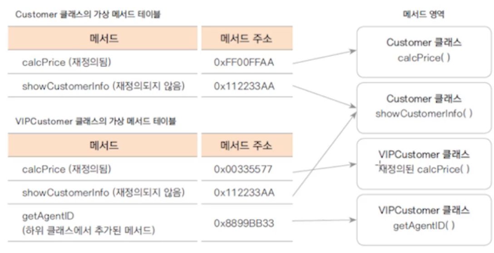

---

layout: single
title: "Do It Java Day18"
categories: java
tag: [java]
toc: true
author_profile: false 
---
# 상속과 다형성 3

## 1. 메서드 오버라이딩

* 상위 클래스에 정의된 메서드를 같은 이름과 매개변수로 하위 클래스에서 재정의 하는 것
* 상속된 메서드의 기능을 수정하거나 추가할 경우 사용


**Tip. 오버로딩**

* 이름이 같고 매개변수가 다른 메서드가 여러개 있는 것


## 2. 묵시적 형 변환과 재정의된 메서드 호출

**가상 메서드(virtual method)**

* 객체의 변수나 메서드의 참조는 그 타입에 따라 이루어 지지만, 가상 메서드는 타입과 상관없이 실제 생성된 인스턴스의 메서드가 호출된다

* 자바는 모든 메서드가 가상 메서드이다

```java
Customer vc = new VIPCustomer(); //Customer타입의 VIPCustomer인스턴스 생성
vc.calcPrice(10000); //메서드 실행 시 
// 메서드가 재정의 되지 않았으면 타입(Customer)의 메서드가 실행된다
// 메서드가 재정의 되었으면 인스턴스(VIPCustomer)의 메서드가 실행된다
```



## 3. 다형성(polymorphism)

* 하나의 코드가 여러가지 자료형으로 구현되는 것
* 정보은닉, 상속과 더불어 객체지향 프로그래밍의 가장 큰 특징 중 하나
* 객체지향 프로그래밍의 유연성, 재활용성, 유지보수성에 기본이 되는 특징

```java
//다형성 예시
class Animal{
	public void move() {
		System.out.println("동물이 움직입니다.");
	}
}

class Human extends Animal {
	public void move() {
		System.out.println("사람이 걷습니다.");
	}
}

class Tiger extends Animal {
	public void move() {
		System.out.println("호랑이가 뜁니다.");
	}
}

class Eagle extends Animal {
	public void move() {
		System.out.println("독수리가 납니다.");
	}
}

public class AnimalTest {
	public static void main(String[] args) {
		AnimalTest test = new AnimalTest();
		test.moveAnimal(new Human());
		test.moveAnimal(new Tiger());
		test.moveAnimal(new Eagle());
	}
	
	public void moveAnimal(Animal animal) {
		animal.move();
	}
}
```

