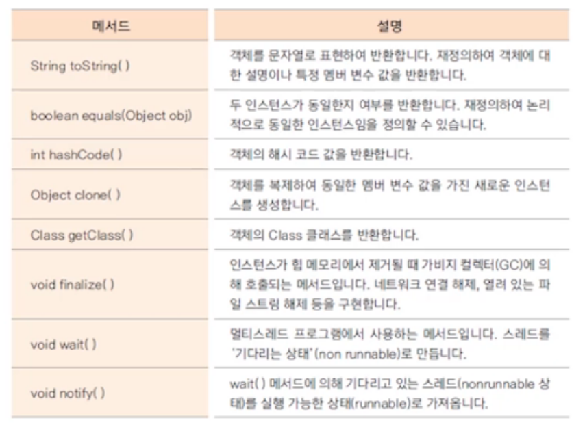

# 기본 클래스 1

## 1. java.lang 패키지

* 프로그래밍시 import하지 않아도 자동으로 import됨

```java
import java.lang.*;
```

* 많이 사용하는 기본 클래스들이 속한 패키지
* String, Integer, System 등


## 2. Object 클래스

* 모든 클래스의 최상위 클래스
* java.lang.Object 경로
* 모든 클래스는 Object 클래스를 상속 받는다(컴파일러가 자동으로 상속 시킴)



**toString() 메서드**

* 객체의 정보를 String으로 바꿀 때 사용
* String 클래스에선 문자열 반환
* Integer 클래스에선 정수 값 반환


**equals() 메서드**

* 두 인스턴스의 주소 값을 비교하여 true/false 반환
* 재정의하여 두 인스턴스가 논리적으로 동일한지 판단하도록 하기도 한다


**hashCode() 메서드**

* hash: 정보를 저장 및 검색하기 위해 사용하는 자료구조
* 자료의 특정 값(키 값)에 대해 저장 위치를 반환해주는 해시 함수를 사용한다

```java
저장 위치 = hash.(키 값);
index = hash.(key);
```

* 힙 메모리에 인스턴스가 저장되는 방식이 해시이다
* hashCode() 메서드는 자바 가상 머신이 저장한 인스턴스 주소 값을 10진수로 나타낸다


**서로 다른 메모리의 인스턴스가 같다면?**

* 재정의 된 equals() 메서드의 값이 true가 나와야 함
* 동일한 hashCode() 반환 값을 가져야 함

=> 논리적 동일함을 위해 equals() 메서드를 재정의 하였다면 hashCode() 메서드도 재정의하여 같은 값이 반환되도록 한다

* String 클래스: 동일한 문자열 인스턴스에 대해 동일한 값이 반환된다
* Integer 클래스: 동일한 정수 값 인스턴스에 대해 동일한 값이 반환된다


* equals(), hashCode() 재정의 예시

```java
class Student {
	int studentID;
	String studentName;
	
	public Student(int studentID, String studentName) {
		this.studentID = studentID;
		this.studentName = studentName;
	}

	@Override
	public boolean equals(Object obj) {
		if(obj instanceof Student) {
			Student std = (Student)obj; //매개변수를 Object 타입으로 받으므로 다운 캐스팅
			if(studentID == std.studentID) 
				return true;
			else
				return false;
		}
		return false;
	}
	
	@Override
	public int hashCode() {
		return studentID;// 대부분 equals 재정의 할 때 이용했던 멤버변수 값 사용 
	}
}

public class EqualsTest {
		public static void main(String[] args) {
			Student std1 = new Student(10001, "Tomas");
			Student std2 = new Student(10001, "Tomas");
			
			System.out.println(std1 == std2); //인스턴스 주소가 다르므로 false
			System.out.println(std1.equals(std2)); //studentID값이 같으므로 true
			System.out.println(std1.hashCode() == std2.hashCode()); //같은 주소 값을 반환하여 true
		}
}
```

​	

**clone() 메서드**

* 객체의 원본 유지하고 복사본을 만들어 사용할 때 사용하는 메서드
* 기본 틀(prototype)을 두고 복잡한 생성과정을 반복하지 않고 복제
* clone() 메서드를 사용하면 객체의 정보(멤버변수 값)가 같은 인스턴스가 생성되어 객체 지향 프로그램의 정보은닉, 객체보호 관점에 위배될 수 있다

=> 객체의 clone() 메서드 사용을 허용한다는 의미로 cloneable 인터페이스를 명시해 준다

```java
class Point {
	int x;
	int y;
	
	public Point(int x, int y) {
		this.x = x;
		this.y = y;
	}
	
	public String toString() {
		return "x=" + x + ", " + "y=" + y;
	}
}

class Circle implements Cloneable{
	Point point;
	private int radius;
	
	public Circle(int x, int y, int radius) {
		point = new Point(x, y);
		this.radius = radius;
	}
	
	public String toString() {
		return "원점은 " + this.point + "이고, 반지름은 " + radius + "입니다";
		//this.point하면 point 멤버변수의 타입 클래스의 toString을 실행
	}

	@Override
	protected Object clone() throws CloneNotSupportedException {
		return super.clone();
	}
}

public class ObjectCloneTest {
	public static void main(String[] args) throws CloneNotSupportedException {
		Circle circle = new Circle(10, 20, 5);
		Circle cloneCircle = (Circle)circle.clone();
		
		//서로 다른 해시코드 값을 가진 인스턴스가 확인된다
		System.out.println(System.identityHashCode(circle));
		System.out.println(System.identityHashCode(cloneCircle));
		
		System.out.println(circle.toString()); // 원점은 x=10, y=20이고, 반지름은 5입니다
	}
}
```

