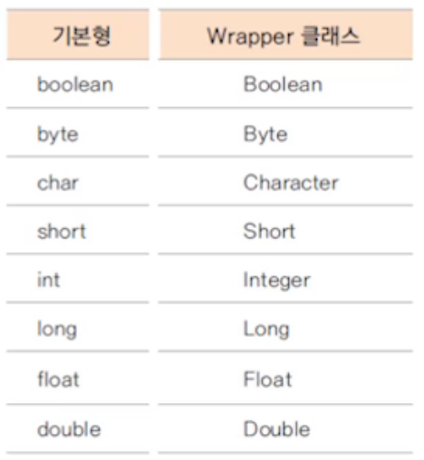

# 기본 클래스 2

## 1. String 클래스

**선언 방법**

1. 힙 메모리의 인스턴스로 선언

```java
String str = new String("abc");
```

2. 상수 풀에 있는 주소를 참조하여 선언

```java
String str = "abc";
```


**String 클래스로 문자열 연결**

* 한 번 생성된 String 값(문자열)은 불변(immutable)
* 두 개의 String 값을 연결하면 새로운 인스턴스가 생성된다

=> 문자열 연결을 계속하면 gabage 메모리가 많이 생길 수 있다

=> 문자열을 자주 연결하고나 변경할 때는 StringBuilder, StringBuffer 사용하면 좋다

```java
public class StringTest {
	public static void main(String[] args) {
		String str1 = new String("Hello");
		int instance1 = System.identityHashCode(str1);
		String str2 = new String("World");
		
		str1 = str1.concat(str2); //기존 인스턴스의 값을 바꾸는 것이 아닌 새로운 인스턴스 생성
		int instance2 = System.identityHashCode(str1);
		
		System.out.println(instance1 == instance2); //false 출력
	}
}
```


**StringBuilder, StringBuffer 사용하기**

* 내부적으로 가변적인 char[] 배열을 가지고 있는 클래스
* 문자열을 자주 연결하고나 변경할 때 사용하면 유용하다
* 매번 인스턴스를 새로 생성하지 않고 기존 배열을 변경하여 gabage 메모리 생성 감소
* StringBuffer는 멀티 쓰레드 프로그래밍에서 동기화(sybchronization)를 보장
* 단일 쓰레드 프로그램에서는 StringBuilder 사용을 권장
* toString 메서드로 String 반환


* StringBuilder 예시

```java
public class StringBuilderTest {
	public static void main(String[] args) {
		StringBuilder buffer = new StringBuilder("java");
		int instanceHash1 = System.identityHashCode(buffer);
		
		buffer.append(" and");
		buffer.append(" android");
		int instanceHash2 = System.identityHashCode(buffer);
		
		//계속해서 같은 인스턴스 사용
		System.out.println(instanceHash1 == instanceHash2); //true
		
		//String으로 출력하기
		String str2 = buffer.toString();
		System.out.println(str2); //java and android
	}
}
```


## 2. Wrapper 클래스

* 기본 자료형(primitive data type)에 대한 클래스



**오토 박싱과 언박싱**

```java
public class WrapperClassTest {
	public static void main(String[] args) {
		Integer num1 = new Integer(100); //Integer는 객체
		int num2 = 200; //int는 기본 자료형
		int sum = num1 + num2; //num1이 num1.intValue()를 통해 변환 => 언박싱
		Integer num3 = num2; //integer.valueOf(num2)를 통해 변환 => 오토박싱
	}
}
```


## 3. Class 클래스

* 자바의 모든 클래스와 인터페이스는 컴파일 후 class파일로 생성된다
* class파일에는 객체의 정보(멤버변수, 메서드, 생성자 등)가 포함되어 있다
* Class 클래스는 컴파일된 class 파일에서 객체의 정보를 가져올 수 있다


**Class 클래스 가져오기**

```java
public class ClassTest {
	public static void main(String[] args) throws ClassNotFoundException {
		Person person = new Person();
		
		// 방법1.Object 클래스의 getClass() 메서드 사용하기
		Class pClass1 = person.getClass(); //getClass()는 object의 메서드로 Class 클래스를 반환해준다
		System.out.println(pClass1.getName()); //클래스의 풀네임(패키지명 + 클래스명)
		
		// 방법2.클래스 파일 이름을 Class 변수에 직접 대입하기
		Class pClass2 = Person.class; 
		
		// 방법3. Class.forName("클래스 풀네임")메서드 사용하기
		Class pClass3 = Class.forName("classex.Person");//동적로딩
		
		System.out.println(pClass1.equals(pClass2));//true
		System.out.println(pClass1.equals(pClass3));//true
	}
}
```


* 동적로딩: 해당 명령을 실행할 때 바인딩이 발생함
* 정적로딩: 컴파일 할 때 바인딩이 모두 발생함
