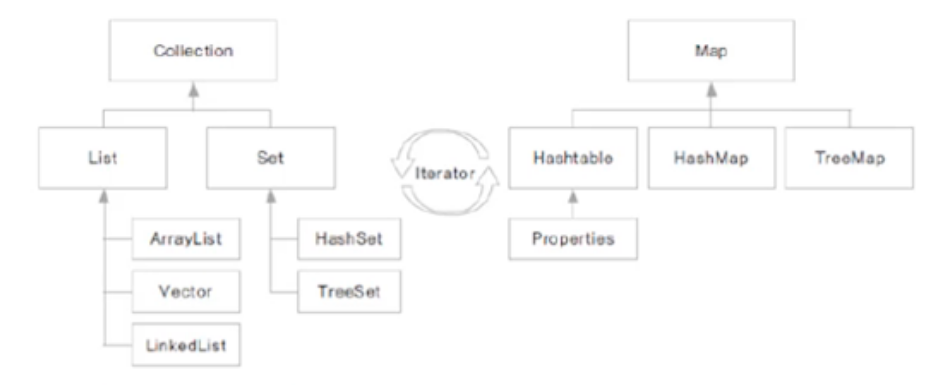

# 컬렉션 프레임워크3

## 1. 컬렉션 프레임워크

* 프로그램 구현에 필요한 자료구조(Data Structure)를 구현해 놓은 라이브러리
* java.util 패키지에 구현되어 있다
* 개발에 소요되는 시간을 절약하면서 최적화된 알고리즘을 사용할 수 있다
* 여러 인터페이스와 구현 클래스 사용 방법을 이해해야 한다

## 2. Collection 인터페이스

* 하나의 객체를 관리하기 위한 메서드가 선언된 인터페이스
* 하위에 List와 Set 인터페이스가 있다
* 여러 클래스들이 Collection 인터페이스를 구현한다

**List 인터페이스**

- 순서가 있는 자료 관리
- 중복 허용
- ArrayList, Vector, LinkedList, Stack, Queue 등이 구현

**Set 인터페이스**

* 순서가 정해져 있지 않음
* 중복을 허용하지 않음
* HashSet, TreeSet 등이 구현

**Collection 인터페이스의 주요 메서드**

* boolean add(E e) - Collection에 객체를 추가합니다
* void clear() - Collection의 모든 객체를 제거합니다
* Iterator< E > iterator - Collection을 순환할 반복자(Iterator)를 반환합니다
* boolean remove(Object o) - Collection에 매개변수에 해당하는 인스턴스가 존재하면 제거합니다
* int size() - Collection에 있는 요소의 개수를 반환합니다

