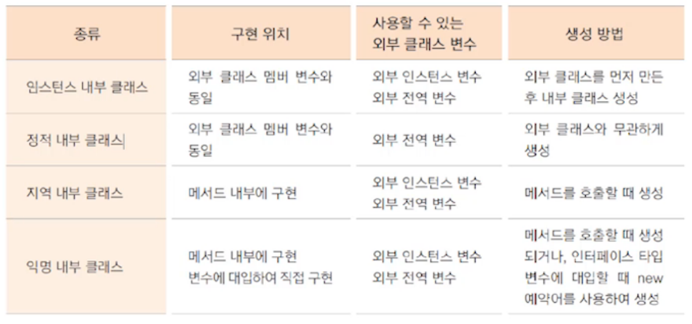

# 내부 클래스, 람다식, 스트림 1

## 1. 내부 클래스



**인스턴스 내부 클래스, 정적 내부 클래스 예시**

````java
class OutClass{
	
	private int num = 10;
	private static int sNum = 20;
	private InClass inClass;
	
	public OutClass(){
		inClass = new InClass();
	}
	
	//인스턴스 내부 클래스
	private class InClass{
		int inNum = 200;
		//static int sInNum = 100; //인스턴스 내부 클래스에서는 정적 변수 사용 불가능
		
		void inTest() {
			System.out.println(num);
			System.out.println(sNum);
		}
		
		//인스턴스 내부 클래스에서는 정적 메서드 사용 불가능
		//static void sTest() { }
	}
	
	public void usingInTest() {
		inClass.inTest();
	}
	
	//정적 내부 클래스
	static class InStaticClass{
		int iNum = 100;
		static int sInNum = 200;
		
		void inTest() {
			//num += 10; //외부 클래스의 인스턴스 변수 사용 불가
			sNum += 10; //외부 클래스의 정적 변수는 사용 가능
			System.out.println(sNum);
			System.out.println(iNum);
			System.out.println(sInNum);
		}
		
		static void sTest() {
			System.out.println(sNum);
			//System.out.println(iNum); //정적 메서드는 인스턴스 변수 사용 불가
			System.out.println(sInNum);
		}
	}
}

public class InnerTest {
	public static void main(String[] args) {
		OutClass outClass = new OutClass();
		outClass.usingInTest();
		
		OutClass.InStaticClass sInClass = new OutClass.InStaticClass();
		sInClass.inTest();
		OutClass.InStaticClass.sTest();
	}
}
````


**지역 내부 클래스 예시**

```java
class Outer{
	int outNum = 100;
	static int sNum = 200;
	
	public Runnable getRunnable(){
		
		int localNum = 100;
		
		//지역 내부 클래스
		class MyRunnable implements Runnable {
			@Override
			public void run() {
				outNum += 100; //인스턴스 변수는 수정 가능
				//localNum += 100; //지역 변수는 수정 불가(지역 변수가 모드 상수가 된다)
				
				System.out.println(outNum);
				System.out.println(sNum);
				System.out.println(localNum); //지역 변수 사용은 가능
			}
		}
		
		return new MyRunnable();
	}
}

public class LocalInnerTest {
	public static void main(String[] args) {
		Outer outer = new Outer();
		outer.getRunnable().run();
	}
}
```


**익명 내부 클래스 예시**

* 익명 내부 클래스는 추상메서드가 하나만 정의된 경우에만 사용 가능

```java
class Outer{
	//익명 내부 클래스
	Runnable runnable = new Runnable() {
		@Override
		public void run() {
			System.out.println("runnable");
		}
	};
}

public class LocalInnerTest {
	public static void main(String[] args) {
		Outer outer = new Outer();
		outer.runnable.run();
	}
}
```

