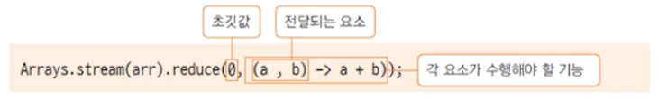

# 내부 클래스, 람다식, 스트림 3

## 1. 스트림(stream)

**자료의 대상과 관계 없이 동일한 연산을 수행**

* 배열, 컬렉션을 대상으로 동일한 연산을 수행 함
* 일관성 있는 연산으로 자료의 처리를 쉽고 간단하게 함

**한 번 생성하고 사용한 스트림은 재사용 할 수 없음**

* 자료에 대한 스트림을 생성하여 연산을 수행하면 스트림은 소모됨
* 다른 연산을 위해서는 새로운 스트림을 생성해야 함

**스트림 연산을 기존 자료를 변경하지 않음**

* 자료에 대한 스트림을 생성하면 별도의 메모리 공간을 사용하므로 기존 자료를 변경하지 않음

**스트림 연산은 중간 연산과 최종 연산으로 구분됨**

* 스트림에 대해 중간 연산은 여러 개 적용될 수 있지만 최종 연산은 마치막에 한 번만 적용됨
* 최종 연산이 호출되어야 중간 연산의 결과가 모두 적용됨 => **지연 연산**


**예시**

```java
public class IntArrayTest {
	public static void main(String[] args) {
		int[] arr = {1,2,3,4,5};
		
		//일반적인 스트림 사용
		int sum = Arrays.stream(arr).sum();
		System.out.println(sum); //15
		
		//한 번 생성하고 사용한 스트림은 재사용 할 수 없음
		IntStream stream = Arrays.stream(arr); //스트림 생성
		int sumStream = stream.sum(); //스트림 사용
		//int count = (int) stream.count(); //스트림 재사용으로 오류 발생
		int count = (int) Arrays.stream(arr).count(); //스트림 재생성하면 정상 작동
		System.out.println(sumStream); //15
		System.out.println(count); //5
	}
}
```

```java
import java.util.ArrayList;
import java.util.List;
import java.util.stream.Stream;

public class ArrayListTest {
	public static void main(String[] args) {
		List<String> sList = new ArrayList<String>();
		sList.add("Tomas");
		sList.add("james");
		sList.add("Edward");
		
		Stream<String> stream = sList.stream();
		stream.forEach(s -> System.out.println(s)); //Tomas james Edward
		
		sList.stream().sorted().forEach(s -> System.out.println(s)); //Edward Tomas james
		
		
	}
}
```


**reduce() 연산**

* 정의된 연산이 아닌 프로그래머가 직접 지정하는 연산을 적용
* 최종 연산으로 스트림의 요소를 소모하며 연산 수행
* 배열의 모든 요소의 합을 구하는 reduce() 연산



* 두 번째 요소로 전달되는 람다식에 따라 다양한 기능을 수행


**reduec로 가장 긴 문자열 반환하기**

```java
import java.util.Arrays;
import java.util.function.BinaryOperator;

class CompareString implements BinaryOperator<String>{
	@Override
	public String apply(String s1, String s2) {
		if(s1.getBytes().length >= s2.getBytes().length)
			return s1;
		else return s2;
	}
}

public class ReduceTest {
	public static void main(String[] args) {
		String[] greeting = {"안녕하세요~~~~~~~~", "hello", "Good Moring", "반갑습니다"};
		
		//구현부를 만들어서 사용하기
		String str1 = Arrays.stream(greeting).reduce("", (s1, s2) ->{
			if(s1.getBytes().length >= s2.getBytes().length)
				return s1;
			else return s2;
		});
		System.out.println(str1);//안녕하세요~~~~~~~~
		
		//BinaryOperator로 구현부 만들기
		String str2 = Arrays.stream(greeting).reduce(new CompareString()).get();
		System.out.println(str2);//안녕하세요~~~~~~~~
	}
}
```

