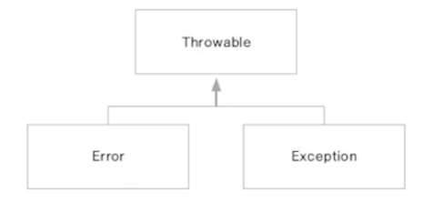
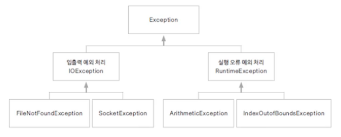

# 예외 처리

## 1. 오류란 무엇인가요?

* **컴파일 오류**: 코드 작성 중 발생하는 문법적 오류
* **실행 오류**: 실행 중인 프로그램이 의도하지 않은 동작을 하거나 중지되는 오류

* 실행 오류로 인한 비정상 종료는 서비스 운영에 치명적
* 오류가 발생할 경우 로그를 남겨 원인을 찾아야 함
* 자바는 예외 처리를 통해 프로그램의 비정상 종료를 막고 log를 남길 수 있음


## 2. 오류와 예외 클래스

* **시스템 오류(Error)**: 가상 머신에서 발생, 프로그래머가 처리할 수 없음

ex) 동적 메모리가 없는 경우, 스택 오버 플로우 등

* **예외(Exception)**: 프로그램에서 제어할 수 있는 오류

ex) 읽어 들이려는 파일이 존재하지 않는 경우, 네트워크 연결이 끊어진 경우



**예외 클래스의 종류**

* 모든 예외 클래스의 최상위 클래스는 Exception
* 다양한 예외 클래스가 제공됨




```java
import java.io.FileInputStream;
import java.io.FileNotFoundException;
import java.io.IOException;

public class ExceptionTest {
	public static void main(String[] args) {
		FileInputStream fis = null;
		
		try {
			fis = new FileInputStream("a.txt");
		} catch (FileNotFoundException e) {
			System.out.println(e);
		} finally {
			try {
				fis.close();
			} catch (IOException e) {
				e.printStackTrace();
			}
			System.out.println("finally");
		}
		System.out.println("end");
	}
}

/*결과
finally
end
*/
```


## 3. try-with-resources문

* 리소스를 자동 해제하도록 제공해주는 구문
* 자바 7부터 제공
* close()를 명시적으로 호출하지 않아도 try{} 블록에서 열린 리소스는 모두 자동 해제됨
* 단, 해당 리소스가 AutoCloseable을 구현해야 함

```java
public class AutoCloaseObj implements AutoCloseable {
	@Override
	public void close() throws Exception {
		System.out.println("close()");
	}
}
```

```java
public class AutoCloseTest {
	public static void main(String[] args) {
		try(AutoCloaseObj obj = new AutoCloaseObj()){
			throw new Exception(); //강제로 예외 처리
		} catch (Exception e) {
			System.out.println("exection");
		}
	}
}

/* 결과
close()
exection
*/
```


## 4. 예외 처리 미루기

* 메서드 선언부에  throws를 사용하여 예외처리 미루기 가능
* 예외가 발생한 메서드에서 예외 처리를 하지 않고 메서드를 호출한 곳에서 예외 처리 한다는 의미
* main()에서 throws를 사용하면 가상머신에서 처리한다


## 5. 사용자 정의 예외

* JDK에서 제공되는 예외 클래스 외에 사용자가 필요에 의해 예외 클래스를 정의하여 사용
* 기존 JDK 예외 클래스 중 가장 유사한 클래스에서 상속
* 기본적으로 Exception에서 상속 가능

```java
public class IDFormatException extends Exception {
	public IDFormatException (String message) {
		super(message);
	}
}
```

```java
public class IDFormatTest {
	private String userID;
	
	public String getUserID() {
		return userID;
	}

	public void setUserID(String userID) throws IDFormatException {
		if(userID == null) {
			throw new IDFormatException("아이디는 null일 수 없습니다.");
		} else if(userID.length() < 8 || userID.length() > 20) {
			throw new IDFormatException("아이디는 8자 이상 20자 이하로 쓰세요.");
		}
		this.userID = userID;
	}

	public static void main(String[] args) {
		IDFormatTest idTest = new IDFormatTest();
		String userID = null;
		
		try {
			idTest.setUserID(userID);
		} catch (IDFormatException e) {
			System.out.println(e); //exception.IDFormatException: 아이디는 null일 수 없습니다.
		}
		
		userID = "1234567";
		try {
			idTest.setUserID(userID);
		} catch (IDFormatException e) {
			System.out.println(e); //exception.IDFormatException: 아이디는 8자 이상 20자 이하로 쓰세요.
		}		
	}
}
```

