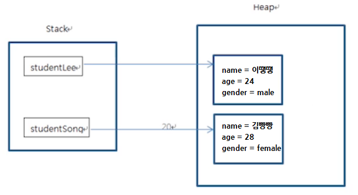

[Day 1]

## 자바의 장점

1. 플랫폼 독립성: 플랫폼(Windows, Rinux, Mac 등)에 영향을 받지 않으므로 다양한 환경에서 사용 가능

  2. 객체 지향 언어이기 때문에 유지보수가 쉽고 확장성이 좋음

  3. 프로그램이 안정적이다

  4. 풍부한 기능을 제공하는 오픈소스다(JDK)


[Day 2]

## 음의 정수 표현

* 양수의 2의 보수를 취한 후 1을 더하여 음수를 표현


[Day 4]

## 상수(final)

* 변하지 않는 값
* 한 번 값을 넣으면 다른 값을 대입할 수 없다


## 형 변환(type conversion)

* 변수에 다른 자료형의 값이 대입되는 경우 형 변환 발생
* **묵시적 형 변환**

\- 변환되는 자료형을 명시할 필요 없음

\- 작은 수에서 큰 수로, 덜 정밀한 수(정수)에서 더 정밀한 수(실수)로 대입되는 경우

* **명시적 형 변환**

\- 변환되는 자료형을 명시해야 하며 **자료의 손실이 발생할 수 있다**

\- 큰 수에서 작은 수로, 더 정밀한 수에서 덜 정밀한 수로 대입되는 경우

* 자료형 크기 비교

\- 정수형: byte(1byte) < short(2byte) = char(2byte, 문자형) < int(4byte) < long(8byte) 

\- 실수형: float(4byte) < double(8byte)


[Day 5]

## 증가 감소 연산자

* 1만큼 더하거나 1만큼 뺄 때 사용하는 연산자
* 항의 앞/뒤 위치에 따라 연산의 결과가 달라짐에 주의

```java
int val;
int num = 0;

val = ++num; //num 값이 1증가한 후 val 변수에 num값을 대입, val = 1, num = 1
val = num++; //val 변수에 num 값을 대입한 후 num 값이 1증가, val = 1, num = 2
val = --num; //num 값이 1감소한 후 val 변수에 num값을 대입, val = 1, num = 1
val = num--; //val 변수에 num 값을 대입한 후 num 값이 1감소, val = 1, num = 0
```


## 단락 회로 평가(short circuit evaluation)

* 논리 연산자를 사용하는 연산에서 결과가 확정될 경우 뒤의 연산은 생략한다

\- 논리 곱(&&)은 앞의 항이 false이면 뒤의 항의 결과를 평가하지 않아도 false이므로 생략

\- 논리 합(||)은 앞의 항이 true이면 뒤 항의 결과를 평가하지 않아도 true이므로 생략


[Day 8]

## 객체지향 프로그래밍

<a href="https://ko.wikipedia.org/wiki/%EA%B0%9D%EC%B2%B4_%EC%A7%80%ED%96%A5_%ED%94%84%EB%A1%9C%EA%B7%B8%EB%9E%98%EB%B0%8D" target="_blank">위키백과-객체 지향 프로그래밍</a>

\-  컴퓨터 프로그래밍 패러다임 중 하나

\- 프로그램을 명령어의 목록으로 보는 시각에서 벗어나 객체 간의 상호작용으로 구상

 

#### 객체지향 프로그래밍 구성요소

* 클래스(Class)

\- 한 집단의 속성(attribute)과 행위(behavior)를 정의한 것

\- 객체지향 프로그램의 기본적인 사용자 정의 데이터형

\- 각각의 클래스는 독립적으로 디자인해야 한다

* 객체(Object)

\- 클래스의 인스턴스(실제로 메모리상에 할당된 것)

\- 고유의 속성(attribute)을 가지며 클래스에서 정의한 행위(behavior)를 수행할 수 있다

* 메서드(Method)

\- 객체에 명령을 내리는 메시지

\- 객체 간의 통신에도 사용


#### 객체지향 프로그래밍 특징

* 추상화

\- 불필요한 정보는 숨기고 중요한 정보만을 표현함으로써 프로그램을 간단히 만드는 것

\- 캡슐화: 접근 제어를 통해서 자료의 세부 정보를 은닉, 인위적 변형으로 인한 오류 방지

<a href="https://ko.wikipedia.org/wiki/%EC%BA%A1%EC%8A%90%ED%99%94" target="_blank">위키백과-캡슐화</a>

* 상속

\- 새로운 클래스가 기존 클래스의 속성과 메서드를 이용할 수 있게 한다

\- 상속을 통해 프로그램의 요구에 맞추어 클래스를 수정할 수 있고 클래스 간의 종속 관계를 형성함으로써 객체를 조직화할 수 있다

* 다형성

\- 한 요소에 여러 개념을 넣어 놓는 것

\- 오버라이딩: 같은 이름의 메소드가 여러 클래스에서 다른 기능을 하는 것

\- 오버로딩: 같은 이름의 메소드가 매개변수나 자료형에 따라서 다른 기능을 하는 것

* 동적 바인딩

\- 필요할 때마다 동적으로 메모리를 생성하고, 필요 없는 메모리는 제거

\- 작은 메모리로 큰 프로그램을 실행할 수 있지만, 정적 바인딩에 비해 프로그램 속도가 느리다


## 함수와 스택 메모리

* 스택 메모리

\- 함수가 호출될 때 사용하는 메모리

\- 함수의 기능 수행이 끝나면 자동으로 반환

```java
//함수 만들기
public class FunctionTest {
	public static void main(String[] args) {
		int num1 = 10;
		int num2 = 30;
		
		int sum = addNum(num1, num2);
		System.out.println(sum);
	}
	
	public static int addNum(int n1, int n2) {
		int result = n1 + n2;
		return result;
	}
}
```


[Day 9]

## 인스턴스와 힙(heap) 메모리

* 인스턴스

\- 클래스가 메모리에 생성된 것

\- 하나의 클래스 코드에서 여러 개의 인스턴스를 생성

\- 힙(heap) 메모리에 생성됨

\- 각 인스턴스는 메모리에 개별적으로 생성됨



* 힙 메모리

\- new 예약어를 통해 메모리 생성

\- garbage collecter를 통해 메모리 제거


## 참조 변수와 참조 값

* 참조 변수: 인스턴스 생성 시 선언하는 변수
* 참조 값: 인스턴스가 생성되는 힙 메모리 주소

```java
Student student = new Student(); //student가 참조 변수
System.out.println(student); //힙 메모리의 주소 값 반환(참조 값)
```


## 용어 정리

* 객체 - 객체 지향 프로그램의 대상, 클래스의 인스턴스
* 클래스 - 한 집단의 속성과 행위를 정의한 것
* 인스턴스 - 클래스가 메모리에 생성된 것
* 멤버 변수 - 클래스의 속성
* 메서드 - 객체에 명령을 내리는 메시지
* 참조 변수 - 인스턴스 생성 시 선언하는 변수
* 참조 값 - 인스턴스가 생성되는 힙 메모리 주소


## 생성자

* 인스턴스를 초기화하는 명령어 집합
* 생성자의 이름은 클래스의 이름과 같다
* **메소드가 아니므로 상속되지 않으며** 리턴 값이 없다

* 생성자를 아예 만들지 않으면 디폴트 생성자 자동 생성


[Day 10]

## 기본 자료형과 참조 자료형

<a href="https://sublivan.tistory.com/4" target="_blank">기본자료형 & 참조자료형</a>


**기본 자료형(primitive data type)**

* 자바 컴파일러에 의해 해석되는 자료형
* 스택(Stack) 메모리에 저장
* 사용하기 전에 반드시 선언(Declared)되어야 함

- 8가지를 미리 정의하고 제공
- OS(운영체제)에 따라 자료형의 길이가 변하지 않는다
- 비객체 타입이므로 null 값을 가질 수 없다. 만약 null을 넣고 싶다면 Wrapper Class를 활용해야 한다.


**참조 자료형 (reference data type)**

* 기본형을 제외한 모든 자료형
* JAVA 최상위 클래스인 Object 클래스를 상속
* 클래스 타입(class type), 인터페이스 타입(interface type), 배열 타입(array type), 열거 타입(enum type) 등 이 있다
* 빈 객체를 의미하는 Null이 존재
* 문법상으로는 에러가 없지만 실행시켰을 때 에러가 나는 런타임 에러가 발생
  - 예) 객체나 배열을 Null 값으로 받으면 NullPointException이 발생하므로 변수 값을 넣어야 한다.
* Heap 영역에 생성


## 정보은닉

**private 접근 제어자**

* 클래스의 외부에서 내부의 멤버 변수나 메서드에 접근하지 못하게 한다
* 멤버 변수나 메서드를 외부에서 수정하지 못하도록 하여 오류를 줄일 수 있음
* 필요한 경우 get(), set() 메서드를 통해 값을 변경하도록 할 수 있음


[Day 12]

## static 변수

```java
//사용 형식: static 자료형 변수명
static int num;
```

* 여러 개의 인스턴스가 같은 메모리의 값을 공유하기 위해 사용

* 프로그램이 메모리에 적재(load)될 때 데이터 영역의 메모리에 생성(인스턴스가 생성될 때x, heap영역 x)
* 클래스 변수라고도 한다
* 인스턴스 생성과 관계없이 클래스 이름으로 직접 참조

```java
//static변수
Student.serialNum = 100; //serialNum이 static변수

//멤버변수(인스턴스변수)
Student stu = new Student();
stu.serialNum = 100;
```


## static변수 vs 인스턴스 변수


**Tip.스태틱 메서드 안에서는 멤버 변수를 사용할 수 없다**

```java
public class Student {
	static int serialNum = 10000;
	int studentID;
	
	public static int getSerialNum() {
		this.studentID = 10; //static메서드 안에서는 멤버 변수 사용 불가능
		return serialNum;
	}
}
```


## 3. 변수의 유효 범위

**지역 변수(로컬 변수)**

* 선언 위치: 함수 내부에 선언
* 사용 범위: 함수 내부에서만 사용
* 메모리: 스택
* 생성과 소멸: 함수가 호출될 때 생성, 함수 동작 완료 후 소멸

**멤버 변수(인스턴스 변수)**

* 선언 위치: 클래스 내부에 선언
* 사용 범위: 클래스 내부에서 사용, private이 아니면 참조 변수로 다른 클래스에서 사용 가능
* 메모리: 힙
* 생성과 소멸: 인스턴스가 생성될 때 힙에 생성, 가비지 컬렉터에 의해 소멸

**static 변수(클래스 변수)**

* 선언 위치: static 예약어를 사용해 클래스 내부에 선언
* 사용 범위: 클래스 내부에서 사용, priavate이 아니면 클래스 이름으로 다른 클래스에서 사용 가능
* 메모리: 데이터 영역
* 생성과 소멸: 프로그램이 시작할 때 상수와 함께 데이터 영역에 생성, 프로그램이 끝나고 메모리를 해제할 때 소멸


## static응용: singleton 패턴

* 인스턴스를 하나만 만들어야 하는 경우에 사용!

```java
public class Company {
	//내부에서 인스턴스 생성
	private static Company instance = new Company();
	
	//외부에서 생성자를 사용하지 못하게 한다
	private Company() {};
	
	//내부에서 생성한 인스턴스를 외부에서 사용할 수 있도록 해주는 메서드
	public static Company getInstance() {
		return instance;
	}
}
```

```java
public class CompanyTest {
	public static void main(String[] args) {
		Company c1 = Company.getInstance();
		Company c2 = Company.getInstance();
		
		System.out.println(c1==c2);//true => 같은 인스턴스를 가르킨다
	}
}
```


[Day 17]

## 접근 제어자(Access Modifier, 접근 제한자, 접근 지정자)

* 변수나 메소드의 사용 권한을 설정
* private: 클래스 내에서만 사용 가능 => 클래스
* default: 같은 패키지의 클래스에서만 사용 가능 => 패키지
* protected: 같은 패키지 혹은 상속 받은 클래스만 사용 가능 => 패키지 + 상속
* public: 모든 클래스에서 사용 가능 => 모든


## 상속에서 클래스 생성 과정

* 하위 클래스의 인스턴스가 생성될 때 상위 클래스의 인스턴스가 먼저 생성된다
* 상위 클래스의 생성자가 호출된 후 하위 클래스의 생성자가 호출된다
* 하위 클래스의 생성자에서는 무조건 상위 클래스의 생성자가 호출되어야 한다

=> 따로 구현하지 않으면 컴파일러가 상위 클래스의 기본 생성자를 호출하는 super()를 넣어준다

* 만약 상위 클래스에 기본생성자가 없을 경우 하위 클래스는 명시적으로 상위 클래스를 호출해야 한다


**super 예약어**

* 하위 클래스가 상위 클래스에 접근할 때 사용

* this가 자기 자신의 인스턴스 주소를 가지는 것처럼 super는 하위 클래스가 상위 클래스에 대한 주소를 가진다


##  캐스팅(Casting, 형변환)

* 타입을 변환하는 것
* 자바의 상속 관계에 있는 부모와 자식 클래스 간에는 서로 간의 형변환이 가능


**업캐스팅**

* 자식 클래스의 객체가 부모 클래스 타입으로 형변환 되는 것
* 묵시적 형 변환(타입을 명시하지 않아도 됨)
* 부모 클래스의 멤버 변수와 메서드만 사용 가능

**다운캐스팅**

* 업캐스팅된 것을 다시 원상태로 돌리는 것

* **다운캐스팅할 때는 타입을 명시적으로 지정해줘야 한다**

```java
//부모 클래스
class Person{
	String name;
	Person(String name){
		this.name = name;
	}
}

//자식 클래스
class Student extends Person{
	String check;
	Student(String name){
		super(name);
	}
}

public class Main{
	public static void main(String[] args){
		Person p = new Student("홍길동"); //업캐스팅
        p.check = "컴파일 에러 발생";	// 컴파일 에러 발생
        
		Student s = (Student)p;	// 다운캐스팅
		s.name = "김유신";
		s.check = "check!";
	}
}
```

**가상 메서드(virtual method)**

* 객체의 변수나 메서드의 참조는 그 타입에 따라 이루어 지지만, 가상 메서드는 타입과 상관없이 실제 생성된 인스턴스의 메서드가 호출된다

* 자바는 모든 메서드가 가상 메서드이다

```java
Customer vc = new VIPCustomer(); //Customer타입의 VIPCustomer인스턴스 생성
vc.calcPrice(10000); //메서드 실행 시 
// 메서드가 재정의 되지 않았으면 타입(Customer)의 메서드가 실행된다
// 메서드가 재정의 되었으면 인스턴스(VIPCustomer)의 메서드가 실행된다
```


**Tip. 업캐스팅한 경우**

* 자식 클래스에만 정의된 멤버 변수, 메서드는 사용 불가
* 자식 클래스에서 오버라이드한 메서드는 자식 클래스의 메서드가 사용됨


[Day 19]

## 추상 클래스

* 추상 메서드를 포함한 클래스
* 추상 메서드는 구현코드 없이 메서드의 선언만 있음

```java
abstract in add(int x, int y); //추상 메서드 O
abstract in add(int x, int y) { }; //구현부({ })가 있으면 추상 메서드 X
```

* abstract 예약어 사용
* 추상 클래스는 인스턴스화(new)할 수 없음


**구상 클래스**

* 클래스내의 메소드가 모두 구현된 클래스
* 인스턴스화(new)할 수 있음


[Day 20]

**템플릿 메서드 패턴**

* java 디자인 패턴 중 하나
* 일부분을 서브 클래스로 캡슐화해 전체 업무 구조는 바꾸지 않으면서 특정 단계의 동작만을 바꾸는 패턴
* 추상 클래스와 구상 클래스를 활용해 기능의 흐름을 정의한다
* 추상 클래스로 선언된 상위 클래스에서 템플릿 메서드를 활용하여 전체적인 흐름을 정의한다

​	\-> 하위 클래스에서 구현되어야 하는 부분은 추상 메서드로 선언

​	-> 공통으로 사용하는 기능은 일반 메서드로 선언(하위 클래스에서 재정의 하면 안되는 경우 final로 선언)

* 프레임워크에서 많이 사용되는 설계 패턴

<a href="https://niceman.tistory.com/142" target="_blank">템플릿 메서드 패턴 참고</a>

<a href="https://www.crocus.co.kr/1531" target="_blank">템플릿 메서드 패턴 참고2</a>


**후크(Hook) 메서드**

* 추상 클래스에서 빈 구현부로 정의된 메서드
* 하위 클래스에서 선택적으로 오버라이드해서 사용할 수 있음


**Tip. final예약어**

* final 변수는 오직 한 번만 값을 할당할 수 있다.
* final 메서드는 하위 클래스에서 오버라이딩할 수 없다
* final 클래스는 상속되지 않는다


