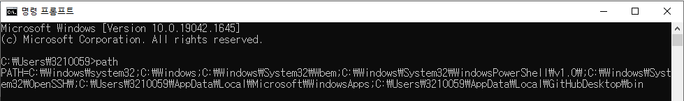

## 환경변수

* 프로세스가 컴퓨터에서 동작하는 방식에 영향을 미치는, 동적인 값들의 모임이다.

## 환경변수를 설정하는 이유

* 운영체제가 명령을 수행하기 위한 탐색 경로 설정 => 어느 경로에서 명령어를 던져도 같은 파일이 실행된다!
* 운영체제가 명령을 받았을 때의 동작 순서

1. 현재 위치한 디렉토리에 해당 명령어가 있는지 확인
2. Path라는 환경변수가 가지고 있는 모든 경로에 대해서 입력된 명령어가 존재하는지 확인 
3. 명령어를 발견하지 못하면 에러 메세지를 출력

## 환경 변수의 일반적인 사용 사례:

1. **소프트웨어 경로 지정**: 많은 소프트웨어가 설치될 때 `PATH` 환경 변수에 자신의 실행 파일 경로를 추가합니다. 이렇게 하면 사용자가 커맨드 라인에서 해당 소프트웨어를 직접 실행할 수 있게 됩니다.
2. **소프트웨어 설정**: 특정 소프트웨어는 환경 변수를 사용하여 사용자의 기본 설정을 저장하기도 합니다. 예를 들어, 데이터베이스 연결 문자열이나 API 키 같은 민감한 정보를 저장하는 데 사용될 수 있습니다.
3. **운영 체제 설정**: 운영 체제는 시스템의 기본 설정을 환경 변수에 저장하여, 애플리케이션이나 서비스가 해당 정보를 쉽게 조회할 수 있게 합니다. 예를 들어, `TEMP` 또는 `TMP` 환경 변수는 일시적인 파일들을 저장할 위치를 지정합니다.

## 환경변수 확인

* 명령 프롬프트에서 path 입력

## 참고

<a href="https://ko.wikipedia.org/wiki/%ED%99%98%EA%B2%BD_%EB%B3%80%EC%88%98" target="_blank">위키백과(환경변수)</a>

<a href="https://www.lifencoding.com/software/26?p=1" target="_blank">환경변수를 설정하는 이유(블로그)</a>

ChatGPT-4.0

## 보완/복습

* 2022.09.15 복습
* 2023.10.10 복습
