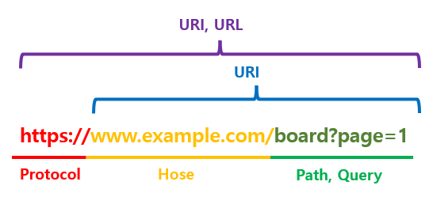

## URI(Uniform Resource Identifier, 통합 자원 식별자)

* 리소스의 고유한 식별자
* URL(Uniform Resource Locator)과 URN(Uniform Resource Name)으로 구분

## URL(Uniform Resource Locator, 통합 자원 주소자)

*  리소스의 위치를 정확하게 지정하는 형식
*  URL의 구성 요소
   - 프로토콜(Protocol): 리소스에 접근하기 위한 통신 규약을 지정(http, https 등)
   - 호스트(Host): 리소스가 위치한 서버의 도메인 이름이나 IP 주소
   - 포트(Port): 웹 서버와 통신할 때 사용되는 포트 번호 - ex) 80(HTTP), 443(HTTPS)
   - 경로(Path): 웹 서버 내에서 리소스의 위치를 나타내는 부분, 일반적으로 파일 경로 또는 디렉토리 경로로 표현
     - ex) `https://example.com/`home
   - 쿼리(Query): 웹 서버에 전달되는 매개변수
     - ex) `https://example.com/`?id=123
   - 프래그먼트(Fragment): HTML 문서 내에서 특정 위치나 요소를 가리키는 역할, 주로 웹 페이지의 내부 북마크를 만들 때 사용

## URN(Uniform Resource Name, 통합 자원 명칭)

* 리소스의 위치가 아니라 리소스의 이름을 나타내며, 리소스가 이동하더라도 이름은 일정하다
  * ex) urn:isbn:0451450523 => 특정 ISBN(국제 표준 도서 번호)을 가리키는 책의 이름

## URI, URL, URN의 관계

## URL 와URI 구분

- https://example.com의 경우 [https://example.com](https://example.com/) 이라는 서버를 나타내기 때문에 URL이면서 URI
- https://example.com/home 의 경우 example 서버의 home이라는 경로를 의미하기에 URL 이면서 URI
- https://example.com/one/two/abc.html 의 경우 example 서버의 one/two 디렉토리 아래의 abc.html을 가리키므로 URL이면서 URI
- example.com 의 경우 프로토콜(https 등)이 없으므로 URI 이지만 URL은 아님

## 정리

* **URI는 네트워크 상에서 자원의 위치를 식별할 수 있는 값이며, URL은 네트워크 상에서 자원의 위치를 나타내는 값입니다. URI가 더 포괄적인 개념으로 URL을 포함하고 있습니다.** 예를들어 https://example.com은 URI이면서 URL입니다. 하지만 프로토콜을 나타내는 https를 제거하면 example.com은 URI이지만 URL은 아닙니다.

## 참고

* <a href="https://kotlinworld.com/96" target="_blank">리소스 구분 관점에서 보는 URI, URL, URN의 차이</a>
* [URI와 URL, 어떤 차이점이 있나요?](https://www.elancer.co.kr/blog/view?seq=74)
* ChatGPT-4.0

## 보완/복습

* 2023.10.31 보완
