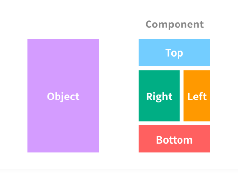

## 컴포넌트(Component)란?

* 시스템에서 독립적인 업무 또는 기능을 수행하는 모듈
* 교체 가능한 부품과 같아 소프트웨어 재사용성을 높인다
* 컴포넌트 기반 프로그래밍을 하면 마치 레고 블록처럼 이미 만들어진 컴포넌들을 조합하여 화면을 구성할 수 있다

## 컴포넌트의 조건

* 컴포넌트는 구현, 명세화, 패키지화, 그리고 배포 될 수 있어야 한다

1) 소스코드가 아닌 실행코드 기반으로 재사용할 수 있도록 구현 완료되어 있어야 한다.

2) 용도, 유형, 기술표준과 인터페이스등에 대한 정보가 명세화(specification) 되어 있어야 한다.
3) 교체가능한 컴포넌트를 개발하기 위해 표준(standard)을 준수하여 개발해야 한다.
4) 배포될 때 관련 문서와 코드들이 독립적인 단위로 패키지화(packaing)되어 있어야 한다.
5) 사용자가 필요한 기능만을 패키지한 컴포넌트를 재사용할 수 있도록 독립적으로 배포(deployment) 가능해야 한다.

## 모듈 VS 컴포넌트

* 컴포넌트는 주로 소프트웨어 시스템의 큰 부분을 나타내며 독립적인 기능을 제공합니다.
  * **예시:** 사용자 인증 컴포넌트, 데이터베이스 연결 컴포넌트, UI 컴포넌트 (버튼, 폼 등) 등

* 모듈은 코드의 구성과 재사용을 위한 작은 단위로 사용되며, 보통 컴포넌트 내부에서 기능을 구현하거나 라이브러리로 사용됩니다.
  * **예시:** 자바스크립트의 ES6 모듈, Python의 모듈 (import 및 from을 사용하여 가져옴) 등

## 정리

* 컴포넌트 란?

**컴포넌트는 시스템에서 독립적인 업무 또는 기능을 수행하는 모듈을 말합니다. 이는 소프트웨어를 교체 가능한 부품처럼 사용하여 소프트웨어의 재사용성을 높이고 유지보수가 용이하게 만듭니다.** 

* 모듈과 컴포넌트의 차이

컴포넌트는 주로 소프트웨어 시스템의 큰 부분을 나타내며 독립적인 기능을 제공합니다. 모듈은 코드의 구성과 재사용을 위한 작은 단위로 사용되며, 보통 컴포넌트 내부에서 기능을 구현하거나 라이브러리로 사용됩니다.

## 참고

* <a href="https://doubled.tistory.com/22" target="_blank">모듈과 컴포넌트 차이</a>

* <a href="https://cluster-taek.tistory.com/18" target="_blank">모듈과 컴포넌트 차이2</a>

* <a href="https://hanamon.kr/%EC%BB%B4%ED%8F%AC%EB%84%8C%ED%8A%B8-component%EB%9E%80/" target="_blank">컴포넌트란 무엇인가?</a>

* <a href="https://thefif19wlsvy.tistory.com/24" target="_blank">컴포넌트란 무엇인가?2</a>

* ChatGPT-4.0

## 보완/복습

* 2023.11.06 복습
