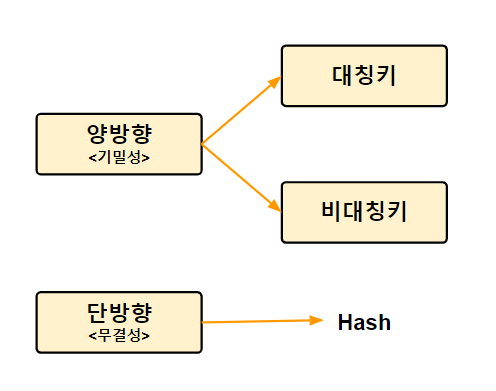

## 단방향 암호화

* 암호문을 복호화 할 수 없다
* 대표적으로 Hash방식을 사용한다

## 양방향 암호화

* 암호문을 복호화 할 수 있다
* 대표적으로 대칭키(비공개키) 방식과 비대칭키(공개키) 방식이 있다

## 대칭키 암호화

* 암호화, 복호화 모두 동일한 키를 사용 => 키를 비공개
* 장점: 속도가 빠르다
* 단점: 송신 측에서 수신 측에 암호 키를 전달하는 과정에서 노출 우려가 있다

* 사용 사례 : DES, AES

## 비대칭키 암호화

* 암호화 복호화에 서로 다른 키를 사용 => 키를 공개

* 장점: 안전성이 높다(키 노출 우려가 적음)
* 단점: 속도가 느리다

* 사용 사례 : RSA

## 정리

* 암호화 방식은 대표적으로 단방향 암호화 방식과 양방향 암호화 방식으로 나눌 수 있습니다. **단방향 암호화 방식은 한 번 암호화하면 복호화 할 수 없는 방식으로 사용자 패스워드를 암호화할 때 주로 사용합니다. 양방향 암호화 방식은 암호화된 자료가 복호화 가능한 방식으로 데이터를 암호화하여 주고 받을 때 주로 사용합니다.** 양방향 암호화 방식에는 대칭키 암호화 방식과 비대칭키 암호화 방식이 있습니다. **대칭키 암호화 방식은 송식 측과 수신 측이 동일한 키를 사용해 복호화하는 방식으로 속도가 빠르지만 전송 중에 키가 노출될 수 있어 안전성이 낮습니다. 비대칭키 암호화 방식은 송식 측과 수신 측이 다른 키를 사용해 복호화하는 방식으로 속도가 느리지만 안전성이 높습니다.**

## 참고

<a href="https://javaplant.tistory.com/26" target="_blank">암호화 개념 정리</a>

