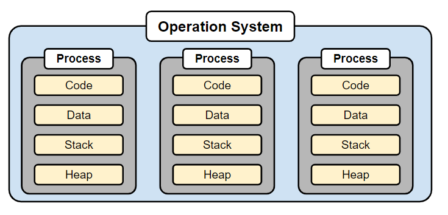

## 프로세스(Process)란?

* 운영체제로부터 자원을 할당 받는 작업의 단위

* 각각 독립된 메모리 영역(Code, Data, Stack, Heap의 구조)을 할당 받음
* 프로세스당 최소 1개의 스레드(메인 스레드)를 보유

## 스레드(Thread)란?

* 프로세스가 할당 받은 자원을 이용하는 실행 단위
* 프로세스 내에서 Stack 영역만 각각 따로 할당 받고 나머지 영역은 공유 => 메모리 공유

## 멀티 프로세스

* 하나의 응용프로그램을 여러 개의 프로세스로 구성하여 프로세스가 각각 작업(Task)을 처리하도록 하는 것
* 장점

\- 하나의 프로세스에 문제가 발생해도 다른 프로세스에 영향이 확산되지 않는다

* 단점

\- 프로세스는 각각 독립된 메모리 영역을 할당 받았기 때문에 Context Switching 과정에서 많은 시간이 소모

\- 프로세스 사이의 어렵고 복잡한 통신 기법(IPC)

#### Context Switching

* CPU에서 여러 프로세스를 돌아가면서 작업을 처리 과정
* 동작 중인 프로세스가 대기로 바뀌면서 해당 프로세스의 상태(Context)를 보관하고, 다음 프로세스가 이전 상태를 복구하는 작업

## 멀티 스레드

* 하나의 응용프로그램을 여러 개의 스레드로 구성하고 각 스레드로 하여금 작업을 처리하도록 하는 것
* 장점

\- 프로세스를 생성하여 자원을 할당하는 동작이 줄어 자원을 효율적으로 관리

\- 작업량이 작아 Context Switching 용이

\- Stack 영역을 제외한 모든 메모리를 공유하기 때문에 통신 부담이 적어 프로그램 응답 시간 단축

* 단점

\- 하나의 스레드에 문제가 발생하면 전체 프로세스가 영향

\- 설계 및 디버깅이 어렵다

\- 자원 공유로 인한 문제가 발생할 수 있다

\- 단일 프로세스 시스템의 경우 효과를 기대하기 어렵다

## 정리

프로세스는 운영체제로부터 자원을 할당 받는 단위로 각 프로세스는 독립된 메모리 영역을 가집니다. 스레드는 프로세스로부터 자원을 할당 받는 단위로 각 스레드는 스택 영역이외의 메모리 영역을 프로세스 내에서 공유합니다. **멀티 프로세스로 처리하던 작업을 멀티 스레드로 처리하게 되면 각 스레드의 작업량이 작아 컨텍스트 스위칭이 용이하며, 스레드 간에 메모리를 공유하여 작업 효율도 증가할 수 있습니다. 하지만 하나의 스레드에 문제가 발생하면 전체 프로세스가 영향을 받을 수 있고 자원 공유로 인해 예상치 못한 문제가 발생할 수 있는 등 설계 및 디버깅 과정의 난도가 높아집니다.**

## 참고

<a href="https://gmlwjd9405.github.io/2018/09/14/process-vs-thread.html" target="_blank">프로세스와 스레드의 차이(Process vs Thread)</a>

## 보완/복습

* 2023.11.06 복습
