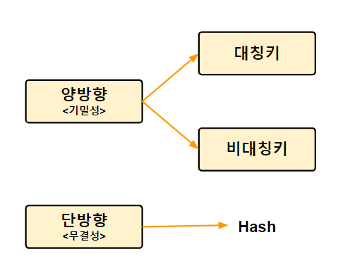

## 단방향 암호화

* 암호문을 복호화 할 수 없다
* 대표적으로 Hash방식을 사용한다
* 사용 사례 : 사용자 비밀번호

## 양방향 암호화

* 암호문을 복호화 할 수 있다
* 대표적으로 대칭키(비공개키) 방식과 비대칭키(공개키) 방식이 있다

## 대칭키 암호화

* 암호화, 복호화 모두 동일한 키를 사용 => 키를 비공개
* 장점: 속도가 빠르고 대량의 데이터 암호화에 효율적
* 단점: 송신 측에서 수신 측에 암호 키를 전달하는 과정에서 노출 우려가 있다

* 사용 사례
  * **SSL/TLS 통신:** 웹 브라우저와 서버 간의 안전한 통신을 위해 사용됩니다. 클라이언트와 서버가 대칭키를 협상하고, 이 키를 사용하여 데이터를 암호화하고 복호화합니다.
  * **디스크 암호화:** 하드 디스크 또는 파일 시스템 레벨에서 데이터를 암호화하여 저장하는 데 사용됩니다. 예를 들어, BitLocker(Windows) 또는 FileVault(Mac)와 같은 솔루션에서 사용됩니다.
  * **이메일 암호화:** 이메일 메시지를 암호화하여 안전하게 전송하는 데 사용됩니다. PGP (Pretty Good Privacy) 및 S/MIME (Secure/Multipurpose Internet Mail Extensions)은 대칭키 및 비대칭키 암호화를 혼합하여 사용하는 예시입니다.

## 비대칭키 암호화

* 암호화 복호화에 서로 다른 키를 사용 => 키를 공개

* 장점: 안전성이 높다(키 노출 우려가 적음)
* 단점: 속도가 느리다

* 사용 사례
  * **전자 서명 및 인증:** 공개 키를 사용하여 전자 서명을 생성하고, 수신자는 해당 전자 서명을 비밀 키로 복호화하여 송신자의 신원을 확인합니다. 이는 인증 및 안전한 통신에 사용됩니다.
  * **SSH 액세스:** SSH (Secure Shell) 프로토콜은 비대칭키 암호화를 사용하여 원격 서버에 안전하게 액세스하기 위해 공개 키와 비밀 키를 활용합니다.
  * **PGP 이메일 암호화:** 이메일 메시지를 보호하기 위해 공개 키와 비밀 키를 사용합니다. 송신자는 수신자의 공개 키를 사용하여 이메일을 암호화하고, 수신자는 자신의 비밀 키로 메시지를 복호화합니다.

## 정리

* 암호화 방식은 대표적으로 단방향 암호화 방식과 양방향 암호화 방식으로 나눌 수 있습니다. **단방향 암호화 방식은 한 번 암호화하면 복호화 할 수 없는 방식**으로 사용자 패스워드를 암호화할 때 주로 사용합니다. 양방향 암호화 방식은 암호화된 자료가 복호화 가능한 방식으로 데이터를 암호화하여 주고 받을 때 주로 사용합니다. 양방향 암호화 방식에는 대칭키 암호화 방식과 비대칭키 암호화 방식이 있습니다. 대칭키 암호화 방식은 송식 측과 수신 측이 동일한 키를 사용해 복호화하는 방식으로 **속도가 빠르지만 전송 중에 키가 노출될 수 있어 안전성이 낮습니다.** 비대칭키 암호화 방식은 송식 측과 수신 측이 다른 키를 사용해 복호화하는 방식으로 **속도가 느리지만 안전성이 높습니다.**

## 참고

* <a href="https://javaplant.tistory.com/26" target="_blank">암호화 개념 정리</a>

* ChatGPT-4.0

## 보완/복습

* 2023.11.06 복습

