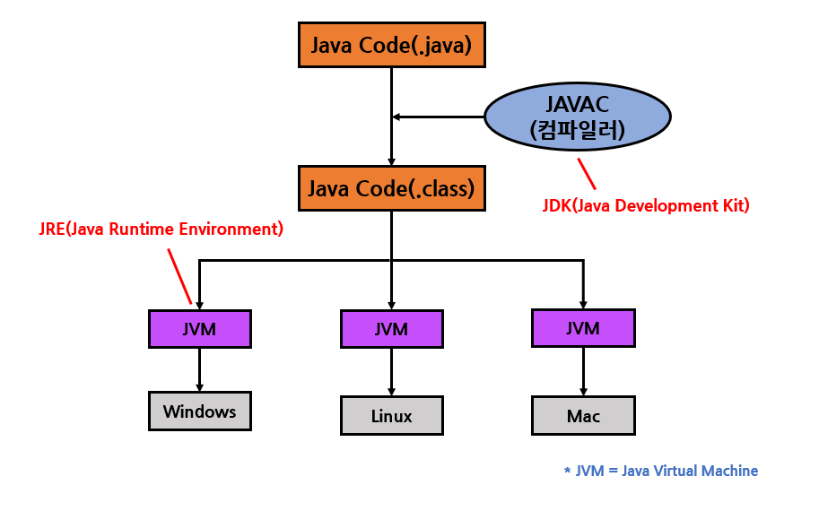

# 자바란?

## 자바의 장점*

* 플랫폼에 종속되지 않음 

  => JVM만 있으면 어느 환경에서나 실행 가능하다.

## 객체 지향 프로그래밍

* 객체: 구체적, 추상적 데이터 단위
* 객체 지향 프로그래밍: 객체를 기반으로 하는 프로그래밍

​	**절차 지향 프로그래밍**: 시간의 흐름에 따른 프로그래밍

## 객체 지향 프로그래밍의 장점*

* 재사용성이 좋다

​	- 상속을 통해 불필요한 코드의 중복을 제거한다

* 코드·버전 관리가 용이하다

​	-  코드간의 관계를 이용해 쉽게 코드를 변경할 수 있다

* 유지보수가 쉽다

​	- 프로그램 추가 수정 시 캡슐화를 통해 주변에 미치는 영향을 최소화 한다

* 신뢰성이 높다

​	- 제어자와 메서드를 통해 데이터를 보호하고 바른 값을 유지할 수 있다

​	- 코드의 중복을 제거해 불일치로 인한 오동작을 방지한다

* 자연적인 모델링이 가능하다

​	- 객체, 클래스, 속성 상속 및 다형성 등은 우리의 일상생활에서 생각하는 방식을 그대로 프로그램 언어로 표현할 수 있게 해준다

**단점**: 절차 지향 프로그래밍에 비해 속도가 느리다
