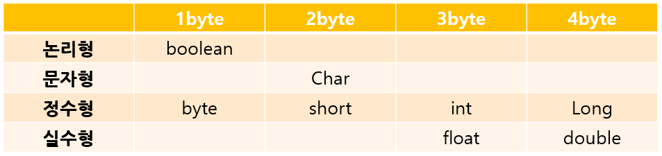

# 변수와 객체

## 변수 명명 규칙*

* 대소문자를 구분한다
* 숫자로 시작할 수 없다
* 특수문자는 '_'와 '$'만 사용할 수 있다
* 예약어를 사용할 수 없다


## 기본 자료형*

* 자바에서 기본적으로 제공되는 데이터 타입
* 각 타입마다 정해진 메모리 사이즈가 있다
* 자바에서 모든 문자는 유니코드 문자체계를 사용한다




## 참조 자료형*

* 클래스를 변수의 자료형으로 사용한다
* JDK가 제공하는 클래스(ex. String) 혹은 직접 구현한 클래스로 변수를 선언한다
* 참조 자료형으로 선언된 변수는 클래스가 생성된 후 그 주소 값을 저장한다


## 클래스

* 객체지향 프로그래밍의 가장 기본이 되는 단위
* 멤버변수와 생성자, 메서드로 구성된다
* 한 자바 파일에 여러 개의 클래스가 있을 경우 public 클래스는 하나만 있어야 하며 해당 클래스의 이름은 자바 파일의 이름과 같아야 한다
* 자바의 모든 코드는 클래스 내부에 위치해야 한다


## 클래스가 지원하는 객체 지향 프로그래밍의 세 가지 특성*

**캡슐화**

* 실제로 구현되는 부분이 외부에 드러나지 않도록 하여 정보를 은닉하는 것
* 객체가 독립적으로 역할을 할 수 있도록 데이터(속성)와 기능(메서드)을 하나로 묶어 관리한다
* 코드가 묶여있어서 오류를 줄일 수 있다
* 속성은 접근 제한자로 숨기고 메소드를 이용해 통신한다.

**상속**

* 하나의 클래스가 가진 특징(함수, 데이터)을 다른 클래스가 그대로 물려받는 것
* 기존 코드를 재활용해서 사용함으로써 코드의 재사용성을 높인다

**다형성**

- 다른 방법으로 동작하는 함수를 동일한 이름으로 호출하는 것
- 오버라이딩(Overriding) - 부모클래스의 메소드와 같은 이름을 사용하며 매개변수도 같되 내부 소스를 재정의하는 것
- 오버로딩(Overloading) - 같은 이름의 함수를 여러 개 정의한 후 매개변수를 다르게 하여 같은 이름을 경우에 따라 호출하여 사용하는 것


## 멤버변수

* 클래스에 선언한 변수를 멤버변수라고 한다
* 클래스의 속성, 특성을 나타낸다
* 모든 객체의 속성은 멤버변수에 의해 변경된다

```java
//멤버변수의 선언 형식
<접근제한자> <자료형> <변수명>;
Public String name;
```


## 생성자

* 역할: 인스턴스 변수의 초기화
* 생성자의 이름은 클래스의 이름과 같아야 한다
* 객체를 생성할 때만 호출된다
* 상속되지 않는다


## 기본 생성자

* 매개변수와 구현부가 없는 생성자
* 클래스에 생성자가 정의되지 않으면 컴파일 과정에서 기본 생성자가 자동으로 생성된다

​	=> 클래스에는 반드시 생성자가 존재한다


## 메서드

* 멤버 변수를 사용해 클래스의 기능을 구현한다

```java
//메서드의 선언 형식
<접근제한자> <반환타입> <메서드명> (<매개변수>){
	[<구현부>]
}
Public void setName(name){
	this.name = name;
}
```


## 인스턴스

* 클래스가 메모리에 생성된 상태


## 패키지

* 소스의 묶음 카테고리
* 소스를 계층구조로 관리하도록 구성한다
