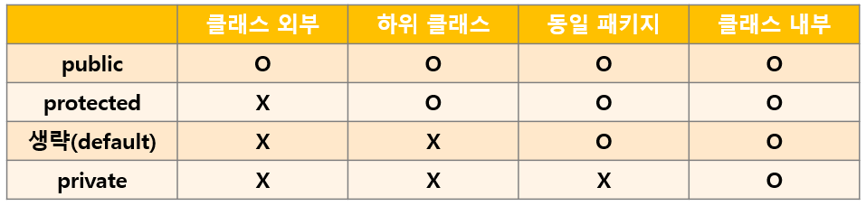

# 객체지향 프로그래밍 하기

## 오버로딩*

* 이름이 같고 매개변수가 다른 생성자, 메소드를 여러 개 만드는 것

## 정보은닉*

* 클래스 내부에서 사용할 변수나 메서드를 private으로 선언해서 외부에서 접근하지 못하도록 하는 것

* private: 자바의 접근 제한자 중 하나로 같은 클래스 내부에서만 접근 가능하도록 한다

**객체 지향 프로그래밍에서 정보은닉의 역할**

* 구현된 클래스의 세부 사항을 숨긴다
* 사용자가 메서드를 통해 데이터에 접근하도록 한다
* 코드 관리를 쉽게 한다

​	=> 구현부를 사용해 데이터의 범위, 조건 등을 제한할 수 있다 => 오류 방지

## 접근 제어자 가시성*

