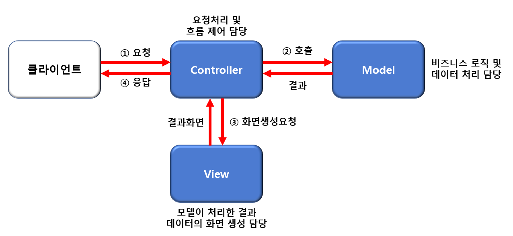
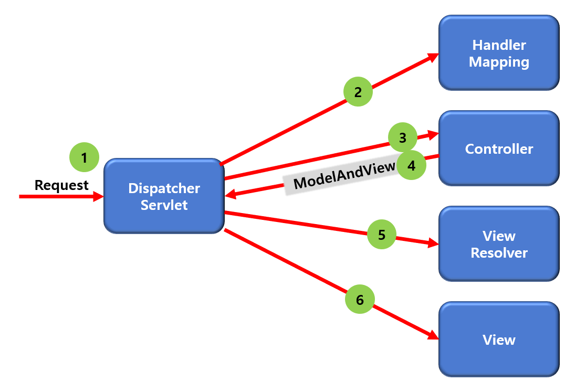

# Spring MVC 소개

## 1. MVC(Model-View-Controller)패턴의 개념

* MVC는 소프트웨어 공학에서 사용되는 아키텍처 패턴으로 MVC 패턴의 주 목적은 Business login과 Presentation logic을 분리하기 위함이다
* MVC 패턴을 사용하면, 사용자 인터페이스로부터 비지니스 로직을 분리하여 애플리케이션의 시각적 요소와 그 이면에서 실행되는 비지니스 로직을 서로 영향 없이 쉽게 고칠 수 있는 애플리케이션을 만들 수 있다

* Model: 애플리케이션의 정보(데이터, Business Logic 포함)
* View: 사용자에게 제공할 화면(Presentation Logic)
* Controller: Model과 View 사이의 상호 작용을 관리

## 2. MVC 컴포넌트 각각의 역할

**모델**

* 데이터 저장소(ex: 데이터베이스 등)와 연동하여 사용자가 입력한 데이터나 사용자에게 출력할 데이터를 다룬다
* 여러 개의 데이터 변경 작업을 하나의 작업으로 묶는 트랜잭션 업무 수행
* DAO 클래스, Service 클래스에 해당

**뷰**

* 모델이 처리한 데이터나 그 작업 결과를 사용자에게 출력하기 위해 화면 구성
* 생성된 화면은 웹 브라우저가 출력하고, 뷰 컴포넌트는 HTML과 CSS, Java Script를 사용하여 웹 브라우저가 출력할 UI를 만듦
* HTML과 JSP를 사용하여 작성할 수 있음

**컨트롤러**

* 클라이언트의 요청을 받았을 때 해당 요청에 대한 업무를 수행하는 컴포넌트를 호출
* 클라이언트가 보낸 데이터를 전달하기 쉽게 가공하여 모델에 전달
* 모델이 업무 수행을 완료하면 결과를 뷰에게 전달
* Servlet과 JSP를 사용하여 작성

## 3. Front Controller 패턴 아키텍처

**Front Controller 프로세스**

* Front Controller는 클라이언트가 보낸 요청을 받아서 공통적인 작업을 먼저 수행
* Front Controller는 적절한 세부 Controller에게 작업을 위임
* 각각의 애플리케이션 Controller는 클라이언트에게 보낼 뷰를 선택해서 최종 결과를 생성
* Front Controller 패턴은 인증이나 권한 체크와 같이 모든 요청에 대하여 공통적으로 처리해야 하는 로직이 있을 경우 클라이언트의 요청을 중앙 집중적으로 관리하고자 할 경우에 사용

## 4. Spring MVC 개념

**Spring MVC의 특징**

* Spring은 DI나 AOP 같은 기능뿐만 아니라, 서블릿 기반의 웹 개발을 위한 MVC 프레임워크를 제공
* Spring MVC는 모델2 아키텍처와 Front Controller 패턴을 프레임워크 차원에서 제공
* Spring MVC 프레임워크는 Spring을 기반으로 하고 있기 때문에 Spring이 제공하는 트랜잭션 처리나 DI 및 AOP등을 사용하기 용이함

**Spring MVC의 주요 구성 요소**

* DispatcherServlet

​	- 클라이언트의 요청을 받아서 Controller에게 클라이언트의 요청을 전달하고, 리턴한 결과값을 View에게 전달하여 알맞은 응답을 생성

* HandlerMapping

​	- URL과 요청 정보를 기준으로 어떤 핸들러 객체를 사용할지 결정하는 객체, DispatcherServlet은 하나 이상의 핸들러 매핑을 가질 수 있음

* Controller

​	- 클라이언트의 요청을 처리한 뒤, Model을 호출하고 그 결과를 DispatcherServlet에게 알려줌

* ModelAndView

​	- Controller가 처리한 데이터 및 화면에 대한 정보를 보유한 객체

* View

​	- Controller의 처리 결과 화면에 대한 정보를 보유한 객체

* ViewResolver

	- Controller가 리턴한 뷰 이름을 기반으로 Controller 처리 결과를 생성할 뷰를 결정

**Spring MVC의 주요 구성 요소의 요청 처리 과정**

