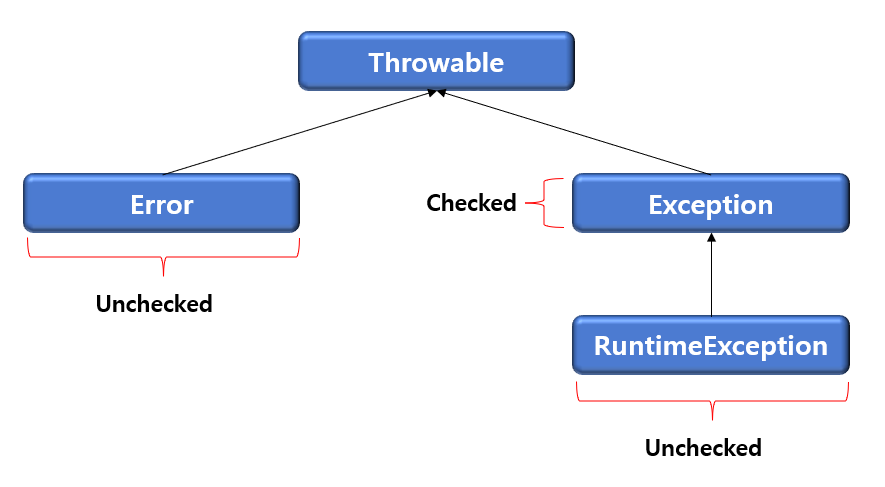

# 예외처리

## 1. Spring 예외처리 개요

 **예외처리**

* 서버에서 발생된 예외가 최종 사용자에게 전달되지 않도록 하는 것
* DAO와 Service에서 발생된 예외는 Controller로 모여짐
* System 예외는 Business 예외로 다시 던지는(re-throwing) 방식 사용
* @ExeptionHandler와 @ControllerAdvice를 사용하여 예외를 처리

**Spring 예외처리 특징**

* 컨트롤러 기반
  * 부가기능을 제공하는 Advice 클래스를 작성한다
  * XML설정 파일에 \<aop:config>를 이용해서 애스펙트를 설정한다(즉, 어드바이스와 포인트컷을 설정한다)
* 글로벌 Excepiton 핸들러
  * 예외처리는 cross-cutting concern, 어플리케이션 전체에 포인트컷이 적용되어야 한다
  * @ControllerAdvice 어노테이션을 포함한 클래스는 전역 예외처리 컨트롤러가 된다
  * 컨트롤러에서 캐치한 예외는 JSP같은 View나 JSON으로 응답이 가능하다

## 2. MyBatis에서의 예외처리

* JDBC 관련 코드는 대부분 SQLException이 발생한다
* 대부분의 SQLException은 복구 불가
* Spring-MyBatis는 SQLException을 DataAccessException(RuntimeException)으로 re-throwing 한다
* DataAccessException에서 SQLException을 추출하여 getErrorCode() 메서드로 에러코드를 확인 한다

**@ControllerAdvice 특징**

* 스프링 3.2 이상에서 사용 가능
* @Controller 나 @RestController에서 발생하는 예외를 catch한다
* 스프링 4.0 이상에서는 특정한 컨트롤러만 지정해서 catch 가능

