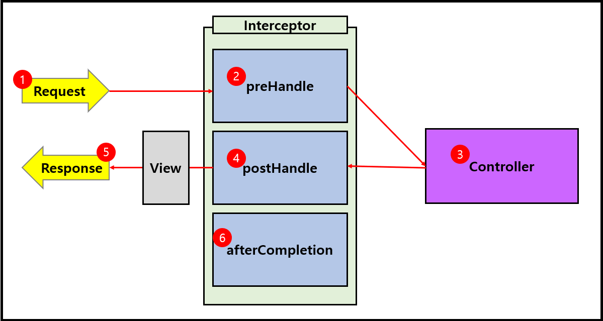

# 인터셉터와 로그인 처리

## 1. Spring Interceptors

* 모든 요청에서 반드시 거쳐야 하는 서블릿 필터와 유사
* 인터셉터는 컨트롤러 요청에만 적용된다
* Bean Container 로딩 후에 적용되기 때문에 빈을 사용할 수 있다

**인터셉터 수행 순서**

* preHandel: 컨트롤러(핸들러) 실행 전
* postHandel: 컨트롤러(핸들러) 실행 후, 뷰 실행 전
* afterCompletion: 뷰 실행 후

