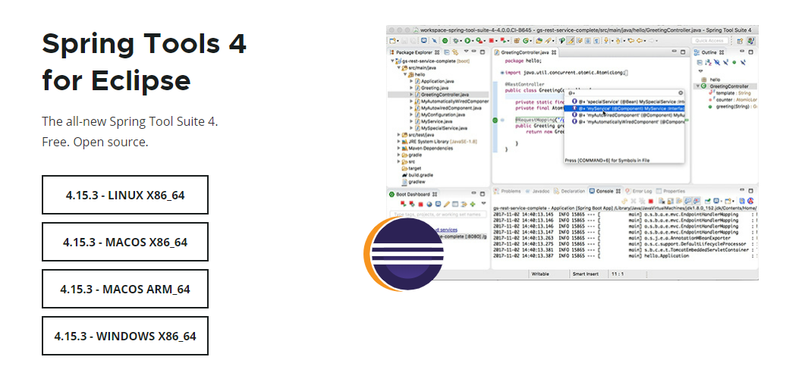
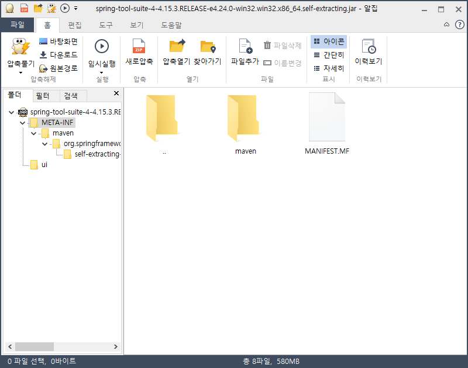
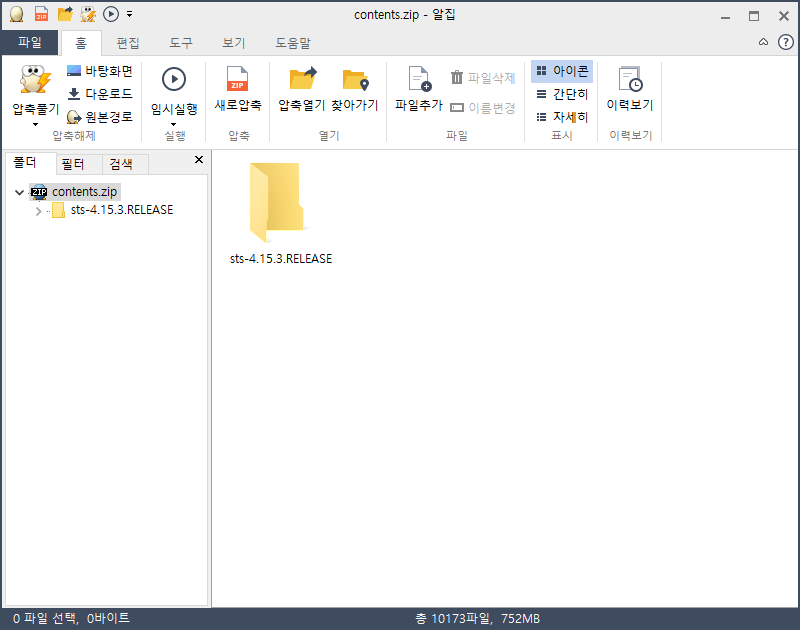
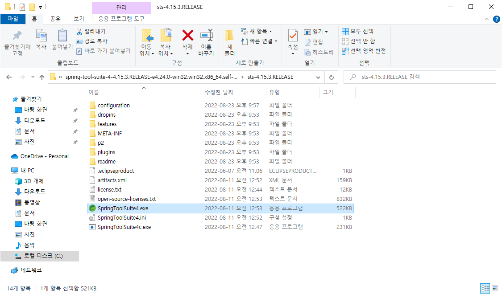

## 1. STS설치

1. STS설치 파일 다운로드
   * <a href="https://spring.io/" target="_blank">https://spring.io/ -> [Projects] -> [Spring Tools4] -> 알맞은 설치 파일 다운로드</a>

2. 다운로드 받은 파일 압축 해제

3. contents.zip 파일 압축 해제

4. STS 실행

* jdk 및 tomcat 설치는 스킵

