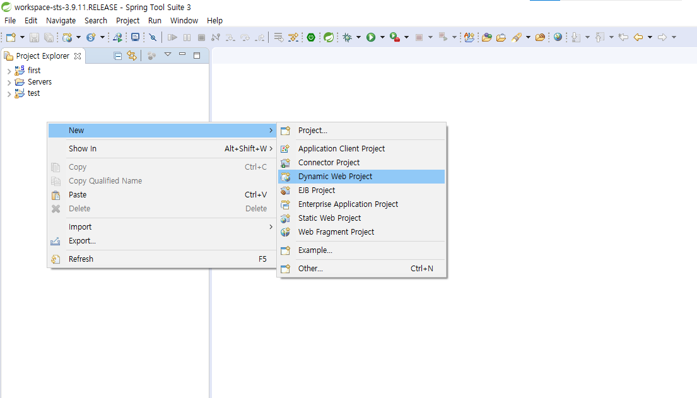
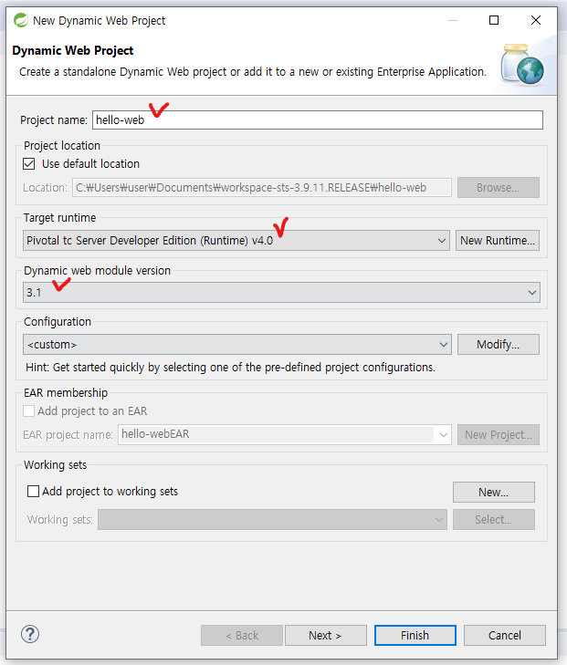
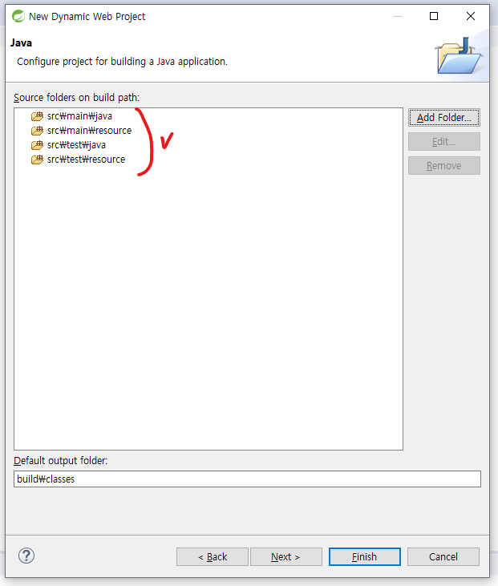
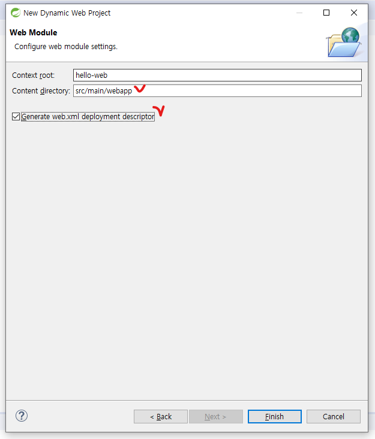
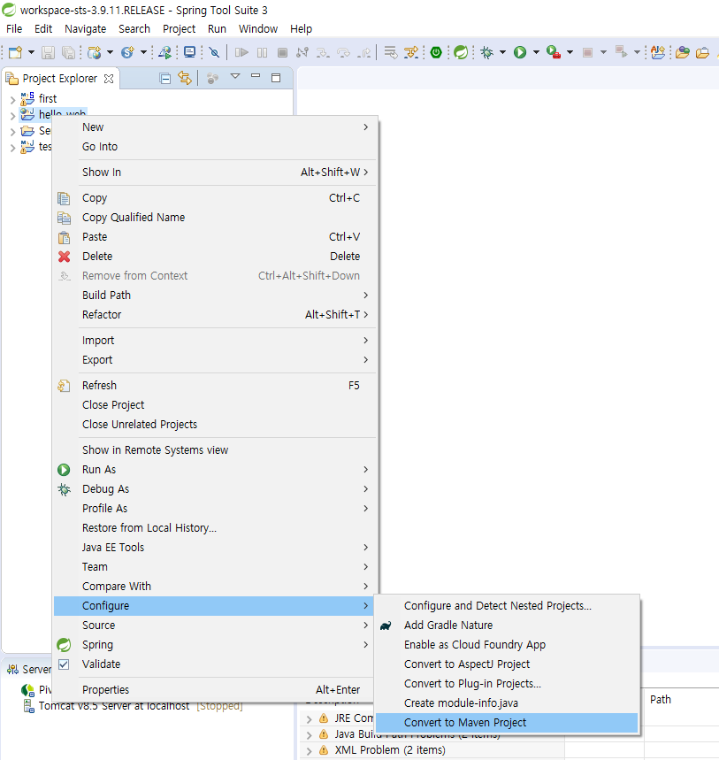
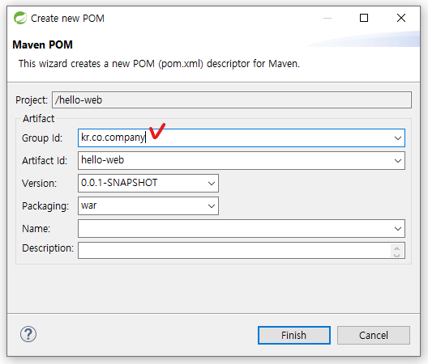
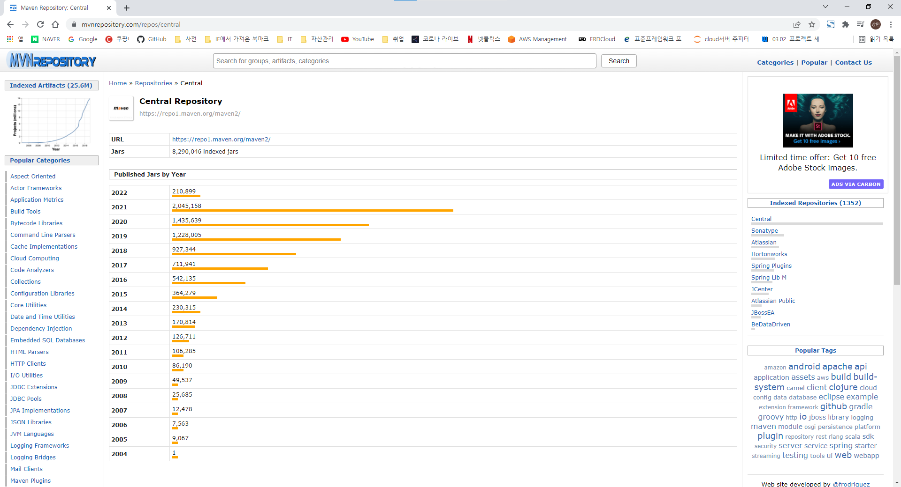
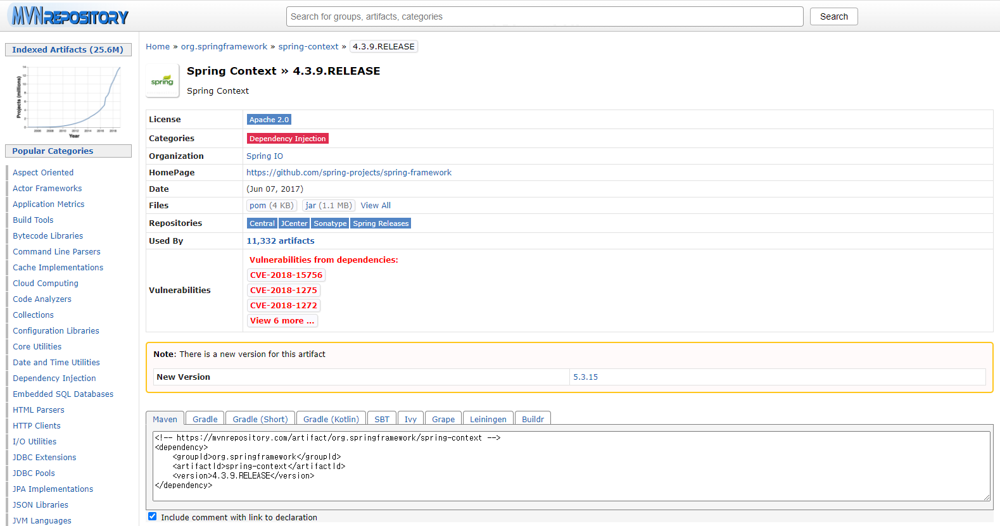
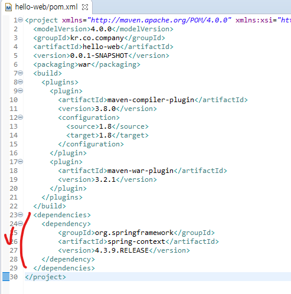
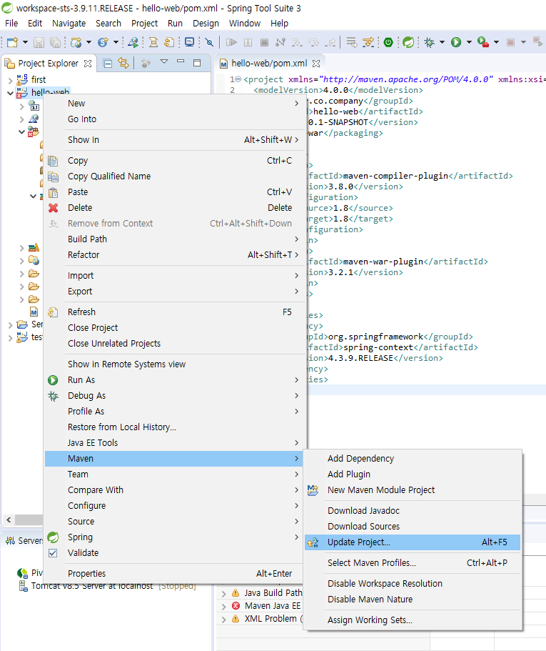

# 메이븐 Spring Project 생성

## 1. 다이나믹 웹 프로젝트 생성

* IDE실행 -> [File] -> [New] -> [Dynamic Web Project] 선택

* Project name 설정 -> Target runtime 설정(일반적으로 tomcat) -> Dynamic web module version 설정 -> [next]

* Source folders on build path 설정

  -> 기존 src 폴더 삭제 후 위와 같이 폴더 생성

* **메이븐은 Source folder 구조가 위와 같이 정해져 있다**

* Content directory 수정(메이븐은 경로가 정해져 있다)
* web.xml(웹 어플리케이션 설정 파일) 생성 선택 ->  [Finish] 선택

## 2. Maven Project로 변경

* 프로젝트 오른쪽 클릭 -> [Configure] -> [Convert to Maven Project]

* Group id 설정 후 [Finish]

## 3. Spring Dependency 추가

* maven central repository 사이트 접속(https://mvnrepository.com/)

* Spring Context 검색 -> 최신 release버전 dependency에 추가

* 프로젝트 오른쪽 클릭 -> [Maven] -> [Update Project] -> 프로젝튼 선택 후 [OK]
