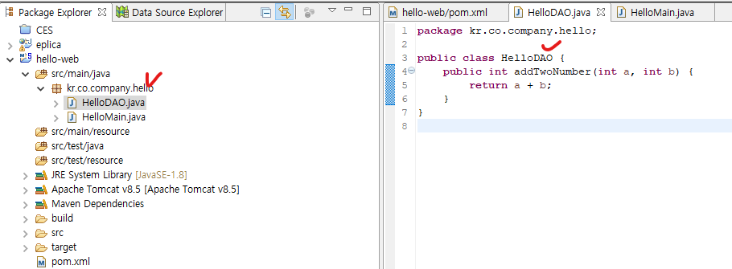
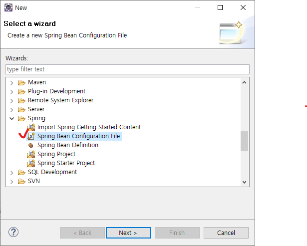
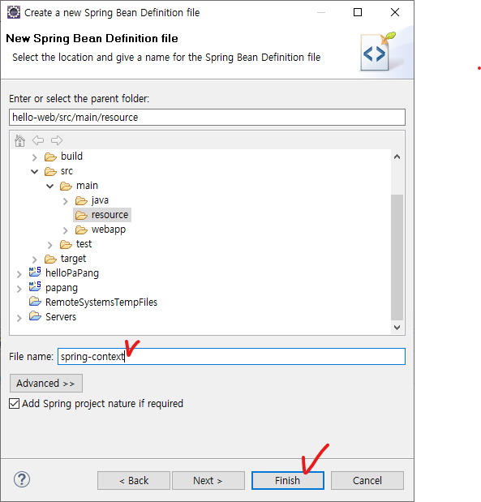

## 1. DAO 작성

* src/main/java 경로에 패키지 생성(kr.co.company.hello) - HelloDAO 클래스 생성



```java
package kr.co.company.hello;

public class HelloDAO {
	public int addTwoNumber(int a, int b) {
		return a + b;
	}
}
```


* HelloMain 클래스 생성

```java
package kr.co.company.hello;

public class HelloMain {

	public static void main(String[] args) {
		HelloDAO dao = new HelloDAO();
		int result = dao.addTwoNumber(3, 5);
		
		System.out.println(result);
	}

}
```


## 2. DAO 빈컨테이너에 등록

* src/main/resource 경로에서 [New] - [Other] - [Spring Bean Configuration File] 선택



* spring-context 입력 후 [Finish] 선택



* spring-context.xml 파일 생성됨

```xml
<?xml version="1.0" encoding="UTF-8"?>
<beans xmlns="http://www.springframework.org/schema/beans"
	xmlns:xsi="http://www.w3.org/2001/XMLSchema-instance"
	xsi:schemaLocation="http://www.springframework.org/schema/beans http://www.springframework.org/schema/beans/spring-beans.xsd">

	
</beans>
```


* bean 등록

```xml
<?xml version="1.0" encoding="UTF-8"?>
<beans xmlns="http://www.springframework.org/schema/beans"
	xmlns:xsi="http://www.w3.org/2001/XMLSchema-instance"
	xsi:schemaLocation="http://www.springframework.org/schema/beans http://www.springframework.org/schema/beans/spring-beans.xsd">
	
	<!-- id는 빈컨테이너에 등록된 빈을 찾기위한 이름으로 사용, 대상 class명과 동일하게 적어야함! -->
	<!-- class는 대상 class 파일 경로 -->
	<bean id="helloDAO" class="kr.co.company.hello.HelloDAO" />
	
</beans>
```


## 3. DL(Dependency Lookup)로 DAO 사용

* 컨테이너를 통한 객체 사용(HelloMain.java 파일 수정)

```java
package kr.co.company.hello;

import org.springframework.context.support.AbstractApplicationContext;
import org.springframework.context.support.ClassPathXmlApplicationContext;

public class HelloMain {

	public static void main(String[] args) {
		
		/*
		//인스턴스 생성을 통한 객체 사용
		HelloDAO dao = new HelloDAO();
		int result = dao.addTwoNumber(3, 5);
		
		System.out.println(result);//결과: 8
		*/
		
		/*컨테이너를 통한 객체 사용*/
		//컨테이너 만들기(매개변수로 Spring Bean Configuration File 경로 적어줘야함)
		AbstractApplicationContext ctx = new ClassPathXmlApplicationContext("/spring-context.xml");
		// -> 스프링 컨테이너 로딩 -> 설정파일에 등록된 모든 bean 생성(객체 생성)
		
		//등록된 bean 찾기(bean의 id값, 대상 class의 타입 입력)
		//getBean이 DL(Dependency Lookup)을 지원한다
		HelloDAO dao = ctx.getBean("helloDAO", HelloDAO.class);
		//-> 객체를 생성하지 않고 이미 생성된 bean을 찾는다 
		int result = dao.addTwoNumber(5, 10);
		
		System.out.println(result);//결과: 15
	}
	//-> 원래는 객체가 제거돼야 하지만 스프링에선 컨테이너에 객체를 반환하여 garbage collection에 의한 overhead 발생 방지

}

```


