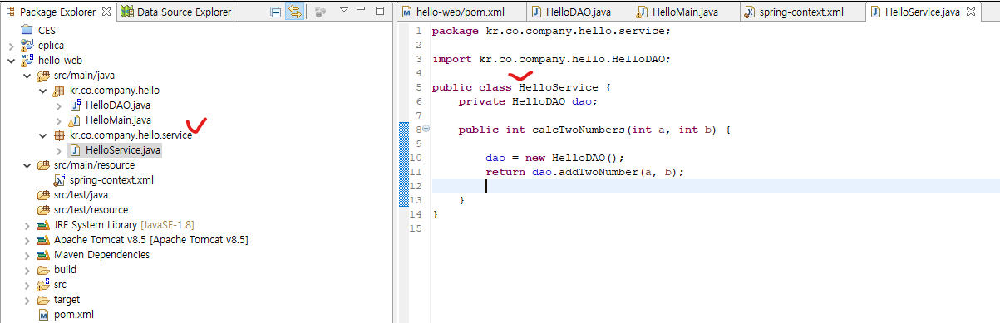
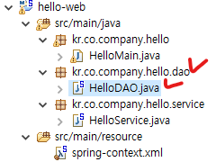

## 1. Service 클래스를 만들어 DAO를 참조

* src/main/java 경로 하위에 kr.co.company.hello.service 패키지 생성 - HelloService 클래스 생성




* HelloService.java

```java
package kr.co.company.hello.service;

import kr.co.company.hello.HelloDAO;

public class HelloService {
	private HelloDAO helloDAO;
	
	public int calcTwoNumbers(int a, int b) {
		helloDAO = new HelloDAO();
		return helloDAO.addTwoNumber(a, b);		
	}
}

```


* spring-context.xml에 bean 등록

```xml
<bean id="helloService" class="kr.co.company.hello.service.HelloService"></bean>
```

```xml
<?xml version="1.0" encoding="UTF-8"?>
<beans xmlns="http://www.springframework.org/schema/beans"
	xmlns:xsi="http://www.w3.org/2001/XMLSchema-instance"
	xsi:schemaLocation="http://www.springframework.org/schema/beans http://www.springframework.org/schema/beans/spring-beans.xsd">
	
	<!-- id는 빈컨테이너에 등록된 빈을 찾기위한 이름으로 사용, 대상 class명과 동일하게 적어야함! -->
	<!-- class는 대상 class 파일 경로 -->
	<bean id="helloDAO" class="kr.co.company.hello.HelloDAO" />
	<bean id="helloService" class="kr.co.company.hello.service.HelloService"></bean>
	
</beans>
```


* HelloMain.class에서 HelloService객체를 통한 메서드 실행

```java
package kr.co.company.hello;

import kr.co.company.hello.service.HelloService;

import org.springframework.context.support.AbstractApplicationContext;
import org.springframework.context.support.ClassPathXmlApplicationContext;

public class HelloMain {

	public static void main(String[] args) {
		
		AbstractApplicationContext ctx = new ClassPathXmlApplicationContext("/spring-context.xml");
		
		//HelloService 객체 생성
		HelloService dao = ctx.getBean("helloService", HelloService.class);
		//HelloService 객체의 메서드 사용
		int result = dao.calcTwoNumbers(5, 10);
		
		System.out.println(result);//결과 15
	}

}
```


## 2. Dependency Injection을 통한 참조

### 2-1.Setter를 통한 Injection

* 기존 HelloService 코드는 ``new HelloDAO()``로 매번 객체를 새로 생성해서 효율적이지 못함

```java
package kr.co.company.hello.service;

import kr.co.company.hello.HelloDAO;

public class HelloService {
	private HelloDAO helloDAO;
	
	public int calcTwoNumbers(int a, int b) {
		helloDAO = new HelloDAO();//매번 객체를 새로 생성해서 효율적이지 못함
		return helloDAO.addTwoNumber(a, b);		
	}
}

```

* ``new HelloDAO()``를 대체하기 위해 setter메서드 생성

```java
package kr.co.company.hello.service;

import kr.co.company.hello.HelloDAO;

public class HelloService {
	private HelloDAO helloDAO;
	
	public void setHelloDAO(HelloDAO dao) {
		this.helloDAO = dao;
	}
	
	public int calcTwoNumbers(int a, int b) {
		//setter를 통해 객체를 주입하여 helloDAO 객체를 생성하지 않아도 오류가 나지 않도록 함
        return helloDAO.addTwoNumber(a, b);
	}
}

```

* spring-context.xml을 통해 HelloService객체에 HelloDAO객체를 주입

```xml
<bean id="helloService" class="kr.co.company.hello.service.HelloService">
    <!-- setter의 프로퍼티 값을 name에 입력(setHelloDAO에서 set 다음에 적힌 값) -->	
    <!-- ref에는 주입시켜줄 객체 ID -->	
    <property name="helloDAO" ref="helloDAO"></property>
</bean>
```

```xml
<?xml version="1.0" encoding="UTF-8"?>
<beans xmlns="http://www.springframework.org/schema/beans"
	xmlns:xsi="http://www.w3.org/2001/XMLSchema-instance"
	xsi:schemaLocation="http://www.springframework.org/schema/beans http://www.springframework.org/schema/beans/spring-beans.xsd">
	
	<bean id="helloDAO" class="kr.co.company.hello.HelloDAO" />
	<bean id="helloService" class="kr.co.company.hello.service.HelloService">
		<!-- setter의 프로퍼티 값을 name에 입력(setHelloDAO에서 set 다음에 적힌 값) -->	
		<!-- ref에는 주입시켜줄 객체 ID -->	
		<property name="helloDAO" ref="helloDAO"></property>
	</bean>
	
</beans>
```

* HelloMain.java 실행

```java
package kr.co.company.hello;

import kr.co.company.hello.service.HelloService;

import org.springframework.context.support.AbstractApplicationContext;
import org.springframework.context.support.ClassPathXmlApplicationContext;

public class HelloMain {

	public static void main(String[] args) {
		
		AbstractApplicationContext ctx = new ClassPathXmlApplicationContext("/spring-context.xml");
		
		//HelloService 객체 생성
		HelloService dao = ctx.getBean("helloService", HelloService.class);
		//HelloService 객체의 메서드 사용
		int result = dao.calcTwoNumbers(5, 10);
		
		System.out.println(result);//결과 15
	}

}
```


### 2-2. Constructor를 통한 Injection

* HelloService 클래스에 생성자 만들기

```java
package kr.co.company.hello.service;

import kr.co.company.hello.HelloDAO;

public class HelloService {
	private HelloDAO helloDAO;
	
	//생성자(HelloDAO를 주입받음)
	public HelloService(HelloDAO helloDAO){
		this.helloDAO = helloDAO;
	}
	
	public int calcTwoNumbers(int a, int b) {
		return helloDAO.addTwoNumber(a, b);
	}
}
```

* spring-context.xml을 통해 HelloService객체에 HelloDAO객체를 주입

```xml
<bean id="helloService" class="kr.co.company.hello.service.HelloService">
    <!-- ref에 주입받을 객체 ID입력 -->
    <constructor-arg ref="helloDAO"></constructor-arg>
</bean>
```

```xml
<?xml version="1.0" encoding="UTF-8"?>
<beans xmlns="http://www.springframework.org/schema/beans"
	xmlns:xsi="http://www.w3.org/2001/XMLSchema-instance"
	xsi:schemaLocation="http://www.springframework.org/schema/beans http://www.springframework.org/schema/beans/spring-beans.xsd">
	
	<bean id="helloDAO" class="kr.co.company.hello.HelloDAO" />
	<bean id="helloService" class="kr.co.company.hello.service.HelloService">
		<!-- ref에 주입받을 객체 ID입력 -->
		<constructor-arg ref="helloDAO"></constructor-arg>
	</bean>
	
</beans>
```

* HelloMain.java 실행


## 3. 두 개의 DAO를 사용하는 예제(HelloDAO, AnotherDAO)

* kr.co.company.hello.dao 패키지 생성 - HelloDAO 클래스 이동



* kr.co.company.hello.dao 패키지 하위에 AnotherDAO 클래스 생성

```java
package kr.co.company.hello.dao;

public class AnotherDAO {
	public int square(int a) {
		return a*a;
	}
}
```

* HelloService 클래스에 두 개의 DAO를 사용한 메서드 작성

```java
package kr.co.company.hello.service;

import kr.co.company.hello.dao.AnotherDAO;
import kr.co.company.hello.dao.HelloDAO;

public class HelloService {
	private HelloDAO helloDAO;
	private AnotherDAO anotherDAO;//AnotherDAO 멤버변수 설정
	
	//생성자로 객체 주입
	public HelloService(HelloDAO helloDAO){
		this.helloDAO = helloDAO;
	}
	
	//setter로 객체 주입
	public void setAnotherDAO(AnotherDAO dao) {
		this.anotherDAO = dao;
	}
	
	public int calcTwoNumbers(int a, int b) {
		return helloDAO.addTwoNumber(a, b);
	}
	
	//두 개의 DAO를 사용한 메서드
	public int calcTwoNumbersAndSquare(int a, int b) {
		int result = helloDAO.addTwoNumber(a, b);
		return anotherDAO.square(result);
	}
}
```

* spring-context.xml에 bean 추가, HelloService객체에 HelloDAO객체 주입

```xml
<bean id="anotherDAO" class="kr.co.company.hello.dao.AnotherDAO"></bean>
```

```xml
<!-- setter로 객체 주입 -->
<property name="anotherDAO" ref="anotherDAO"></property>
```

```xml
<?xml version="1.0" encoding="UTF-8"?>
<beans xmlns="http://www.springframework.org/schema/beans"
	xmlns:xsi="http://www.w3.org/2001/XMLSchema-instance"
	xsi:schemaLocation="http://www.springframework.org/schema/beans http://www.springframework.org/schema/beans/spring-beans.xsd">
	
	<bean id="helloDAO" class="kr.co.company.hello.dao.HelloDAO" />
	<bean id="helloService" class="kr.co.company.hello.service.HelloService">
		<!-- 생성자로 객체 주입 -->
		<constructor-arg ref="helloDAO"></constructor-arg>
		<!-- setter로 객체 주입 -->
		<property name="anotherDAO" ref="anotherDAO"></property>
	</bean>
	<bean id="anotherDAO" class="kr.co.company.hello.dao.AnotherDAO"></bean>
	
</beans>
```

* HelloMain으로 calcTwoNumbersAndSquare 메서드 실행

```java
package kr.co.company.hello;

import kr.co.company.hello.service.HelloService;

import org.springframework.context.support.AbstractApplicationContext;
import org.springframework.context.support.ClassPathXmlApplicationContext;

public class HelloMain {

	public static void main(String[] args) {
		
		AbstractApplicationContext ctx = new ClassPathXmlApplicationContext("/spring-context.xml");
		
		HelloService dao = ctx.getBean("helloService", HelloService.class);
		int result = dao.calcTwoNumbersAndSquare(5, 10);//두 개의 DAO를 주입해서 사용하는 메서드
		
		System.out.println(result);//결과 225
	}

}
```

