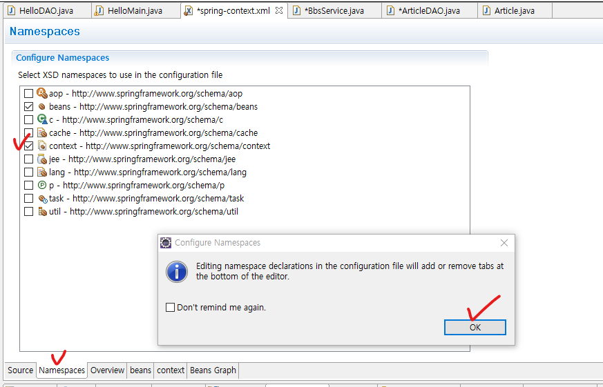

# 게시판 글쓰기 기능 구현

## 1. Service, DAO, VO .. Layering

* VO

```java
package kr.co.company.hello.vo;

public class Article {
	private int articleId;
	private String author;
	private String title;
	private String content;
	
	public Article(){};
	
	public Article(int articleId, String author, String title, String content) {
		super();
		this.articleId = articleId;
		this.author = author;
		this.title = title;
		this.content = content;
	}

	public int getArticleId() {
		return articleId;
	}

	public void setArticleId(int articleId) {
		this.articleId = articleId;
	}

	public String getAuthor() {
		return author;
	}

	public void setAuthor(String author) {
		this.author = author;
	}

	public String getTitle() {
		return title;
	}

	public void setTitle(String title) {
		this.title = title;
	}

	public String getContent() {
		return content;
	}

	public void setContent(String content) {
		this.content = content;
	}

	@Override
	public String toString() {
		return "Article [articleId=" + articleId + ", author=" + author
				+ ", title=" + title + ", content=" + content + "]";
	}
}
```

* DAO

```java
package kr.co.company.hello.dao;

import kr.co.company.hello.vo.Article;

public class ArticleDAO {
	public void insertArticle(Article article) {
		System.out.println("insert OK");
	}
}
```

* Service

```java
package kr.co.company.hello.service;

import kr.co.company.hello.dao.ArticleDAO;
import kr.co.company.hello.vo.Article;

public class BbsService {
	private ArticleDAO articleDAO;
	
	//의존성 주입
	public void setArticleDAO(ArticleDAO dao) {
		this.articleDAO = dao;
	}
	
	public void registArticle(Article article) {
		articleDAO.insertArticle(article);
	}
}
```

* Bean 등록 및 의존성 주입(spring-context.xml)

```xml
<bean id="bbsService" class="kr.co.company.hello.service.BbsService">
    <property name="articleDAO" ref="articleDAO"></property>
</bean>
<bean id="articleDAO" class="kr.co.company.hello.dao.ArticleDAO"></bean>
```

```xml
<?xml version="1.0" encoding="UTF-8"?>
<beans xmlns="http://www.springframework.org/schema/beans"
	xmlns:xsi="http://www.w3.org/2001/XMLSchema-instance"
	xsi:schemaLocation="http://www.springframework.org/schema/beans http://www.springframework.org/schema/beans/spring-beans.xsd">
	
	<bean id="helloDAO" class="kr.co.company.hello.dao.HelloDAO" />
	<bean id="helloService" class="kr.co.company.hello.service.HelloService">
		<!-- 생성자로 객체 주입 -->
		<constructor-arg ref="helloDAO"></constructor-arg>
		<!-- setter로 객체 주입 -->
		<property name="anotherDAO" ref="anotherDAO"></property>
	</bean>
	<bean id="anotherDAO" class="kr.co.company.hello.dao.AnotherDAO"></bean>
	
	<bean id="bbsService" class="kr.co.company.hello.service.BbsService">
		<property name="articleDAO" ref="articleDAO"></property>
	</bean>
	<bean id="articleDAO" class="kr.co.company.hello.dao.ArticleDAO"></bean>
</beans>
```

* main으로 테스트

```java
package kr.co.company.hello;

import kr.co.company.hello.service.BbsService;
import kr.co.company.hello.service.HelloService;
import kr.co.company.hello.vo.Article;

import org.springframework.context.support.AbstractApplicationContext;
import org.springframework.context.support.ClassPathXmlApplicationContext;

public class HelloMain {

	public static void main(String[] args) {
		
		AbstractApplicationContext ctx = new ClassPathXmlApplicationContext("/spring-context.xml");
		
		BbsService service = ctx.getBean("bbsService", BbsService.class);
		service.registArticle(new Article()); //insert OK 출력
	}

}
```


## 2. 어노테이션 등록(@Service, @Repository), DI 구현(@Autowired)

* context 네임 스페이스 등록하기
* spring-context.xml - [NameSpaces] 탭 - [context] 체크 - [OK]



* context 설정 추가

```xml
<!-- base-package 하위의 모든 component어노테이션(@Controller, @Service, @Repository, @Component...)이 붙은 클래스 스캔 -->
<context:component-scan base-package="kr.co.company.hello"></context:component-scan>
```

```xml
<?xml version="1.0" encoding="UTF-8"?>
<beans xmlns="http://www.springframework.org/schema/beans"
	xmlns:xsi="http://www.w3.org/2001/XMLSchema-instance"
	xmlns:context="http://www.springframework.org/schema/context"
	xsi:schemaLocation="http://www.springframework.org/schema/beans http://www.springframework.org/schema/beans/spring-beans.xsd
		http://www.springframework.org/schema/context http://www.springframework.org/schema/context/spring-context-4.3.xsd">
	
	<bean id="helloDAO" class="kr.co.company.hello.dao.HelloDAO" />
	<bean id="helloService" class="kr.co.company.hello.service.HelloService">
		<!-- 생성자로 객체 주입 -->
		<constructor-arg ref="helloDAO"></constructor-arg>
		<!-- setter로 객체 주입 -->
		<property name="anotherDAO" ref="anotherDAO"></property>
	</bean>
	<bean id="anotherDAO" class="kr.co.company.hello.dao.AnotherDAO"></bean>
	
	<!-- base-package 하위의 모든 component어노테이션(@Controller, @Service, @Repository, @Component...)이 붙은 클래스 스캔 -->
	<context:component-scan base-package="kr.co.company.hello"></context:component-scan>
</beans>
```

* @Service 어노테이션 추가, @Autowired로 의존성 주입

```java
package kr.co.company.hello.service;

import org.springframework.beans.factory.annotation.Autowired;
import org.springframework.stereotype.Service;

import kr.co.company.hello.dao.ArticleDAO;
import kr.co.company.hello.vo.Article;

@Service
public class BbsService {
	
	@Autowired //의존성 주입
	private ArticleDAO articleDAO;
	
	public void registArticle(Article article) {
		articleDAO.insertArticle(article);
	}
}
```

* Repository 어노테이션 추가

```java
package kr.co.company.hello.dao;

import org.springframework.stereotype.Repository;

import kr.co.company.hello.vo.Article;

@Repository
public class ArticleDAO {
	public void insertArticle(Article article) {
		System.out.println("insert OK");
	}
}
```


