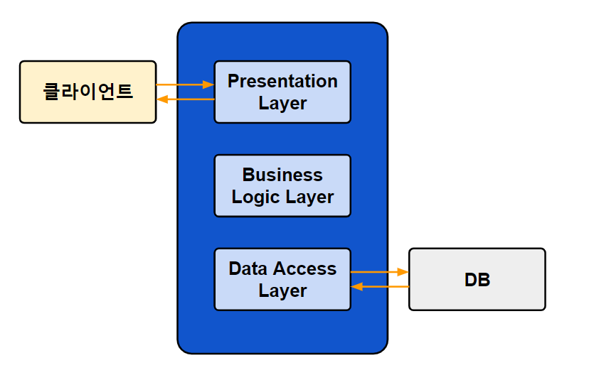
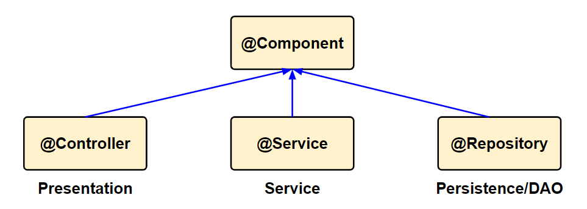

# Layered Architecture & @Component

## 1. Layered Architecture의 특징

**계층화 아키텍처**

* 효율적인 개발과 유지보수를 위해 계층화하여 개발
* 대부분의 중/대규모 어플리케이션에서 적용
* 각 레이어는 독립된 R&R을 가짐
* 각 레이어는 인접한 레이어로만 통신이 가능

**프레젠테이션 영역**

* 사용자와 상호작용을 담당
* 사용자의 요청을 분석/응답

**비즈니스 영역**

* 기능 수행
* 트랜잭션 수행

**데이터 영역**

* 데이터의 전장과 조회를 담당
* 주로 데이터베이스와 연동하여 작업
* DAO(Data Access Object)

**통신 구조**

클라이언트 - 프레젠테이션 영역 - 비즈니스 영역 - 데이터 영역 - DB

**MVC 패턴**

* Layered Architecture를 사용한 대표적 패턴

* 어플리케이션을 Model, View Controller로 구분
* UI를 가지는 대부분의 어플리케이션은 MVC혹은 변형된 MVC 패턴을 사용

* Model - 데이터 저장, 처리
* View - 화면(User Interface)
* Controller - 사용자 요청 처리, 모델과 화면을 연결

## 2. 컴포넌트 자동등록

**어노테이션(Annotation) 사용**

* @Component와 하위 어노테이션 사용
* 하위 어노테이션: @Controller, @Service, @Repository

**<context:component-scan base-package="패키지 명"/>**

* 패키지 명 이후 하위 패키지를 검색해 @Component 어노테이션을 포함하는 모든 클래스를 빈으로 자동 등록

**Context:component-scan**

* Bean이 될 수 있는 모든 Component들을 자동으로 찾아 Bean Container에 등록
* 단, 의존성 관계 등록 하지 않음

**@Autowired**

* Component 간의 의존관계는 Autowired 라는 Annotation으로 적용
* Component-scan과 수동(Setter, 생성자) DI는 혼용해서 사용 가능

