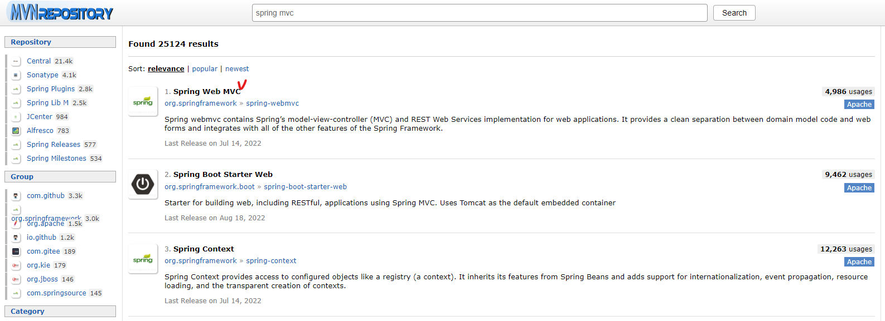
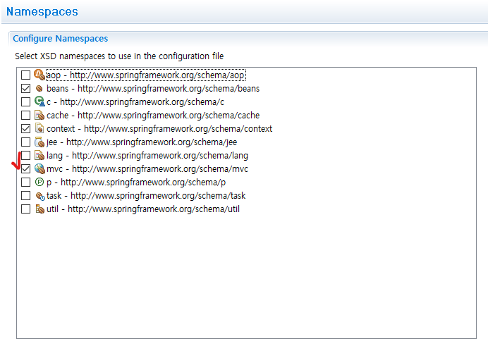

## 1. spring-mvc 라이브러리 설정

* Pom.xml에 Spring Web MVC 추가(https://mvnrepository.com/search?q=spring+mvc)



```xml
<!-- pom.xml -->
<dependency>
<groupId>org.springframework</groupId>
<artifactId>spring-webmvc</artifactId>
<version>5.2.22.RELEASE</version>
</dependency>
```


## 2. DispatcherServlet 설정.. web.xml

* web.xml 파일 작성([project]\src\main\webapp\WEB-INF\web.xml)

```xml
<?xml version="1.0" encoding="UTF-8"?>
<web-app xmlns:xsi="http://www.w3.org/2001/XMLSchema-instance" xmlns="http://xmlns.jcp.org/xml/ns/javaee" xsi:schemaLocation="http://xmlns.jcp.org/xml/ns/javaee http://xmlns.jcp.org/xml/ns/javaee/web-app_3_1.xsd" id="WebApp_ID" version="3.1">
  <servlet>
  	<servlet-name>dispatcherServlet</servlet-name>
  	<servlet-class>org.springframework.web.servlet.DispatcherServlet</servlet-class>
  	<init-param>
  		<param-name>contextConfigLocation</param-name>
  		
  		<!-- context 파일 경로 -->
  		<param-value>/WEB-INF/spring/servlet-context.xml</param-value>
  	</init-param>
  </servlet>
  
  <servlet-mapping>
  	<servlet-name>dispatcherServlet</servlet-name>
  	
  	<!-- 모든 요청이 dispatcherServlet을 통과하도록 한다 -->
  	<url-pattern>/</url-pattern>
  	
  </servlet-mapping>
</web-app>
```


* servlet-context.xml 파일 생성
* spring 폴더에 마우스 오른쪽 클릭 - [new] - [other] - [Spring Bean Configuration File]


## 3. 스프링 빈 설정파일(servelt-context.xml)

**<context:component-scan ..>**

* [servelt-context.xml] - [NameSpaces]탭 클릭 - [context] 체크 - 알림창에서 [OK]


* context:component-scan 입력

```xml
<context:component-scan base-package="kr.co.company.hello"></context:component-scan>
```


**<mvc:annotation-driven />**

* [servelt-context.xml] - [NameSpaces]탭 클릭 - [mvc] 체크 - 알림창에서 [OK]



* <mvc:annotation-driven />입력

```xml
<mvc:annotation-driven />
```


**viewResolver 설정**

```xml
<!-- viewResolver로 jsp 페이지 호출할 때 앞, 뒤에 자동으로 경로 입력 --> 	
<bean id="viewResolver" class="org.springframework.web.servlet.view.InternalResourceViewResolver"> 
    <property name="prefix" value="/WEB-INF/views/"></property>
    <property name="suffix" value=".jsp"></property>
</bean>
```


**최종 servelt-context.xml 코드**

```xml
<?xml version="1.0" encoding="UTF-8"?>
<beans xmlns="http://www.springframework.org/schema/beans"
	xmlns:xsi="http://www.w3.org/2001/XMLSchema-instance"
	xmlns:context="http://www.springframework.org/schema/context"
	xmlns:mvc="http://www.springframework.org/schema/mvc"
	xsi:schemaLocation="http://www.springframework.org/schema/mvc http://www.springframework.org/schema/mvc/spring-mvc-4.3.xsd
		http://www.springframework.org/schema/beans http://www.springframework.org/schema/beans/spring-beans.xsd
		http://www.springframework.org/schema/context http://www.springframework.org/schema/context/spring-context-4.3.xsd">
	
	<context:component-scan base-package="kr.co.company.hello"></context:component-scan>
	<mvc:annotation-driven />

	<!-- viewResolver로 jsp 페이지 호출할 때 앞, 뒤에 자동으로 경로 입력 --> 	
	<bean id="viewResolver" class="org.springframework.web.servlet.view.InternalResourceViewResolver"> 
		<property name="prefix" value="/WEB-INF/views/"></property>
		<property name="suffix" value=".jsp"></property>
	</bean>
</beans>
```


