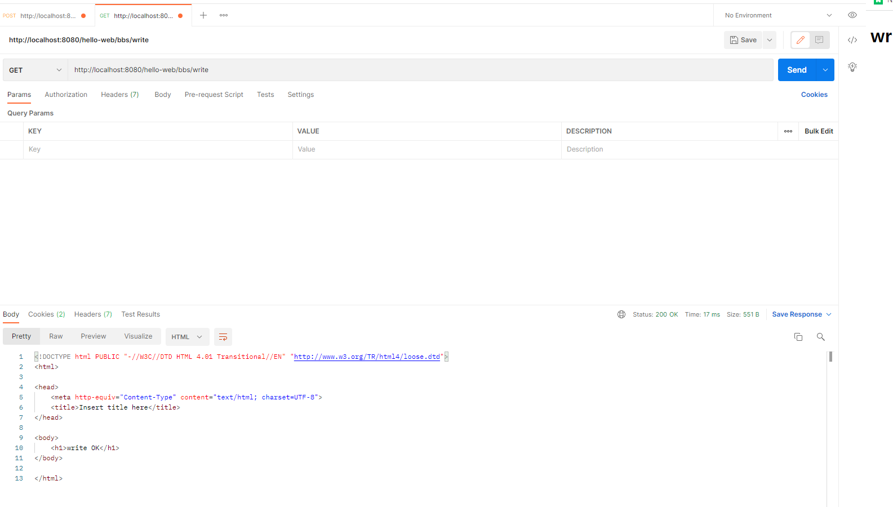
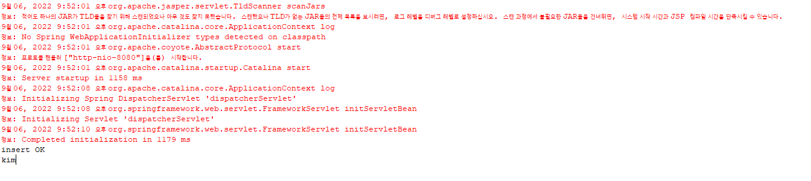

## 1.BbsController, BbsService 작성

* controller 패키지 아래에 BbsController 클래스 생성

```java
package kr.co.company.hello.controller;

import kr.co.company.hello.service.BbsService;
import kr.co.company.hello.vo.Article;

import org.springframework.beans.factory.annotation.Autowired;
import org.springframework.stereotype.Controller;
import org.springframework.web.bind.annotation.RequestMapping;

@Controller
@RequestMapping("/bbs")
public class BbsController {

	@Autowired
	private BbsService bbsService;
	
	@RequestMapping("write")
	public String write(){
		bbsService.registArticle(new Article());
		
		return "write_ok";
	}
}
```

* /WEB-INF/views/**write_ok.jsp** 파일 생성(servlet-context.xml에서 설정한 경로에 맞춤)

```jsp
<%@ page language="java" contentType="text/html; charset=UTF-8"
    pageEncoding="UTF-8"%>
<!DOCTYPE html PUBLIC "-//W3C//DTD HTML 4.01 Transitional//EN" "http://www.w3.org/TR/html4/loose.dtd">
<html>
<head>
<meta http-equiv="Content-Type" content="text/html; charset=UTF-8">
<title>Insert title here</title>
</head>
<body>
	<h1>write OK</h1>
</body>
</html>
```

* postman을 이용해 테스트(url: http://localhost:8080/hello-web/bbs/write)




## 2. HTTP 파라미터 사용

* @RequestParam으로 controller에 파라미터 추가

```java
public String write(@RequestParam("author") String author){
```

```java
package kr.co.company.hello.controller;

import kr.co.company.hello.service.BbsService;
import kr.co.company.hello.vo.Article;

import org.springframework.beans.factory.annotation.Autowired;
import org.springframework.stereotype.Controller;
import org.springframework.web.bind.annotation.RequestMapping;
import org.springframework.web.bind.annotation.RequestParam;

@Controller
@RequestMapping("/bbs")
public class BbsController {

	@Autowired
	private BbsService bbsService;
	
	@RequestMapping("write")
	public String write(@RequestParam("author") String author){
		bbsService.registArticle(new Article());
		System.out.println(author);
		return "write_ok";
	}
}
```

* postman으로 url 호출(url: http://localhost:8080/hello-web/bbs/write?author=kim)

=> ``System.out.println(author);`` 를 통해 kim이 출력된다


