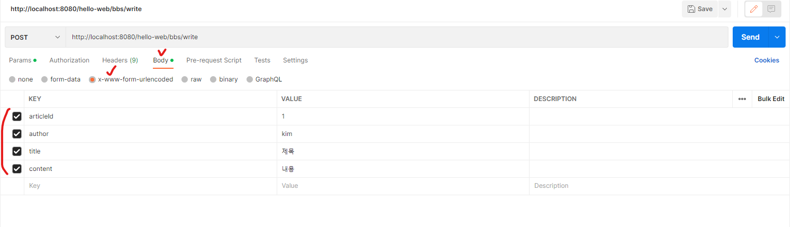
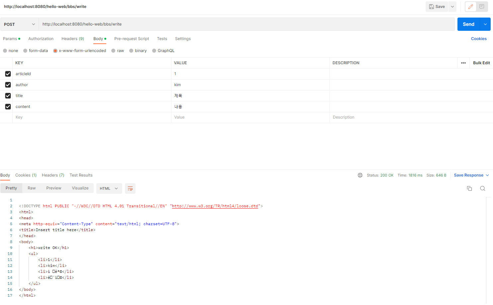

## 1. GET, POST 방식 처리

* BbsController.java 파일에 GET, POST 방식 처리 구현

```java
package kr.co.company.hello.controller;

import kr.co.company.hello.service.BbsService;
import kr.co.company.hello.vo.Article;

import org.springframework.beans.factory.annotation.Autowired;
import org.springframework.stereotype.Controller;
import org.springframework.web.bind.annotation.RequestMapping;
import org.springframework.web.bind.annotation.RequestMethod;
import org.springframework.web.bind.annotation.RequestParam;

@Controller
@RequestMapping("/bbs")
public class BbsController {

	@Autowired
	private BbsService bbsService;
	
	@RequestMapping(value="/write", method=RequestMethod.POST)//Post방식으로 실행
	public String doWrite(){
		bbsService.registArticle(new Article());
		System.out.println("post request");
		return "write_ok";
	}
	
	@RequestMapping("/write")//Get방식으로 실행
	public String write(){
		bbsService.registArticle(new Article());
		System.out.println("get request");
		return "write_ok";
	}
}
```

* postman을 통해 테스트(http://localhost:8080/hello-web/bbs/write)

=> get 방식으로 보내면 이클립스 콘솔 창에 'get request' 출력됨

=> post방식으로 보내면 이클립스 콘솔 창에 'post request' 출력됨


* @PostMapping, @GetMapping을 통해서도 구현 가능(스프링 4.3ver 이후)

```java
package kr.co.company.hello.controller;

import kr.co.company.hello.service.BbsService;
import kr.co.company.hello.vo.Article;

import org.springframework.beans.factory.annotation.Autowired;
import org.springframework.stereotype.Controller;
import org.springframework.web.bind.annotation.GetMapping;
import org.springframework.web.bind.annotation.PostMapping;
import org.springframework.web.bind.annotation.RequestMapping;
import org.springframework.web.bind.annotation.RequestMethod;
import org.springframework.web.bind.annotation.RequestParam;

@Controller
@RequestMapping("/bbs")
public class BbsController {

	@Autowired
	private BbsService bbsService;
	
	@PostMapping("/write")//Post방식으로 실행
	public String doWrite(){
		bbsService.registArticle(new Article());
		System.out.println("post request");
		return "write_ok";
	}
	
	@GetMapping("/write")//Get방식으로 실행
	public String write(){
		bbsService.registArticle(new Article());
		System.out.println("get request");
		return "write_ok";
	}
}
```


## 2. path variable 처리

* path variable을 이용한 메서드 구현

```java
@GetMapping("/{articleId}")//path variable을 이용한 실행
public String viewDetail(@PathVariable String articleId){
    System.out.println("articleId는 " + articleId + " 입니다.");
    return "write_ok";
}
```

* postman을 통해 테스트(http://localhost:8080/hello-web/bbs/1)

=> 'articleId는 1 입니다.' 출력


## 3. Command 객체를 사용한 파라미터 처리

* 매개변수로 VO객체 받도록 구현 -> service로 vo객체 넘기기

```java
//BbsController.java
@PostMapping("/write")//Post방식으로 실행
public String doWrite(Article article){//Article은 VO객체
    bbsService.registArticle(article);
    System.out.println("post request");
    return "write_ok";
}
```

* service에서 dao로 객체 넘김

```java
//BbsService.java
public void registArticle(Article article) {
	articleDAO.insertArticle(article);
}
```

* dao에서 객체 받아서 콘솔로 출력

```java
//ArticleDAO.java
public void insertArticle(Article article) {
	System.out.println(article);
}
```

* postman으로 url호출(http://localhost:8080/hello-web/bbs/write, post방식으로 보냄)

=> 'Article [articleId=1, author=kim, title=ì œëª©, content=내용]]' 출력




## 4. ModelAndView로 JSP페이지에 데이터 전달

* ModelAndView 리턴하도록 코드 수정

```java
@PostMapping("/write")
public ModelAndView doWrite(Article article){ //return type ModelAndView
    bbsService.registArticle(article);
    System.out.println("post request");
    return new ModelAndView("write_ok").addObject("article", article);
}
```

* jsp 수정

```html
<%@ page language="java" contentType="text/html; charset=UTF-8"
    pageEncoding="UTF-8"%>
<!DOCTYPE html PUBLIC "-//W3C//DTD HTML 4.01 Transitional//EN" "http://www.w3.org/TR/html4/loose.dtd">
<html>
<head>
<meta http-equiv="Content-Type" content="text/html; charset=UTF-8">
<title>Insert title here</title>
</head>
<body>
	<h1>write OK</h1>
	<ul>
		<li>${article.articleId}</li>
		<li>${article.author}</li>
		<li>${article.title}</li>
		<li>${article.content}</li>
	</ul>
</body>
</html>
```

* postman으로 값 던지기(이전과 동일하게 던지면 됨) => 화면에 데이터 출력됨


