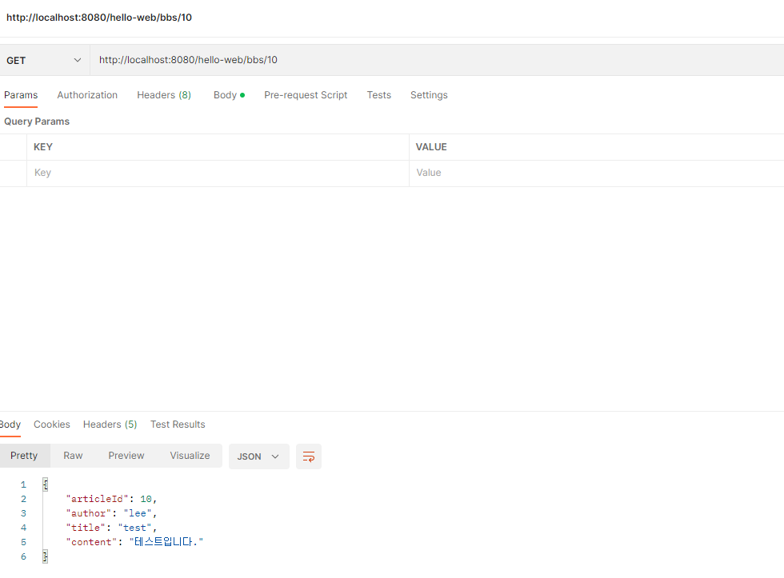
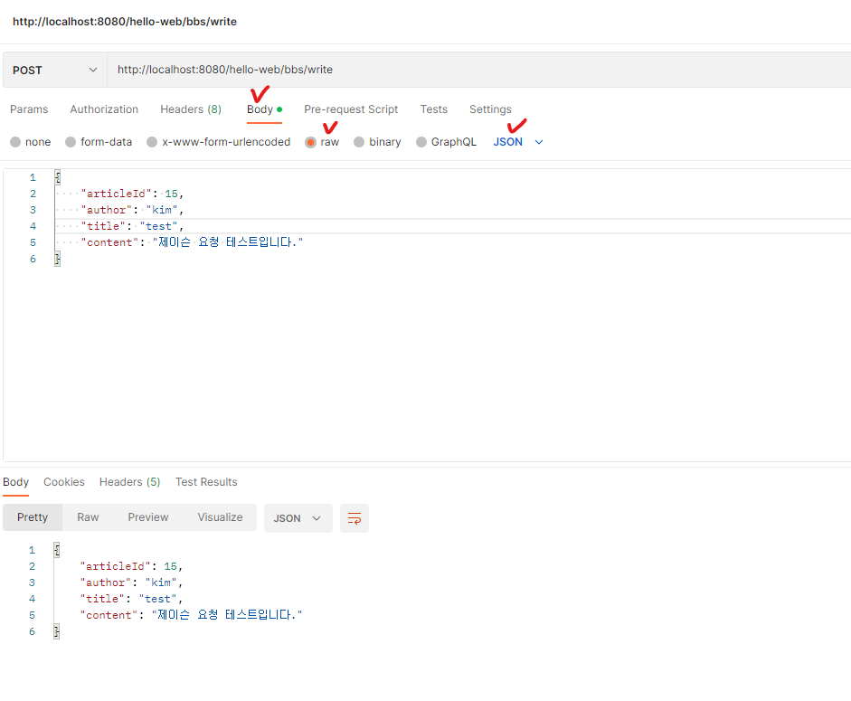

## json으로 응답하기

* pom.xml에 jackson라이브러리 추가(https://mvnrepository.com/artifact/com.fasterxml.jackson.core/jackson-databind)

```xml
<dependency>
    <groupId>com.fasterxml.jackson.core</groupId>
    <artifactId>jackson-databind</artifactId>
    <version>2.13.4</version>
</dependency>
```

* ArticleDAO에 selectArticleById메서드 추가

```java
public Article selectArticleById(String articleId) { //DB조회 대신 임시로 객체 생성해서 리턴
    Article article = new Article(10, "lee", "test", "테스트입니다.");
    return article;
}
```

* BbsService에 viewArticleDetail메서드 추가

```java
public Article viewArticleDetail(String articleId) {
	return this.articleDAO.selectArticleById(articleId);
}
```

* BbsController에 viewDetail메서드 추가

```java
@GetMapping("/{articleId}")
@ResponseBody //jacson라이브러리를 통해 객체를 리턴하면 json으로 바꿔준다
public Article viewDetail(@PathVariable String articleId){
    Article article = this.bbsService.viewArticleDetail(articleId);
    return article; 
}
```

* postman으로 테스트(http://localhost:8080/hello-web/bbs/10)




##  JSON으로 요청하기

* BbsController에 write메서드 추가(이전 write메서드는 지움)

```java
@PostMapping("/write")
@ResponseBody//json으로 리턴
public Article write(@RequestBody Article article){//json 형식으로 요청 받을떄는 @RequestBody 사용
    Article a = article;
    return a;
}
```

* postman으로 테스트(http://localhost:8080/hello-web/bbs/write)


