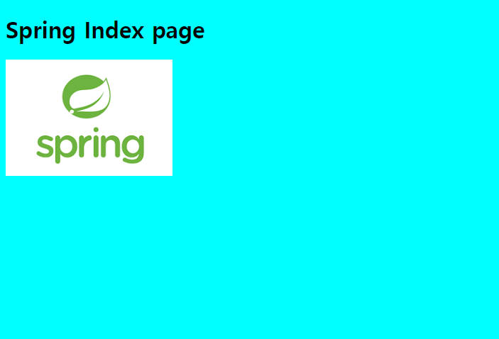
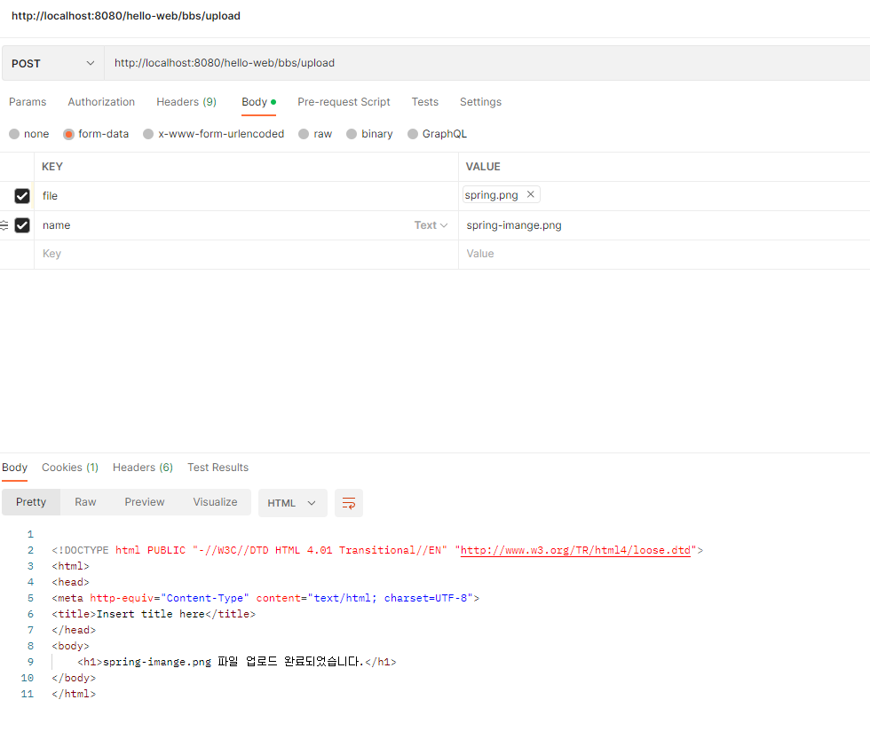

## Static Resource 처리

* BbsController.java 수정

```java
@GetMapping("/")
public String index(){
	return "index";
}
```

* index.jsp 구현(\src\main\webapp\WEB-INF\views\index.jsp)

```jsp
<%@ page language="java" contentType="text/html; charset=UTF-8"
    pageEncoding="UTF-8"%>
<!DOCTYPE html PUBLIC "-//W3C//DTD HTML 4.01 Transitional//EN" "http://www.w3.org/TR/html4/loose.dtd">
<html>
<head>
	<meta http-equiv="Content-Type" content="text/html; charset=UTF-8">
	<title>index page</title>
	<link rel="stylesheet" href="/hello-web/resources/styles/style.css">
</head>
<body>
	<h1>Spring Index page</h1>
	
</body>
</html>
```

* style.css 구현(\src\main\webapp\WEB-INF\resources\styles\style.css)

```css
@CHARSET "UTF-8";

body{
	background-color: cyan;
}
```

* spring.png 이미지 넣기(src\main\webapp\WEB-INF\resources\images\spring.png)

* servlet-context.xml 파일 수정

```xml
<!-- resources/**로 요청이 들어오면 controller를 타지 않고 /WEB-INF/resources/ 경로 하위의 파일로 response를 반환 -->
<mvc:resources location="/WEB-INF/resources/" mapping="/resources/**/"></mvc:resources>
```

```xml
<?xml version="1.0" encoding="UTF-8"?>
<beans xmlns="http://www.springframework.org/schema/beans"
	xmlns:xsi="http://www.w3.org/2001/XMLSchema-instance"
	xmlns:context="http://www.springframework.org/schema/context"
	xmlns:mvc="http://www.springframework.org/schema/mvc"
	xsi:schemaLocation="http://www.springframework.org/schema/mvc http://www.springframework.org/schema/mvc/spring-mvc-4.3.xsd
		http://www.springframework.org/schema/beans http://www.springframework.org/schema/beans/spring-beans.xsd
		http://www.springframework.org/schema/context http://www.springframework.org/schema/context/spring-context-4.3.xsd">
	
	<context:component-scan base-package="kr.co.company.hello"></context:component-scan>
	<mvc:annotation-driven />
	
	<!-- resources/**로 요청이 들어오면 controller를 타지 않고 /WEB-INF/resources/ 경로 하위의 파일로 response를 반환 -->
	<mvc:resources location="/WEB-INF/resources/" mapping="/resources/**/"></mvc:resources>

	<!-- viewResolver로 jsp 페이지 호출할 때 앞, 뒤에 자동으로 경로 입력 --> 	
	<bean id="viewResolver" class="org.springframework.web.servlet.view.InternalResourceViewResolver"> 
		<property name="prefix" value="/WEB-INF/views/"></property>
		<property name="suffix" value=".jsp"></property>
	</bean>
</beans>
```

* 서버 실행 후 http://localhost:8080/hello-web/bbs/ 접속




## 파일 업로드

* servlet-context.xml 파일 수정

```xml
<bean id="multipartResolver" class="org.springframework.web.multipart.commons.CommonsMultipartResolver">
    <property name="maxUploadSize" value="104857600"></property><!-- 10MB -->
    <property name="defaultEncoding" value="UTF-8"></property>
</bean>
```

* pom.xml 수정

```xml
<dependency>
    <groupId>commons-fileupload</groupId>
    <artifactId>commons-fileupload</artifactId>
    <version>1.4</version>
</dependency>
```

* FileUploadController.java 생성

```java
package kr.co.company.hello.controller;

import java.io.File;
import java.io.IOException;

import org.springframework.stereotype.Controller;
import org.springframework.ui.Model;
import org.springframework.web.bind.annotation.PostMapping;
import org.springframework.web.bind.annotation.RequestMapping;
import org.springframework.web.bind.annotation.RequestParam;
import org.springframework.web.multipart.MultipartFile;

@Controller
@RequestMapping("/bbs")
public class FileUploadController {
	
	@PostMapping("/upload")
	public String upload(@RequestParam("file") MultipartFile file,
						 @RequestParam("name") String fileName,
						 Model model) throws IllegalStateException, IOException {
		if(!file.isEmpty()){
			File f = new File("c:\\upload", file.getOriginalFilename());
			file.transferTo(f);
		}
		model.addAttribute("fileName", fileName);
		return "upload_ok";
	}
}
```

* upload_ok.jsp 생성

```jsp
<%@ page language="java" contentType="text/html; charset=UTF-8"
    pageEncoding="UTF-8"%>
<!DOCTYPE html PUBLIC "-//W3C//DTD HTML 4.01 Transitional//EN" "http://www.w3.org/TR/html4/loose.dtd">
<html>
<head>
<meta http-equiv="Content-Type" content="text/html; charset=UTF-8">
<title>Insert title here</title>
</head>
<body>
	<h1>${fileName} 파일 업로드 완료되었습니다.</h1>
</body>
</html>
```

* postman으로 테스트(http://localhost:8080/hello-web/bbs/upload)



**실제로 파일명 저장할 때는 난수화 시켜서 저장하고 DB에서 파일명을 관리하는 방식이 좋다!**
