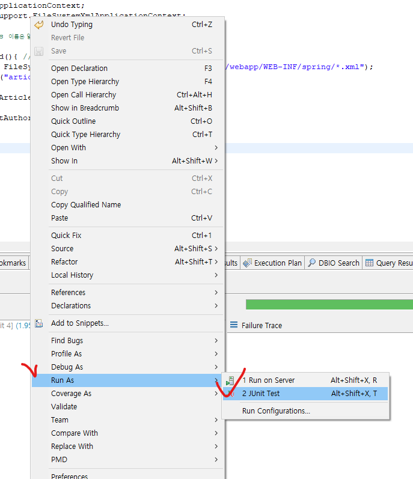

## JUnit4 테스트

* pom.xml에 junit추가(https://mvnrepository.com/artifact/junit/junit)

```xml
<dependency>
    <groupId>junit</groupId>
    <artifactId>junit</artifactId>
    <version>4.13.2</version>
    <scope>test</scope>
</dependency>
```

* ArticleDAOTest.java 구현(src\test\java\kr\co\company\hello\dao\ArticleDAOTest.java 경로)

```JAVA
package kr.co.company.hello.dao;

import kr.co.company.hello.vo.Article;

import org.junit.Assert;
import org.junit.Test;
import org.springframework.context.ApplicationContext;
import org.springframework.context.support.FileSystemXmlApplicationContext;

public class ArticleDAOTest { //Class 이름은 일반적으로 테스트 대상 Class명 뒤에 Test를 붙여 사용
	@Test
	public void testSelectArticleById(){ //메소드 이름은 테스트 대상 메소드명 앞에 test를 붙여 사용
		ApplicationContext ctx = new FileSystemXmlApplicationContext("file:src/main/webapp/WEB-INF/spring/*.xml");
		ArticleDAO dao = ctx.getBean("articleDAO", ArticleDAO.class);
		
		Article article = dao.selectArticleById(null);
		
		Assert.assertTrue(article.getAuthor().equals("lee"));
	}
}
```

* ArticleDAOTest.java에서 마우스 오른쪽 버튼 - [Run As] - [JUnit Test]




## Spring-Test

