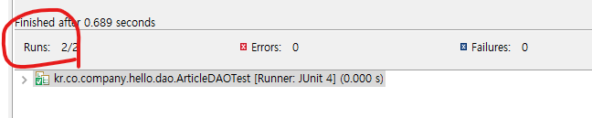
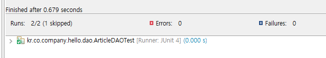

## JUnit4 테스트

* pom.xml에 junit추가(https://mvnrepository.com/artifact/junit/junit)

```xml
<dependency>
    <groupId>junit</groupId>
    <artifactId>junit</artifactId>
    <version>4.13.2</version>
    <scope>test</scope>
</dependency>
```

* ArticleDAOTest.java 구현(src\test\java\kr\co\company\hello\dao\ArticleDAOTest.java 경로)

```JAVA
package kr.co.company.hello.dao;

import kr.co.company.hello.vo.Article;

import org.junit.Assert;
import org.junit.Before;
import org.junit.Test;
import org.springframework.context.ApplicationContext;
import org.springframework.context.support.FileSystemXmlApplicationContext;

public class ArticleDAOTest {
	
	private ApplicationContext ctx;
	
	@Before //모든 테스트 케이스 실행 전에 공통으로 실행해야 하는 부분 
	public void setup() {
		ctx = new FileSystemXmlApplicationContext("file:src/main/webapp/WEB-INF/spring/*.xml");
	}
	
	@Test
	public void testSelectArticleById(){
		
		ArticleDAO dao = ctx.getBean("articleDAO", ArticleDAO.class);
		
		Article article = dao.selectArticleById(null);
		
		Assert.assertTrue(article.getAuthor().equals("lee"));
	}
}
```

* ArticleDAOTest.java에서 마우스 오른쪽 버튼 - [Run As] - [JUnit Test]


## Spring-Test

* pom.xml에 Spring TestContext Framework추가(https://mvnrepository.com/artifact/org.springframework/spring-test)

```xml
<dependency>
    <groupId>org.springframework</groupId>
    <artifactId>spring-test</artifactId>
    <version>5.2.22.RELEASE</version>
    <scope>test</scope>
</dependency>
```

* ArticleDAOTest.java 수정

```java
package kr.co.company.hello.dao;

import kr.co.company.hello.vo.Article;
import org.junit.Assert;
import org.junit.Test;
import org.junit.runner.RunWith;
import org.springframework.beans.factory.annotation.Autowired;
import org.springframework.context.annotation.Configuration;
import org.springframework.test.context.ContextConfiguration;
import org.springframework.test.context.junit4.SpringJUnit4ClassRunner;

@RunWith(SpringJUnit4ClassRunner.class) //Spring-Test 사용 설정
@ContextConfiguration("file:src/main/webapp/WEB-INF/spring/*.xml") //설정파일 위치
public class ArticleDAOTest {
	
	@Autowired //의존성 주입
	private ArticleDAO dao;
	
	@Test
	public void testSelectArticleById(){
		
		Article article = dao.selectArticleById(null);
		
		Assert.assertTrue(article.getAuthor().equals("lee"));
	}
}
```


* 여러개 테스트

```java
package kr.co.company.hello.dao;

import kr.co.company.hello.vo.Article;
import org.junit.Assert;
import org.junit.Test;
import org.junit.runner.RunWith;
import org.springframework.beans.factory.annotation.Autowired;
import org.springframework.context.annotation.Configuration;
import org.springframework.test.context.ContextConfiguration;
import org.springframework.test.context.junit4.SpringJUnit4ClassRunner;

@RunWith(SpringJUnit4ClassRunner.class) //Spring-Test 사용 설정
@ContextConfiguration("file:src/main/webapp/WEB-INF/spring/*.xml") //설정파일 위치
public class ArticleDAOTest {
	
	@Autowired //의존성 주입
	private ArticleDAO dao;
	
	@Test //insert테스트
	public void testInsertArticle() {
		dao.insertArticle(null);
	}
	
	@Test
	public void testSelectArticleById(){
		Article article = dao.selectArticleById(null);
		Assert.assertTrue(article.getAuthor().equals("lee"));
	}
}
```




* @ignore로 테스트 제외

```java
package kr.co.company.hello.dao;

import kr.co.company.hello.vo.Article;

import org.junit.Assert;
import org.junit.Ignore;
import org.junit.Test;
import org.junit.runner.RunWith;
import org.springframework.beans.factory.annotation.Autowired;
import org.springframework.context.annotation.Configuration;
import org.springframework.test.context.ContextConfiguration;
import org.springframework.test.context.junit4.SpringJUnit4ClassRunner;

@RunWith(SpringJUnit4ClassRunner.class) //Spring-Test 사용 설정
@ContextConfiguration("file:src/main/webapp/WEB-INF/spring/*.xml") //설정파일 위치
public class ArticleDAOTest {
	
	@Autowired
	private ArticleDAO dao;
	
	@Test 
	@Ignore //테스트에서 제외
	public void testInsertArticle() {
		dao.insertArticle(null);
	}
	
	@Test
	public void testSelectArticleById(){
		Article article = dao.selectArticleById(null);
		Assert.assertTrue(article.getAuthor().equals("lee"));
	}
}
```


