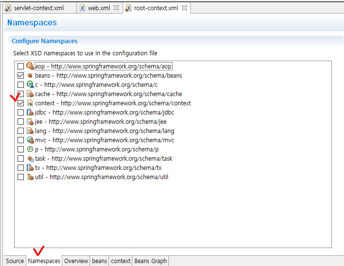
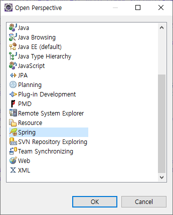
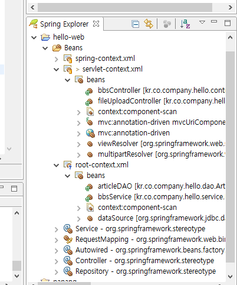
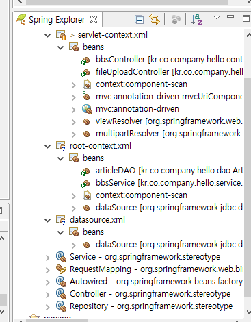

## 1. context 파일 분리

* web.xml 파일에 listerner추가

```xml
  <listener>
  	<listener-class>org.springframwork.web.context.ContextLoaderListener</listener-class>
  </listener>
  
  <context-param>
  	<param-name>contextConfigLocation</param-name>
  	<param-value>/WEB-INF/spring/root-context.xml</param-value>
  </context-param>
```

* root-context.xml생성
  * /WEB-INF/spring폴더 마우버튼 - [new] - [Spring Bean Configuration File] - root-context.xml생성
  * root-context.xml 파일 열기 - [Namespaces] 탭 선택 - [context] 체크



* servlet-context.xml에서 dataSource관련 코드 옮기기

```xml
	<context:property-placeholder location="classpath:config/database.properties"/>
	
	<bean id="dataSource" class="org.springframework.jdbc.datasource.SimpleDriverDataSource">
		<property name="driverClass" value="${db.driverClass}"></property>
		<property name="url" value="${db.url}"></property>
		<property name="username" value="${db.username}"></property>
		<property name="password" value="${db.password}"></property>		
		
		<!-- 
		<property name="driverClass" value="com.sql.jdbc.Driver"></property>
		<property name="url" value="jdbc:mysql://localhost:3306/spirng"></property>
		<property name="username" value="spring"></property>
		<property name="password" value="spring"></property>
		 -->
	</bean>
```

* root-context.xml에 context:component-scan추가

```xml
	<context:component-scan base-package="kr.co.company.hello">
		<!-- Controller 빈은 제외 -->
		<context:exclude-filter type="annotation" expression="org.springframework.stereotype.Controller"/>
	</context:component-scan>
```

* servlet-context.xml에 context:component-scan추가

```xml
	<!-- use-default-filters="false"해줘야 다른 Bean은 include 안 된다 -->
	<context:component-scan base-package="kr.co.company.hello" use-default-filters="false">
		<!-- Controller 빈만 포함 -->
		<context:include-filter type="annotation" expression="org.springframework.stereotype.Controller"/>
	</context:component-scan>
```


**완성 소스**

* web.xml

```xml
<?xml version="1.0" encoding="UTF-8"?>
<web-app xmlns:xsi="http://www.w3.org/2001/XMLSchema-instance" xmlns="http://xmlns.jcp.org/xml/ns/javaee" xsi:schemaLocation="http://xmlns.jcp.org/xml/ns/javaee http://xmlns.jcp.org/xml/ns/javaee/web-app_3_1.xsd" id="WebApp_ID" version="3.1">
  
  <listener>
  	<listener-class>org.springframwork.web.context.ContextLoaderListener</listener-class>
  </listener>
  
  <context-param>
  	<param-name>contextConfigLocation</param-name>
  	<param-value>/WEB-INF/spring/root-context.xml</param-value>
  </context-param>
  
  <servlet>
  	<servlet-name>dispatcherServlet</servlet-name>
  	<servlet-class>org.springframework.web.servlet.DispatcherServlet</servlet-class>
  	<init-param>
  		<param-name>contextConfigLocation</param-name>
  		
  		<!-- context 파일 경로 -->
  		<param-value>/WEB-INF/spring/servlet-context.xml</param-value>
  	</init-param>
  </servlet>
  
  <servlet-mapping>
  	<servlet-name>dispatcherServlet</servlet-name>
  	
  	<!-- 모든 요청이 dispatcherServlet을 통과하도록 한다 -->
  	<url-pattern>/</url-pattern>
  	
  </servlet-mapping>
</web-app>
```

* root-context.xml

```xml
<?xml version="1.0" encoding="UTF-8"?>
<beans xmlns="http://www.springframework.org/schema/beans"
	xmlns:xsi="http://www.w3.org/2001/XMLSchema-instance"
	xmlns:context="http://www.springframework.org/schema/context"
	xsi:schemaLocation="http://www.springframework.org/schema/beans http://www.springframework.org/schema/beans/spring-beans.xsd
		http://www.springframework.org/schema/context http://www.springframework.org/schema/context/spring-context-4.3.xsd">
	
	<context:component-scan base-package="kr.co.company.hello">
		<!-- Controller 빈은 제외 -->
		<context:exclude-filter type="annotation" expression="org.springframework.stereotype.Controller"/>
	</context:component-scan>
	
	<context:property-placeholder location="classpath:config/database.properties"/>
	
	<bean id="dataSource" class="org.springframework.jdbc.datasource.SimpleDriverDataSource">
		<property name="driverClass" value="${db.driverClass}"></property>
		<property name="url" value="${db.url}"></property>
		<property name="username" value="${db.username}"></property>
		<property name="password" value="${db.password}"></property>		
		
		<!-- 
		<property name="driverClass" value="com.sql.jdbc.Driver"></property>
		<property name="url" value="jdbc:mysql://localhost:3306/spirng"></property>
		<property name="username" value="spring"></property>
		<property name="password" value="spring"></property>
		 -->
	</bean>
</beans>
```

* servlet-context.xml

```xml
<?xml version="1.0" encoding="UTF-8"?>
<beans xmlns="http://www.springframework.org/schema/beans"
	xmlns:xsi="http://www.w3.org/2001/XMLSchema-instance"
	xmlns:context="http://www.springframework.org/schema/context"
	xmlns:mvc="http://www.springframework.org/schema/mvc"
	xsi:schemaLocation="http://www.springframework.org/schema/mvc http://www.springframework.org/schema/mvc/spring-mvc-4.3.xsd
		http://www.springframework.org/schema/beans http://www.springframework.org/schema/beans/spring-beans.xsd
		http://www.springframework.org/schema/context http://www.springframework.org/schema/context/spring-context-4.3.xsd">
	
	<!-- use-default-filters="false"해줘야 다른 Bean은 include 안 된다 -->
	<context:component-scan base-package="kr.co.company.hello" use-default-filters="false">
		<!-- Controller 빈만 포함 -->
		<context:include-filter type="annotation" expression="org.springframework.stereotype.Controller"/>
	</context:component-scan>
	
	<mvc:annotation-driven />
	
	<!-- resources/**로 요청이 들어오면 controller를 타지 않고 /WEB-INF/resources/ 경로 하위의 파일로 response를 반환 -->
	<mvc:resources location="/WEB-INF/resources/" mapping="/resources/**/"></mvc:resources>

	<!-- viewResolver로 jsp 페이지 호출할 때 앞, 뒤에 자동으로 경로 입력 --> 	
	<bean id="viewResolver" class="org.springframework.web.servlet.view.InternalResourceViewResolver"> 
		<property name="prefix" value="/WEB-INF/views/"></property>
		<property name="suffix" value=".jsp"></property>
	</bean>
	
	<bean id="multipartResolver" class="org.springframework.web.multipart.commons.CommonsMultipartResolver">
		<property name="maxUploadSize" value="104857600"></property><!-- 10MB -->
		<property name="defaultEncoding" value="UTF-8"></property>
	</bean>
</beans>
```


**Bean 확인**

* [Open Perspective] - [Spring]



* Spring Explorer 탭 확인




## 2. 여러개의 root context 사용

* web.xml의 context-param 태그 수정

```xml
  <context-param>
  	<param-name>contextConfigLocation</param-name>
  	<param-value>
  		/WEB-INF/spring/root-context.xml
  		/WEB-INF/spring/datasource.xml <!-- 데이터 관련 설정 -->
  	</param-value>
  </context-param>
```

* /WEB-INF/spring/datasource.xml 파일 생성
* datasource.xml 파일 열기 - [context] 체크 - root-context.xml에서 dataSource관련 코드 옮기기

* 최종 datasource.xml

```xml
<?xml version="1.0" encoding="UTF-8"?>
<beans xmlns="http://www.springframework.org/schema/beans"
	xmlns:xsi="http://www.w3.org/2001/XMLSchema-instance"
	xmlns:context="http://www.springframework.org/schema/context"
	xsi:schemaLocation="http://www.springframework.org/schema/beans http://www.springframework.org/schema/beans/spring-beans.xsd
		http://www.springframework.org/schema/context http://www.springframework.org/schema/context/spring-context-4.3.xsd">

	<context:property-placeholder location="classpath:config/database.properties"/>
	
	<bean id="dataSource" class="org.springframework.jdbc.datasource.SimpleDriverDataSource">
		<property name="driverClass" value="${db.driverClass}"></property>
		<property name="url" value="${db.url}"></property>
		<property name="username" value="${db.username}"></property>
		<property name="password" value="${db.password}"></property>		
		
		<!-- 
		<property name="driverClass" value="com.sql.jdbc.Driver"></property>
		<property name="url" value="jdbc:mysql://localhost:3306/spirng"></property>
		<property name="username" value="spring"></property>
		<property name="password" value="spring"></property>
		 -->
	</bean>
</beans>
```


* Spring Explorer에서 bean 확인




* web.xml의 context-param 태그 * 기호 사용할 수도 있다

```xml
  <context-param>
  	<param-name>contextConfigLocation</param-name>
  	<param-value>
  		/WEB-INF/spring/*.xml
  	</param-value>
  </context-param>
```

