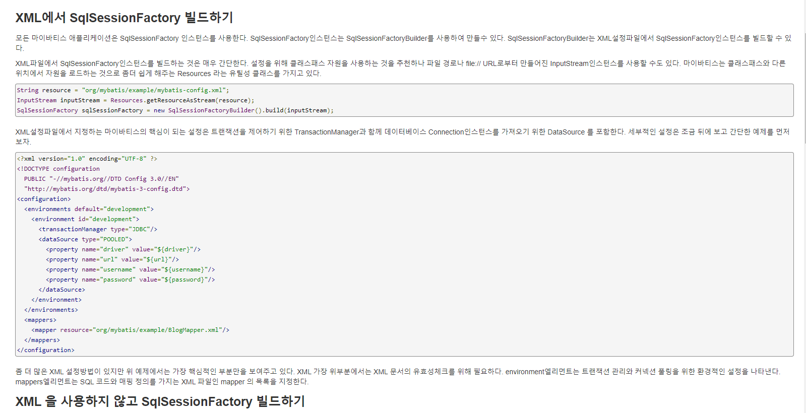
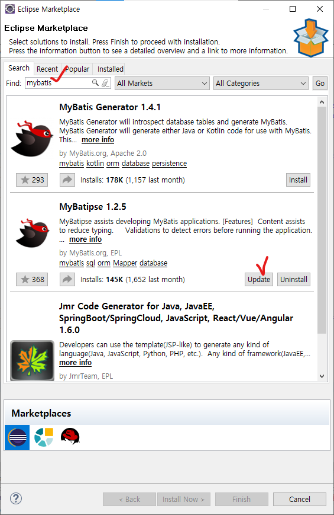
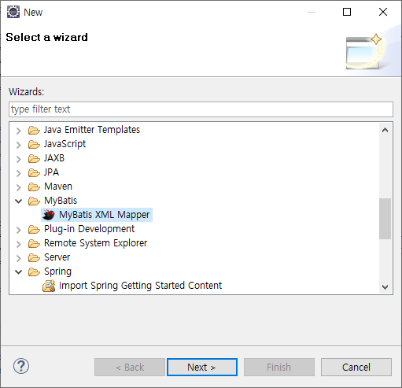

## 1. mybatis, mybatis-spring 의존성 추가

* pom.xml에 mybatis 의존성 추가(https://mvnrepository.com/artifact/org.mybatis/mybatis)

```xml
<dependency>
    <groupId>org.mybatis</groupId>
    <artifactId>mybatis</artifactId>
    <version>3.5.10</version>
</dependency>
```

* pom.xml에 mybatis-spring 의존성 추가(https://mvnrepository.com/artifact/org.mybatis/mybatis)

```xml
<dependency>
    <groupId>org.mybatis</groupId>
    <artifactId>mybatis-spring</artifactId>
    <version>2.0.7</version>
</dependency>
```


## 2. mybatis 메인설정 파일, mybatis-config.xml 설정

* mybatis-config.xml 파일 생성(경로: hello-web\src\main\resource\mybatis-config.xml)
* mybatis 공식 페이지 - [시작하기] 접속(https://mybatis.org/mybatis-3/ko/getting-started.html)

* XML에서 SqlSessionFactory 빌드하기 부분 XML소스 복사해서 mybatis-config.xml에 붙여넣기



* configuration 태그 사이의 내용 삭제

```xml
<?xml version="1.0" encoding="UTF-8" ?>
<!DOCTYPE configuration
  PUBLIC "-//mybatis.org//DTD Config 3.0//EN"
  "http://mybatis.org/dtd/mybatis-3-config.dtd">
<configuration>

</configuration>
```


## 3. sqlSessionFactory, sqlSession 설정

* datasource.xml에 sqlSessionFactory, sqlSession 빈 추가

```xml
	<bean id="sqlSessionFactory" class="org.mybatis.spring.SqlSessionFactoryBean">
		<property name="dataSource" ref="dataSource"></property> <!-- dataSource 아이디 -->
		<property name="configLocation" value="classpath:mybatis-config.xml"></property> <!-- config 파일 경로 -->
		<property name="mapperLocations"> <!-- mapper 파일 경로 -->
			<list>
				<value>classpath:mappers/article-mapper.xml</value>
			</list>
		</property>
	</bean>
	
	<bean id="sqlSession" class="org.mybatis.spring.SqlSessionTemplate">
		<constructor-arg ref="sqlSessionFactory"></constructor-arg>
	</bean>
```


## 4. Mapper 파일 설정

**mybatis 이클립스 플러그인 설치**

* [Help] - [Eclipse Marketplace] - mybatis 검색 - MyBatipse 설치



* mappers 폴더 생성(경로: hello-web\src\main\resource\mappers)
* mappers에서 마우버튼 - [New] - [Other] - [MyBatis XML Mapper] 선택 - article-mapper.xml 생성


