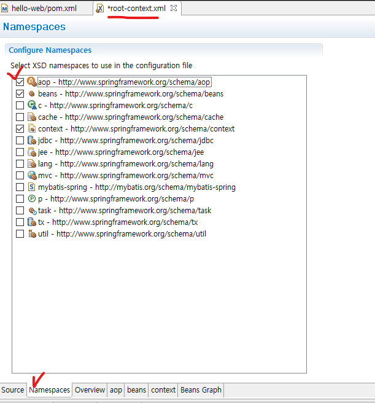

## 1. 의존성 설치(spring-aop, aspectj weaver)

* pom.xml에 spring-aop 의존성 추가(https://mvnrepository.com/artifact/org.springframework/spring-aop)

```xml
		<dependency>
		    <groupId>org.springframework</groupId>
		    <artifactId>spring-aop</artifactId>
		    <version>5.2.22.RELEASE</version>
		</dependency>
```

* pom.xml에 aspectj weaver 의존성 추가(https://mvnrepository.com/artifact/org.aspectj/aspectjweaver)

```xml
		<dependency>
		    <groupId>org.aspectj</groupId>
		    <artifactId>aspectjweaver</artifactId>
		    <version>1.9.9.1</version>
		    <scope>runtime</scope>
		</dependency
```


## 2. AOP 자동 프록시 설정

* root-context.xml에 aop 네임스페이스 추가 및 소스 수정



```xml
<!-- aop사용 -->
<aop:aspectj-autoproxy/>
```

```xml
<?xml version="1.0" encoding="UTF-8"?>
<beans xmlns="http://www.springframework.org/schema/beans"
	xmlns:xsi="http://www.w3.org/2001/XMLSchema-instance"
	xmlns:context="http://www.springframework.org/schema/context"
	xmlns:aop="http://www.springframework.org/schema/aop"
	xsi:schemaLocation="http://www.springframework.org/schema/beans http://www.springframework.org/schema/beans/spring-beans.xsd
		http://www.springframework.org/schema/context http://www.springframework.org/schema/context/spring-context-4.3.xsd
		http://www.springframework.org/schema/aop http://www.springframework.org/schema/aop/spring-aop-4.3.xsd">

    <!-- aop사용 -->
	<aop:aspectj-autoproxy/>
	
	<context:component-scan base-package="kr.co.company.hello">
		<!-- Controller 빈은 제외 -->
		<context:exclude-filter type="annotation" expression="org.springframework.stereotype.Controller"/>
	</context:component-scan>
</beans>
```


## 3. SampleAspect 생성

```java
package kr.co.company.hello.aspect;

import org.aspectj.lang.JoinPoint;
import org.aspectj.lang.annotation.Aspect;
import org.aspectj.lang.annotation.Before;
import org.springframework.stereotype.Component;

@Component//자동으로 Bean 등록
@Aspect
public class SampleAspect {
	
	//execution(리턴타입 적용경로)
	@Before("execution(* kr.co.company.hello..*.*(..))")//advice
	public void before(JoinPoint joinPoint){
		String targetMethodName =
				joinPoint.getSignature().getName();//호출된 메소드명 반환
		
		System.out.println(targetMethodName);
	}
}
```

