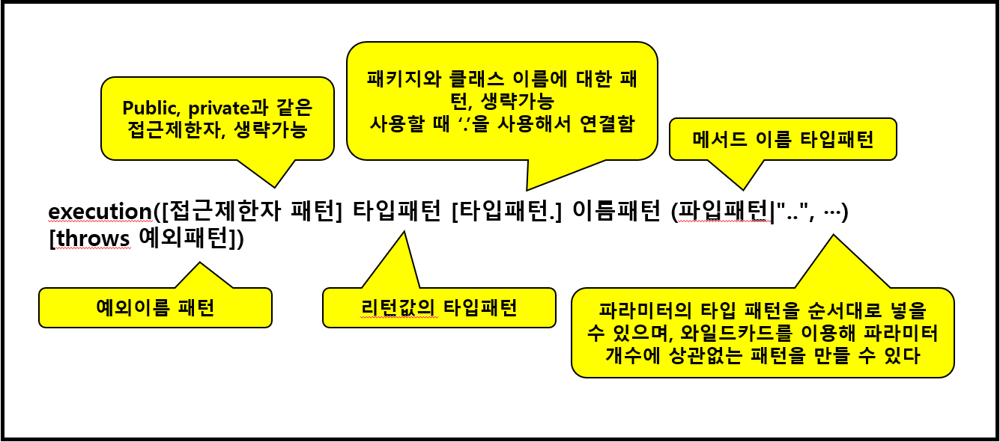

# PointCut 표현식과 Advisor 구현

## 1. PointCut 표현식

**PointCut 표현식 문법**

* AspectJ 포인트컷 표현식은 포인트컷 지시자를 이용해 작성한다
* 포인트컷 지시자 중 가장 대표적으로 사용되는 것은 execution()이다
* execution() 지시자를 사용한 포인트컷 표현식의 문법 구조 ↓




**PointCut 표현식 예시**

```java
execution(* hello(..)) //hello라는 이름을 가진 모든 메서드에 적용
execution(* hello()) //hello라는 이름을 가지고 파라미터가 없는 메서드에 적용
execution(* myspring.user.service.UserServiceImpl.*(..)) //'myspring.user.service.UserServiceImpl' 클래스의 모든 메서드에 적용
execution(* myspring.user.service.*.*(..)) // 'myspring.user.service' 패키지의 모든 클래스에 적용(서브패키지의 클래스는 포함X)
execution(* myspring.user.service..*.*(..)) // 'myspring.user.service' 패키지의 모든 클래스에 적용(서브패키지의 클래스 포함)
execution(* *..Target.*(..)) // 'Target'이라는 이름의 모든 클래스에 적용(다른 패키지에 이름이 같은 클래스가 있다면 같이 적용되므로 주의해야 함)
```


## 2. Spring AOP 구현 - @Aspect

**Spring AOP의 구현 방식**

1. XML 기반의 POJO 클래스를 이용한 구현

   * 부가기능을 제공하는 Advice 클래스를 작성

   * XML 설정 파일에 \<aop:config>를 이용해서 애스펙트를 설정(즉, 어드바이스와 포인트컷을 설정함)

2. @Aspect 어노테이션을 이용한 구현

   * @Aspect 어노테이션을 이용해 부가기능을 제공하는 Aspect 클래스를 작성, Aspect 클래스는 어드바이스를 구현하는 메서드와 포인트컷을 포함한다

   * XML 설정 파일에 <aop:aspectj-autoproxy />를 설정함


**@Aspect 어노테이션**

* Aspect 클래스를 선언할 때 사용
* AspectJ 5버전부터 추가됨
* XML 설정 파일에 어드바이스와 포인트컷을 설정하지 않고 클래스 내부에 정의할 수 있다
* \<aop:asepctj-autoproxy> 태그를 설정파일에 추가하면 @Aspect 어노테이션이 적용된 Bean을 Aspect로 사용 가능


**Advice의 종류**

* Around  - Joinpoint 앞과 뒤에서 실행
* Before - Joinpoint 앞에서 실행
* After Returning - Joinpoint 메서드 호출이 정상적으로 종료된 뒤에 실행
* After Throwing  - 예외가 발생할 때 실행


**Advice를 정의하는 어노테이션**

* @Before ("pointcut")
  * 타깃 객체의 메서드가 실행되기 전에 호출
  * JoinPoint를 통해 파라미터 정보를 참조할 수 있다
* @After("pointcut")
  * 타깃 객체의 메서드가 정상 종료되거나 예외가 발생했을 때 호출
  * 리턴 값이나 예외를 직접 전달받을 수는 없다
* @Around("pointcut")
  * 타깃 객체의 메서드가 호출되는 전 과정을 모두 담을 수 있는 가장 강력한 어드바이스
* @AfterReturning(pointcut="", returning="")
  * 타깃 객체의 메서드가 정상적으로 실행을 마친 후에 호출
  * 리턴 값을 참조할 때는 returning 속성에 리턴값을 저장할 변수 이름을 지정해야 함
* @AfterThrowing(pointcut="", returning="")
  * 타깃 객체의 메서드에서 예외가 발생하면 호출
  * 발생된 예외를 참조할 때는 throwing 속성에 예외를 저장할 변수 이름을 지정해야 함


**JoinPoint 인터페이스**

* AOP가 적용되는 지점
* 주요 메서드
  * getArgs() - 메서드 아규먼트를 반환
  * getThis() - 프록시 객체를 반환
  * getTarget() - 대상 객체를 반환
  * getSignature() - 어드바이즈 되는 메서드의 설명을 반환
  * toString() - 어드바이즈 되는 메서드의 설명을 출력
* 모든 어드바이스는 org.aspect.lang.JoinPoint 타입의 파라미터를 어드바이스 메서드에 첫 번째 매개변수로 선언할 수 있음
* Around 어드바이스는 JoinPoint의 하위 클래스인 ProceedingJoinPoint 타입의 파라미터를 필수적으로 선언해야 한다


