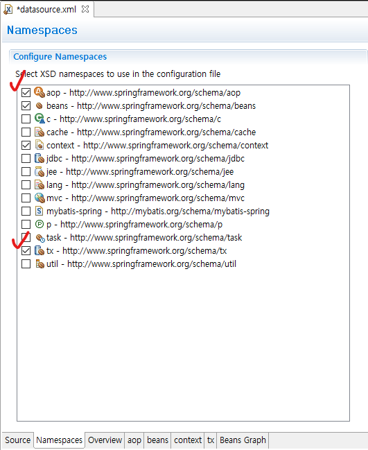

## 1. 트랜잭션 설정

* datasource.xml - [Namespaces] - [aop], [tx] 체크



* datasource.xml 수정

```xml
	<!-- 트랜잭션 매니저 빈 생성 -->
	<bean id="transactionManager" class="org.springframework.jdbc.datasource.DataSourceTransactionManager">
		<property name="dataSource" ref="dataSource"></property>
	</bean>
	
	<tx:advice id="txAdvice" transaction-manager="transactionManager">
		<tx:attributes>
			<tx:method name="*"/><!-- 모든 메소드를 트랜잭션 처리 -->
		</tx:attributes>
	</tx:advice>
	
	<aop:config>
		<!-- ..Service 클래스의 모든 메소드를 트랜잭션 처리 -->
		<aop:pointcut expression="execution(* kr.co.company.hello.service.*Service.*(..))" id="transactionPointcut"/>
		<aop:advisor advice-ref="txAdvice" pointcut-ref="transactionPointcut"/>
	</aop:config>
```


## 2. 의존성 추가

* pom.xml - [spring-context], [spring-webmvc] 디펜던씨에 exclusions 추가

```xml
		<dependency>
		    <groupId>org.springframework</groupId>
		    <artifactId>spring-context</artifactId>
		    <version>5.2.22.RELEASE</version>
		    <!-- 추가 부분 -->
		    <exclusions>
		    	<exclusion>
		    		<groupId>commons-logging</groupId>
		    		<artifactId>commons-logging</artifactId>
	    		</exclusion>
		    </exclusions>
		    <!-- //추가 부분 -->
		</dependency>
  		
  		<dependency>
		    <groupId>org.springframework</groupId>
		    <artifactId>spring-webmvc</artifactId>
		    <version>5.2.22.RELEASE</version>
		    <!-- 추가 부분 -->
		    <exclusions>
		    	<exclusion>
		    		<groupId>commons-logging</groupId>
		    		<artifactId>commons-logging</artifactId>
	    		</exclusion>
		    </exclusions>
		    <!-- //추가 부분 -->
		</dependency>
```

* pom.xml 의존성 추가

```xml
		<dependency>
		    <groupId>org.slf4j</groupId>
		    <artifactId>slf4j-api</artifactId>
		    <version>2.0.0</version>
		</dependency>
				
		<dependency>
			<!-- java commons-logging 대신 slf4j를 쓰도록 함 -->
		    <groupId>org.slf4j</groupId>
		    <artifactId>jcl-over-slf4j</artifactId>
		    <version>2.0.0</version>
		</dependency>
				
		<dependency>
			<!-- 로깅 구현체 -->
		    <groupId>ch.qos.logback</groupId>
		    <artifactId>logback-classic</artifactId>
		    <version>1.4.1</version>
		    <scope>test</scope>
		</dependency>
```


## 3. logback 설정파일 클래스 패스 추가


