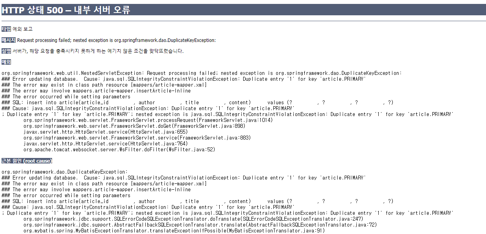

## 1. 사용자 예외작성

* BizException.java 생성(kr.co.company.hello.exception.BizException.java)

```java
package kr.co.company.hello.exception;

//RuntimeException을 상속받으면 예외를 try ~ catch 구문으로 잡아주지 않아도 된다
public class BizException extends RuntimeException {
	
	public BizException(){
		super();
	}
	
	//예외를 파라미터로 받는 생성자
	public BizException(Throwable t){
		super(t);
	}
	
	//문자열 메세지를 파라미터로 받는 생성자
	public BizException(String msg){
		super(msg);
	}
}

```


## 2. 컨트롤러에서 예외 최종 처리

* GlobalExceptionHandler.java 생성(kr.co.company.hello.controller.GlobalExceptionHandler.java)

```java
package kr.co.company.hello.controller;

import kr.co.company.hello.exception.BizException;

import org.springframework.ui.Model;
import org.springframework.web.bind.annotation.ControllerAdvice;
import org.springframework.web.bind.annotation.ExceptionHandler;

@ControllerAdvice
public class GlobalExceptionHandler {
	
	@ExceptionHandler(BizException.class)//파라미터로 예외 타입 받음
	public String handleBizException(Exception e, Model model){
		
		//예외의 클래스명 출력
		model.addAttribute("type", e.getClass().getSimpleName());
		
		//예외의 메세지 출력
		model.addAttribute("msg", e.getMessage());
		
		return "error"; //error.jsp를 리턴
	}
}
```


## 3. 에러페이지 작성

* BbsService.java 에 예외 발생 소스 추가

```java
	public void testService(){
		System.out.println("target invoked...");
		
		//예외 발생시키기
		throw new BizException("testService fail...");
	}
```

* error.jsp 생성(hello-web\src\main\webapp\WEB-INF\views\error.jsp)

```jsp
<%@ page language="java" contentType="text/html; charset=UTF-8"
    pageEncoding="UTF-8"%>
<!DOCTYPE html PUBLIC "-//W3C//DTD HTML 4.01 Transitional//EN" "http://www.w3.org/TR/html4/loose.dtd">
<html>
<head>
<meta http-equiv="Content-Type" content="text/html; charset=UTF-8">
<title>Insert title here</title>
</head>
<body>
	<h1>에러발생!</h1>
	<h2>error type : ${type}</h2>
	<h2>msg : ${msg}</h2>
</body>
</html>
```


##  4. 다른 예외 처리

* BbsController.java 수정

```java
	@GetMapping("/")
	public String index(){
		//bbsService.testService();
		bbsService.registArticle(new Article(1, "kim", "test", "test"));
		
		return "index";
	}
```

* http://localhost:8080/hello-web/bbs/ 여러번 호출하면 mybaits 쿼리에서 DuplicateKeyException 발생(키 값 중복 입력 오류)



* GlobalExceptionHandler.java에 소스 추가

```java
	//DuplicateKeyException 오류 처리
	@ExceptionHandler(DuplicateKeyException.class)
	public String handleMbsException(Exception e, Model model){
		model.addAttribute("type", e.getClass().getSimpleName());
		model.addAttribute("msg", e.getMessage());
		return "error"; //error.jsp를 리턴
	}
```

