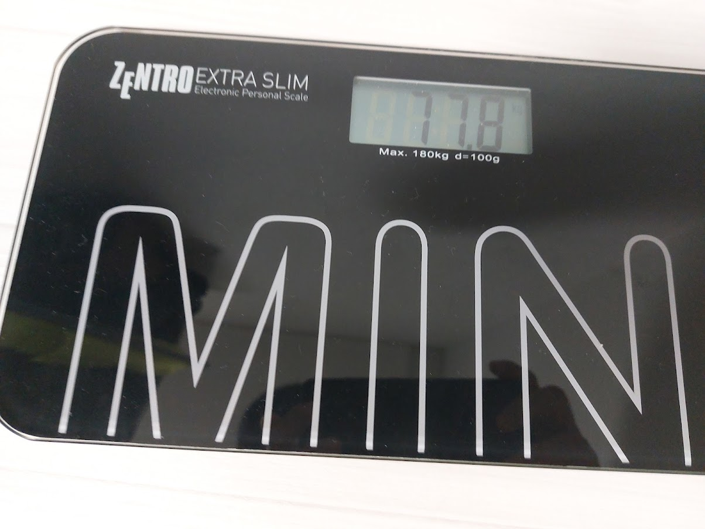

## 1. 금일 활동 내용(06.12)

* 07:00 ~ 08:00 : 운동
  * 런닝 1시간
  * 복근 3세트

* 12:00 ~ 13:00 : SQLP 실전 문제 풀이
  * 3과목 20문제

* 18:00 ~ 21:00 : SQLP 이론서
  * 1과목 공부

* 21:00 ~ 23:00 : 운동
  * 런닝 1시간
  * 복근 3세트
  * 77kg 대 달성!

## 2. 활동 리뷰

* (긍정)다이어트가 순조롭게 진행 중
  * 항상 폭식을 주의하자!

##  3. 주간 목표(06.10~06.16, 2주차)

* SQLP 실전 문제 1회독
* SQLP 이론서 1과목 1회독
* Hello Papang 서버 배포
* 다이어트
  * 목표: 77.0kg

  * 현재: 77.8kg

## 4. 최종 목표

* SQLP 시험 합격
  * SQLP 실전 문제 3회독(0/3)
  * SQLP 이론서 3회독(0/3)
  * 오라클 튜닝 관련 도서 3회독(0/3)
* Hello Papang 개발 완료
  * 매주 1개 이상의 메뉴 개발 수행

* 몸무게 4kg 감량(30일 간 다이어트)
  * 30일 간 아침 및 저녁 운동 수행하여 79kg -> 75kg으로 4kg 이상 감량
  * 70일 간 운동하여 몸무게 유지 및 체력 증진

