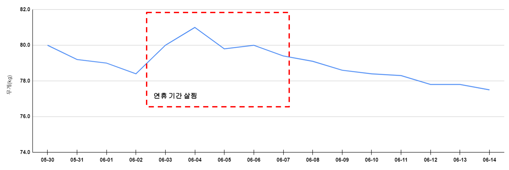

## 1. 금일 활동 내용(06.14)

* 07:00 ~ 08:00 : 운동
  * 런닝 1시간 20분
* 12:00 ~ 13:00 : SQLP 이론서
  * 1과목 공부
* 18:00 ~ 21:00 : SQLP 이론서
  * 1과목 공부
* 21:00 ~ 23:00 : 운동
  * 런닝 1시간
  * 등, 가슴 5세트
  * 팔 3세트

## 2. 활동 리뷰

* (긍정)SQLP 이론서 공부에 속도가 붙고 있다
* 주말 계획을 세워 이번 주말을 최대한 알차게 보낼 수 있도록 준비하자

##  3. 주간 목표(06.10~06.16, 2주차)

* SQLP 실전 문제 1회독 -> 완료!
* SQLP 이론서 1과목 1회독
* Hello Papang 서버 배포
* 다이어트
  * 목표: 77.0kg

  * 현재: 77.5kg

## 4. 최종 목표

* SQLP 시험 합격
  * SQLP 실전 문제 3회독(1/3)
  * SQLP 이론서 3회독(0/3)
  * 오라클 튜닝 관련 도서 3회독(0/3)
* Hello Papang 개발 완료
  * 매주 1개 이상의 메뉴 개발 수행

* 몸무게 4kg 감량(30일 간 다이어트)
  * 30일 간 아침 및 저녁 운동 수행하여 79kg -> 75kg으로 4kg 이상 감량
  * 70일 간 운동하여 몸무게 유지 및 체력 증진

