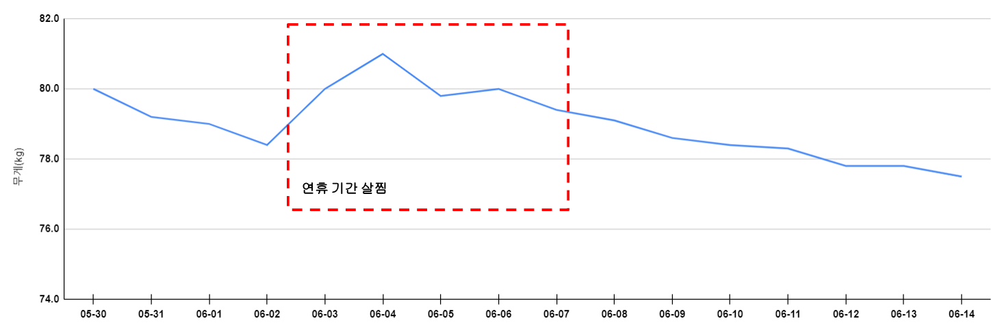

## 1. 금일 활동 내용(06.15)

* 08:00 ~ 09:00 : SQLP 이론서
  * 1과목 공부 -> 감기기운 있는데 헬스장에 에어컨이 너무 강해서 아침운동을 공부로 대체
* 12:00 ~ 13:00 : SQLP 이론서
  * 1과목 공부
* 18:00 ~ 21:00
  * SQLP 이론서 -> 1과목 공부 완료!
* 21:00 ~ 23:00 : 운동
  * 런닝 1시간
  * 어깨 5세트
  * 복근 3세트

## 2. 활동 리뷰

* (긍정)SQLP 이론서 1과목 공부 완료!

* 주말 계획을 세워 이번 주말을 최대한 알차게 보낼 수 있도록 준비하자

  [금요일]

  * 저녁
    * 저녁 : 떡볶이 + 튀김(치팅데이)
    * 휴식 후 운동 꼭 하기

  [토요일]

  * 오전
    * 운동
    * Hello Papang 서버 배포 완료
  * 오후
    * 점심 : 진라면 + 계란
    * SQLP 이론서 2과목 공부
    * 저녁 약속 => 끝나고 꼭 운동하러 갈 것!
    * 운동

  [일요일]

  * 오전
    * 운동
    * SQLP 이론서 2과목 공부
  * 오후
    * 점심 : 롯데리아 쿠폰 사용하기
    * Hello Papang 관리자 메뉴 부분 총 점검
    * SQLP 이론서 2과목 공부
    * 운동

##  3. 주간 목표(06.10~06.16, 2주차)

* (완료) SQLP 실전 문제 1회독 
* (완료) SQLP 이론서 1과목 1회독
* Hello Papang 서버 배포
* 다이어트
  * 목표: 77.0kg

  * 현재: 77.4kg

## 4. 최종 목표

* SQLP 시험 합격
  * SQLP 실전 문제 3회독(1/3)
  * SQLP 이론서 3회독(0/3)
  * 오라클 튜닝 관련 도서 3회독(0/3)
* Hello Papang 개발 완료
  * 매주 1개 이상의 메뉴 개발 수행

* 몸무게 4kg 감량(30일 간 다이어트)
  * 30일 간 아침 및 저녁 운동 수행하여 79kg -> 75kg으로 4kg 이상 감량
  * 70일 간 운동하여 몸무게 유지 및 체력 증진

